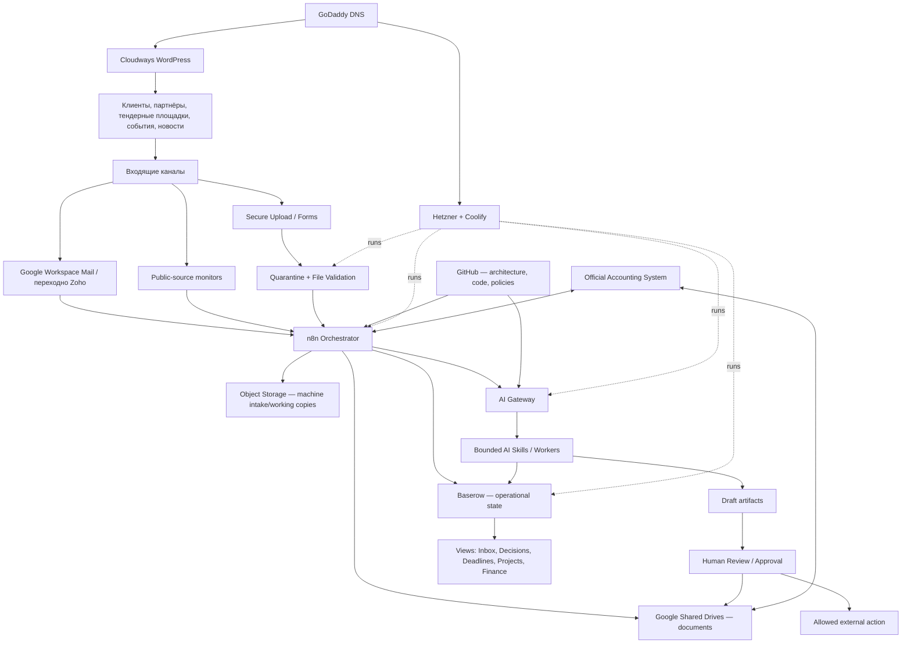
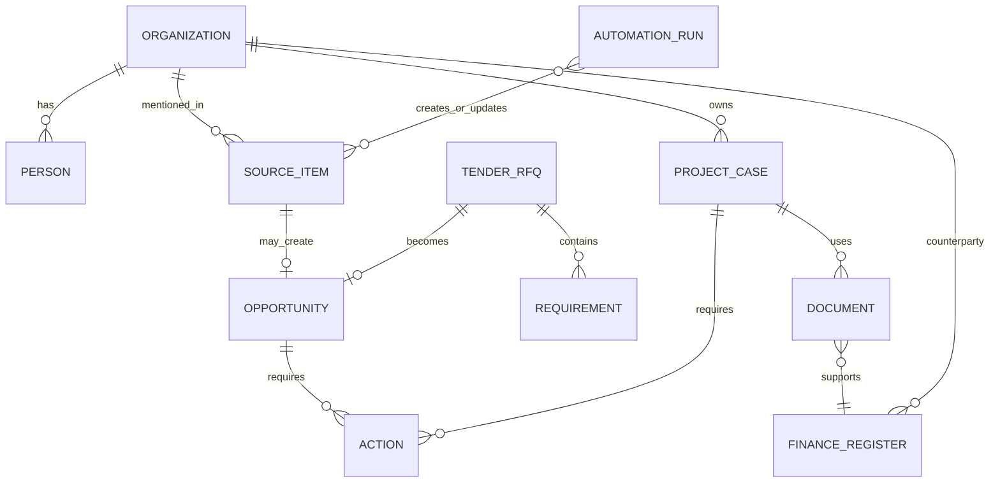

# AdaptEng Company Operating Architecture
## Единая архитектура компании, данных, автоматизаций и AI-сотрудников

> **Версия:** 1.0-master  
> **Дата:** 2026-07-23  
> **Владелец:** Ivan Shyla / AdaptEng  
> **Статус:** итоговая целевая архитектура и план реализации  
> **Заменяет в роли главного документа:** AI-only планы как верхнеуровневую архитектуру компании  
> **Связанные документы:** `AI_WORKFORCE_PLAN_v3_FINAL.md`, действующие политики `ai-dev-loop-control-plane`, архитектура `adapteng-automation-platform`

Этот документ описывает всю операционную систему AdaptEng: корпоративные аккаунты, документы, коммерческую работу, клиентские кейсы, проекты, знания, маркетинг, бухгалтерию, автоматизации, AI-сотрудников, безопасность и подключение новых людей.

Документ не разрешает автономную отправку клиентам, публикацию, оплату, подписание, изменение официального бухгалтерского учёта, merge или deploy без установленного human approval.

---

## 0. Решение в одном экране

### 0.1 Что строится

AdaptEng создаёт не «одного большого AI-агента» и не папку со всеми материалами, а **Company Operating System** — связанную систему, в которой каждому типу данных назначено правильное место:

| Слой | Выбранная система | Основная роль |
|---|---|---|
| Корпоративная идентичность и документы | **Google Workspace** | Пользователи, Shared Drives, документы, шаблоны, проекты, финальный архив |
| Операционная работа | **Baserow self-hosted** | Клиенты, возможности, тендеры, кейсы, проекты, задачи, сроки, статусы, реестры |
| Автоматизации | **n8n self-hosted** | Сбор данных, маршрутизация, дедупликация, уведомления, интеграции и расписания |
| Исполняемая инфраструктура | **Hetzner + Coolify** | Контейнеры Baserow, n8n, PostgreSQL, workers, monitoring и backups |
| Архитектура и код | **GitHub** | Код, схемы, политики, workflow exports, runbooks и история решений |
| AI-слой | **AI Gateway + ограниченные workers** | Извлечение, классификация, сравнение, draft и поиск по разрешённым данным |
| Публичный сайт | **Cloudways** | Production WordPress сайта AdaptEng |
| Домен и DNS | **GoDaddy** | Регистрация домена и DNS-записи |
| Почта | **Google Workspace — целевая; Zoho — переходный контур** | Корпоративная переписка и входящие процессы |
| Официальный бухгалтерский учёт | **Отдельная бухгалтерская система** | Проводки, налоги, официальные инвойсы и отчётность |
| Машинный приём и временная обработка файлов | **EU object storage** | Quarantine, входящие загрузки, snapshots и технические рабочие копии |

### 0.2 Главный принцип

> **Единым должно быть управление, а не физическое место хранения всего.**

- документы принадлежат компании в Google Workspace;
- состояние процессов хранится в Baserow;
- автоматизации выполняются в n8n;
- код и логика версионируются в GitHub;
- официальный бухучёт ведётся в специализированной системе;
- сервер исполняет процессы, но не является единственной копией документов;
- AI работает только через разрешённые данные, skills и approval boundaries.

### 0.3 Центральные точки входа

Для человека:

1. **Baserow `AdaptEng OS`** — ежедневный рабочий центр.
2. **Google Shared Drive `AdaptEng Company`** — корпоративные документы.
3. **Google Shared Drive `AdaptEng Finance & Legal`** — ограниченные юридические и финансовые документы.
4. **GitHub `adapteng-company-os`** — карта и логика всей системы.

Для автоматизаций:

1. n8n получает события;
2. записывает или обновляет сущности в Baserow;
3. сохраняет документы в разрешённое хранилище;
4. вызывает AI только для конкретной функции;
5. создаёт action, draft или запрос решения;
6. фиксирует результат и audit trail.

---

## 1. Архитектурные принципы

1. **Company-owned by default.** Рабочие файлы не остаются в личном Google Drive и личных аккаунтах.
2. **Один источник истины на тип данных.** Одинаковый статус не ведётся параллельно в нескольких системах.
3. **Минимальная вложенность.** На старте максимум два уровня папок после папки проекта или раздела.
4. **Structured state before AI memory.** Baserow и metadata создаются раньше общего RAG или «вечной памяти».
5. **Draft-first.** AI подготавливает; человек подтверждает внешнее, финансовое, юридическое и технически критичное действие.
6. **Source-backed facts.** Технический или коммерческий факт имеет source link, документ или human verification.
7. **Least privilege.** Каждая автоматизация и AI-worker получает только необходимые права.
8. **Public-data first.** Первые AI-workflows работают на публичных данных и внутренних шаблонах без client-confidential контекста.
9. **Не создавать сервис ради сервиса.** Новый компонент добавляется только при измеренном ограничении.
10. **Масштабирование без миграционного тупика.** Все ключевые сущности получают стабильные идентификаторы и могут быть перенесены из Baserow в отдельный API/PostgreSQL без изменения бизнес-логики.

---

## 2. Общая схема системы



---

## 3. Карта источников истины

| Данные | Каноническое место | Представление/копия | Не хранить как истину |
|---|---|---|---|
| Корпоративные пользователи | Google Workspace Admin | Baserow People | Личные аккаунты |
| Рабочие документы | Google Shared Drives | Ссылки и metadata в Baserow | GitHub, n8n executions |
| Клиенты и контакты | Baserow | Google Contacts при необходимости | Разрозненные таблицы |
| Возможности, тендеры, RFQ | Baserow | Weekly brief | Telegram и email как единственный реестр |
| Требования конкурсов | Baserow, строка на требование | Proposal matrix | Один AI-текст без источника |
| Клиентские кейсы и проекты | Baserow | Project folder в Drive | Чат или почтовая цепочка |
| Исходные клиентские файлы | Google Shared Drive после проверки | Object-storage working copy | Docker volume как единственная копия |
| Входящие непроверенные файлы | Object Storage `quarantine` | Metadata в Baserow | Shared Drive до проверки |
| Шаблоны документов | Google Shared Drive `Templates` | Контролируемые схемы в GitHub | Локальные копии сотрудников |
| Код и n8n exports | GitHub | Deployments на Coolify | Ручная единственная копия в UI n8n |
| Политики и архитектура | `adapteng-company-os` | `Start Here` в Drive | Устные договорённости |
| Операционные финансовые статусы | Baserow | Dashboard/alerts | Почтовый inbox |
| Официальный бухучёт | Бухгалтерская система | Baserow mirror и PDF-архив | Baserow как бухгалтерская книга |
| Secrets и credentials | Coolify secret store / корпоративный vault | Только references | GitHub, Baserow, документы |
| Audit automation/AI | PostgreSQL / run ledger | Baserow exception views | Только n8n execution UI |

---

## 4. Google Workspace: корпоративный документальный дом

### 4.1 Решение

- Стартовый тариф: **Google Workspace Business Starter**.
- Переход на Standard выполняется без перестройки архитектуры.
- Триггер обновления: использование более 70% доступного storage, регулярная загрузка видео/фото с объектов либо появление второго активного пользователя с большим архивом.
- Zoho Mail остаётся временно рабочим до отдельной контролируемой миграции почты.
- При создании Workspace сначала добавляется verification TXT в GoDaddy; сайт и MX Zoho не меняются до mail cutover.

### 4.2 Shared Drive 1 — `AdaptEng Company`

```text
AdaptEng Company/
├── 00_START_HERE
├── 01_CORPORATE
├── 02_COMMERCIAL
├── 03_PROJECTS_CASES
├── 04_KNOWLEDGE
├── 05_MARKETING
├── 06_TEMPLATES
└── 90_ARCHIVE
```

#### `00_START_HERE`

- `AdaptEng Start Here`
- `Company Systems Map`
- `Document Rules`
- `New Person Onboarding`
- ссылки на Baserow, GitHub, n8n и support runbooks

#### `01_CORPORATE`

- компания и регистрационные документы;
- профили, сертификаты, страхование;
- внутренние политики;
- партнёрские и vendor-документы общего характера.

#### `02_COMMERCIAL`

- утверждённые sales materials;
- предложения и презентации вне конкретного проекта;
- reference letters;
- framework agreements;
- approved price/reference inputs.

Карточки лидов, тендеров и возможностей хранятся в Baserow, а не создают отдельную папку на каждую найденную публикацию.

#### `03_PROJECTS_CASES`

Каждый проект или сервисный кейс получает одну папку:

```text
AE-P0001 — Client — Project/
├── 01_SCOPE_INPUT
├── 02_ENGINEERING_WORK
├── 03_DELIVERY_FIELD
├── 04_REPORTS_HANDOVER
└── 05_SERVICE_FOLLOWUP
```

Для небольшого кейса допускается более лёгкая структура:

```text
AE-CS0001 — Client — Subject/
├── 01_SOURCE
├── 02_WORKING
└── 03_OUTPUT
```

Не создавать пустые папки заранее. Подпапка появляется только при наличии документов соответствующего типа.

#### `04_KNOWLEDGE`

```text
04_KNOWLEDGE/
├── Equipment_Manufacturers
├── Standards_References
├── Engineering_Notes
├── Service_Cases
└── Training
```

Полные лицензированные стандарты имеют restricted access; GitHub хранит только metadata, собственные summaries и mappings.

#### `05_MARKETING`

- approved evidence;
- case studies;
- статьи;
- сайт;
- LinkedIn;
- media library.

Raw client evidence не попадает в Marketing до human approval и sanitization.

#### `06_TEMPLATES`

```text
06_TEMPLATES/
├── Commercial
├── Project
├── Service
├── Reports
├── Corporate
├── Finance
└── Marketing
```

У каждого контролируемого шаблона есть owner, version, status и ссылка из Baserow Documents Register.

### 4.3 Shared Drive 2 — `AdaptEng Finance & Legal`

Доступ: владелец, бухгалтер и явно назначенные лица.

```text
AdaptEng Finance & Legal/
├── 01_LEGAL_ENTITIES
├── 02_CONTRACTS
├── 03_ACCOUNTING
├── 04_TAX
├── 05_BANKING
├── 06_INSURANCE
└── 90_ARCHIVE
```

Финансовые документы организуются сначала по legal entity, затем по году. Архитектура учитывает текущую OSVČ и будущую s.r.o. через поле `legal_entity_id`.

Пример:

```text
03_ACCOUNTING/
└── LE-01_Current_OSVC/
    └── 2026/
        ├── Incoming
        ├── Issued
        ├── Expenses
        ├── Bank
        └── Accountant_Exchange
```

### 4.4 Локальные документы на компьютерах

- Google Drive for desktop может синхронизировать нужные папки.
- Локальная папка является рабочим cache, а не источником истины.
- Не хранить единственную копию проекта на ноутбуке.
- Offline-доступ включается только для реально используемых папок.
- Личные Google Drive и Downloads очищаются после переноса принятого документа.

### 4.5 Перенос с личного Google Drive

1. Создать Workspace и Shared Drives.
2. Переносить только рабочие материалы AdaptEng.
3. Удалить явные дубли и временные файлы.
4. Сначала перенести активные проекты, шаблоны и корпоративные документы.
5. Проверить ссылки и права.
6. Старую рабочую папку сделать read-only на переходный срок.
7. После проверки запретить создание новых корпоративных файлов в личном Drive.

---

## 5. Baserow: операционный центр AdaptEng

### 5.1 Роль

Baserow не заменяет Google Drive, n8n или бухгалтерию. Он хранит **сущности, связи, статусы, решения и следующие действия**.

На старте используется один workspace:

```text
AdaptEng OS
```

Чтобы не раздувать систему, таблицы вводятся двумя волнами.

### 5.2 Волна 1 — обязательные таблицы

| Таблица | Что хранит |
|---|---|
| `Organizations` | Клиенты, prospects, OEM, интеграторы, партнёры, поставщики |
| `People` | Контакты и сотрудники, связанные с организациями |
| `Source Items` | Тендеры, новости, статьи, события, regulatory/vendor signals |
| `Opportunities` | Коммерческая интерпретация подтверждённого сигнала |
| `Tenders & RFQs` | Дедлайн, заказчик, scope, решение go/no-go |
| `Requirements` | Отдельные technical/legal/certification/submission требования |
| `Projects & Cases` | Проекты, диагностика, поддержка, внутренние initiatives |
| `Actions` | Следующее действие, owner, due date, status, result |
| `Documents Register` | Тип, версия, status, owner, Drive link, hash, classification |
| `Automation Runs` | Workflow, найдено/создано/обновлено, ошибки, AI cost |
| `Finance Register` | Операционный реестр счетов, расходов, сроков и payment status |
| `Systems Register` | Все сервисы, владельцы, URL, data class, backup и dependency |

### 5.3 Волна 2 — только по реальной потребности

- `Assets & Equipment`;
- `Deliverables`;
- `Service Findings`;
- `Evidence Items`;
- `Contracts Register` как отдельная таблица;
- `Employees & Access Reviews`;
- `Approvals`;
- `AI Runs & Evaluations`.

### 5.4 Ключевые связи



### 5.5 Обязательные views

1. `Inbox — New & Unreviewed`
2. `Ivan Decision Required`
3. `Deadlines — Next 30 Days`
4. `Active Opportunities`
5. `Tenders — Go/No-Go`
6. `Active Projects & Cases`
7. `Follow-up Required`
8. `Finance — Due & Overdue`
9. `Documents — Missing/Expired`
10. `Automation Errors`

### 5.6 Статусы

#### Возможность

```text
new → qualified → decision_required → approved | rejected | parked
→ action_in_progress → contacted → follow_up → converted | lost | no_result
```

#### Проект или кейс

```text
new → triage → waiting_for_information → analysis → action_required
→ in_progress → draft_ready → client_review → closed → archived
```

#### Документ

```text
DRAFT → REVIEW → APPROVED → ISSUED → OBSOLETE
```

#### Action

```text
open → in_progress → blocked → done | cancelled
```

### 5.7 Стабильные идентификаторы

| Сущность | Формат |
|---|---|
| Organization | `AE-ORG-0001` |
| Opportunity | `AE-OPP-0001` |
| Tender/RFQ | `AE-RFQ-0001` |
| Project | `AE-P0001` |
| Service case | `AE-CS0001` |
| Action | `AE-ACT-0001` |
| Document | `AE-DOC-0001` |
| Finance record | `AE-FIN-0001` |

Идентификатор не меняется при смене названия или статуса.

---

## 6. Серверный контур: Hetzner + Coolify

### 6.1 Что запускается постоянно

```text
Hetzner VPS / Coolify
├── Baserow
├── PostgreSQL
├── n8n
├── AI Gateway
├── bounded workers
├── secure case-intake API
├── file-validation / quarantine worker
├── monitoring / alerting
└── backup jobs
```

На первой стадии обязательны только:

```text
Coolify + PostgreSQL + Baserow + n8n + backups
```

AI Gateway, upload portal и quarantine включаются последовательно после стабилизации core state.

### 6.2 PostgreSQL

Один PostgreSQL service, без публичного порта, с логически раздельными базами:

```text
baserow
n8n
adapteng_core
adapteng_audit
```

На старте Baserow остаётся рабочей базой пользовательских сущностей. `adapteng_core` используется только там, где Baserow не обеспечивает необходимые uniqueness, audit, locking или service API.

### 6.3 Поддомены

| Поддомен | Назначение | Доступ |
|---|---|---|
| `ops.adapteng.com` | Baserow | Сотрудники через защищённый access layer |
| `automation.adapteng.com` | n8n | Только администраторы/разработчики |
| `upload.adapteng.com` | Клиентская защищённая загрузка | Публичный endpoint с токеном и ограничениями |
| `status.adapteng.com` | Ограниченная status page | По необходимости |
| `coolify.adapteng.com` | Coolify admin | Только owner/admin |

Внутренние API, PostgreSQL и workers не публикуются в интернет.

### 6.4 Минимальные требования к серверу

До совместной production-эксплуатации Baserow, n8n и PostgreSQL проверить фактическую нагрузку. Целевой минимальный запас:

- 4 vCPU;
- 8 GB RAM;
- 80+ GB NVMe;
- EU location;
- offsite backup;
- SSH keys only;
- firewall и automatic security updates.

При устойчивой загрузке RAM/CPU выше 70% либо активном swap — увеличить сервер до добавления новых workers.

### 6.5 Object Storage

Object Storage используется для:

```text
adapteng-secure/
├── quarantine
├── case-intake
├── working-copies
├── source-snapshots
├── database-backups
└── archive-backups
```

Он не заменяет Google Shared Drive как человекоориентированный архив.

Политика:

- входящий файл сначала в `quarantine`;
- после проверки оригинал переносится/копируется в проектную папку Shared Drive;
- working copy имеет lifecycle и удаляется после завершения обработки;
- encryption, versioning и backup должны быть включены;
- object-storage credentials выдаются отдельному service account.

### 6.6 Backup

| Компонент | Политика пилота |
|---|---|
| PostgreSQL | Ежедневный encrypted offsite backup, 30 дней |
| Object Storage | Versioning + lifecycle + отдельная backup policy критичных buckets |
| Google Workspace | Организационная retention/backup policy; критичные документы дополнительно экспортируются |
| Coolify config | Ежедневный encrypted backup |
| GitHub | Репозитории + защищённые branches; периодический mirror/export |
| Restore test | Не реже одного раза в месяц для DB и раз в квартал для полного контура |

Backup без доказанного restore считается непроверенным.

---

## 7. Почта, домен и сайт

### 7.1 GoDaddy

Остаётся регистратором и DNS-панелью. Все новые записи документируются в `Systems Register` и `SYSTEM_REGISTRY.yaml`.

### 7.2 Cloudways

- публичный WordPress-сайт остаётся на Cloudways;
- AI runtime и Baserow не размещаются внутри WordPress hosting;
- production changes проходят через `adapteng-website`, staging/backup и human approval;
- Azure остаётся закрытым legacy-контуром и не является rollback target.

### 7.3 Zoho → Google Workspace

Переход выполняется отдельно от запуска Drive и Baserow.

#### Переходный этап

```text
Website → Cloudways
Mail MX → Zoho
Documents/Identity → Google Workspace
```

#### Целевой этап

```text
Website → Cloudways
Mail MX → Google Workspace Gmail
Documents/Identity → Google Workspace
```

До mail cutover:

- не менять MX;
- n8n продолжает читать разрешённые Zoho inboxes;
- сделать inventory адресов, aliases, SMTP и форм сайта;
- протестировать migration и delivery;
- обновить SPF/DKIM/DMARC только по утверждённому runbook;
- сохранить rollback window.

Общие адреса `info@`, `support@`, `finance@`, `tenders@` создаются как aliases/groups, если отдельный вход пользователя не требуется.

---

## 8. Клиентские кейсы и защищённый intake

### 8.1 Каналы входа

1. `support@adapteng.com`;
2. secure upload link;
3. форма сайта;
4. ручное создание сотрудником;
5. позже — customer portal/API.

### 8.2 Lifecycle

```text
Входящее письмо/форма
→ создать AE-CSxxxx
→ сохранить metadata в Baserow
→ файлы в quarantine
→ MIME/size/malware/hash validation
→ accepted | rejected | manual_review
→ оригинал в Google Shared Drive
→ AI extraction по разрешённому scope
→ missing-data checklist
→ owner/engineer review
→ draft response/report
→ approval
→ отправка человеком или A3 action
→ outcome и knowledge case
```

### 8.3 Что хранится где

| Содержание | Место |
|---|---|
| Описание и статус кейса | Baserow `Projects & Cases` |
| Контакт и клиент | Baserow `Organizations/People` |
| Непроверенные вложения | Object Storage `quarantine` |
| Проверенные исходники | Google Shared Drive, папка кейса |
| Hash, MIME, версия, classification | Baserow `Documents Register` |
| Временные extracted chunks | Restricted object storage / temporary processing store |
| AI hypotheses и checklist | Baserow или draft artifact |
| Финальный отчёт | Google Shared Drive `03_OUTPUT` |
| История действий | Baserow `Actions` + audit ledger |

### 8.4 Правила безопасности

- документы клиента считаются untrusted input;
- инструкции внутри PDF/email не являются командами для automation/AI;
- запрещены executable files и автоматическое выполнение macros/scripts;
- один кейс/клиент не попадает в retrieval другого;
- SECRET не передаётся модели;
- числовые измерения не переписываются LLM;
- external AI provider используется только по data-class policy;
- неподтверждённый технический вывод помечается `hypothesis`.

---

## 9. Коммерческий контур

### 9.1 Потоки

- target-account monitoring;
- тендеры и RFQ;
- qualification requirements;
- события и конференции;
- статьи и company signals;
- партнёрские возможности;
- follow-up и outcome tracking.

### 9.2 Полный цикл

```text
Источник найден
→ Source Item
→ dedup/update
→ AI classification
→ привязка к Organization
→ Opportunity или reference knowledge
→ конкретный Action
→ решение Ивана
→ draft/contact/meeting/RFQ
→ follow-up
→ converted/lost/no_result
```

Список новостей без next action не считается коммерческим результатом.

### 9.3 Первый AI-worker

**Commercial Intelligence & Action Worker**:

- работает с публичными источниками;
- ведёт накопительный реестр;
- выделяет максимум 3 приоритетных действия;
- не отправляет письма;
- фиксирует outcome;
- останавливается или redesign, если не создаёт минимум двух полезных действий в месяц после learning period.

---

## 10. Проекты, delivery и инженерное знание

### 10.1 Проектный setup

После `Opportunity → Won/Contracted`:

1. создаётся `AE-Pxxxx`;
2. создаётся Baserow project record;
3. создаётся папка Shared Drive;
4. назначается owner;
5. выбирается deliverables profile;
6. создаются Actions и контрольные сроки;
7. документы получают регистрацию и status.

### 10.2 Project/Delivery Assistant

Будущий worker:

- project setup;
- deliverables register;
- missing-document reminders;
- draft handover index;
- commissioning report draft из approved inputs;
- invoice-readiness signal.

### 10.3 Service Knowledge

Каждый закрытый технический кейс может создать knowledge record:

```text
symptom
context/process
equipment
confirmed cause
actions performed
result
limitations
source documents
human verification
```

AI ищет похожие cases только в разрешённом scope и показывает различия, а не выдаёт прошлый ответ как гарантированный диагноз.

---

## 11. Бухгалтерия и корпоративные финансы

### 11.1 Разделение ролей

| Система | Роль |
|---|---|
| Бухгалтерская программа | Официальный учёт, VAT, проводки, декларации и обязательные отчёты |
| Google `Finance & Legal` | Юридически и операционно значимые PDF, договоры, подтверждения и архив |
| Baserow `Finance Register` | Сроки, status, project/legal entity, counterparty и ссылки |
| n8n | Intake, reminders, reconciliation draft и передача metadata |
| AI | Extraction и проверки, но не официальный posting |

### 11.2 Finance Register — начальные поля

```text
finance_id
legal_entity_id
type: incoming_invoice | issued_invoice | expense | tax | bank | other
counterparty
project_id
invoice_number
issue_date
due_date
currency
amount_net
vat
amount_gross
payment_status
accounting_status
document_link
human_verified
```

### 11.3 Intake

```text
finance@adapteng.com / Finance Inbox
→ n8n сохраняет вложение в quarantine
→ проверка файла
→ AI извлекает реквизиты
→ duplicate check
→ pending row в Baserow
→ human verification
→ документ в Finance & Legal
→ бухгалтерская система
→ status sync/reminder
```

### 11.4 Запреты

AI и n8n без одноразового approval не могут:

- выполнять банковские платежи;
- хранить банковские пароли;
- подписывать документы;
- подавать VAT/tax filings;
- менять проведённые бухгалтерские записи;
- создавать юридические обязательства.

### 11.5 Будущая s.r.o.

Новая компания не требует новой платформы. Добавляются:

- новая `legal_entity` в Baserow;
- отдельный top-level раздел в Finance & Legal;
- отдельные банковские/налоговые credentials;
- отдельные invoice numbering и accounting integration;
- права доступа по legal entity.

---

## 12. Шаблоны и локальные документы компании

### 12.1 Категории шаблонов

- commercial proposal;
- technical specification;
- contract/appendix;
- project kickoff;
- commissioning/service report;
- handover index;
- case intake and diagnostic request;
- invoice/expense support;
- reference letter;
- article/case study;
- internal policy/checklist.

### 12.2 Управление

Каждый основной шаблон имеет:

```text
template_id
name
domain
owner
version
status
language
source_link
approved_at
review_due_at
allowed_ai_use
```

Draft AI не изменяет approved template. Он создаёт новую draft-copy или предлагает change через review.

### 12.3 Языки

Шаблон может иметь EN/CZ/RU версии, но один master смысловой документ. Локализации связаны через `template_family_id`, чтобы правки не расходились незаметно.

---

## 13. GitHub и центральный файл логики

### 13.1 Новый центральный private repo

```text
adapteng-company-os/
├── README.md
├── ARCHITECTURE.md
├── SYSTEM_REGISTRY.yaml
├── DATA_OWNERSHIP.md
├── ACCESS_MODEL.md
├── DOCUMENT_RULES.md
├── AI_POLICY.md
├── IMPLEMENTATION_ROADMAP.md
│
├── domains/
│   ├── commercial.md
│   ├── projects-cases.md
│   ├── knowledge-service.md
│   ├── marketing.md
│   ├── finance-accounting.md
│   └── people-access.md
│
├── integrations/
│   ├── google-workspace.md
│   ├── baserow.md
│   ├── n8n.md
│   ├── coolify.md
│   ├── github.md
│   ├── cloudways-wordpress.md
│   └── accounting-system.md
│
├── schemas/
├── decisions/
└── runbooks/
```

`ARCHITECTURE.md` — главный читаемый документ. `SYSTEM_REGISTRY.yaml` — machine-readable карта сервисов, которую AI Developer и проверки могут использовать.

### 13.2 Роли существующих репозиториев

| Репозиторий | Роль |
|---|---|
| `adapteng-company-os` | Главная архитектура, ownership, policies, decisions и system map |
| `adapteng-automation-platform` | n8n exports, shared schemas, infrastructure, database migrations, monitoring, runbooks |
| `ai-dev-loop-control-plane` | Безопасный AI Developer: bounded code tasks, policies, tests, PR lifecycle |
| `adapteng-marketing` | Marketing evidence workflows, policies, drafts и approved publishing boundary |
| `adapteng-website` | Custom WordPress code и deployment logic для Cloudways |
| `Kraken` | Изолированный experiment без business/client data |

Не переносить реализацию всех репозиториев в `company-os`. Центральный repo хранит карту и contracts, а domain implementation остаётся в своей границе доверия.

### 13.3 Минимальный `SYSTEM_REGISTRY.yaml`

```yaml
systems:
  - id: google-workspace
    owner: ivan
    role: identity-and-documents
    source_of_truth: [users, documents]
    data_classes: [public, internal, confidential, restricted]

  - id: baserow
    owner: ivan
    role: operational-workspace
    source_of_truth: [organizations, opportunities, projects, cases, actions]
    runtime: coolify

  - id: n8n
    owner: automation-platform
    role: orchestration
    source_of_truth: []
    runtime: coolify

  - id: cloudways-wordpress
    owner: website
    role: public-website
    source_of_truth: [published-site-content]

  - id: accounting-system
    owner: finance
    role: statutory-accounting
    source_of_truth: [official-accounting-records]
```

---

## 14. AI Workforce внутри Company OS

### 14.1 Не один агент, а набор skills

```text
Company OS state
→ Task contract
→ Allowed sources
→ One bounded skill
→ Schema validation
→ Human review
→ Action / artifact
→ Outcome recorded
```

### 14.2 Очередь AI-workers

| Приоритет | Worker | Результат |
|---|---|---|
| 1 | Commercial Intelligence & Action | Возможность и next action, а не список ссылок |
| 2 | Case Intake & Triage | Структурированный кейс, missing-data checklist, draft ответа |
| 3 | Bid & Proposal Copilot | RFQ matrix, вопросы, assumptions/exclusions и proposal draft |
| 4 | Marketing Evidence Worker | Case/article/social drafts только из approved evidence |
| 5 | Delivery & Documentation Assistant | Deliverables, handover, report drafts и missing documents |
| 6 | Service Knowledge Engineer | Проверяемые reusable cases и поиск похожего опыта |
| Trigger-based | Compliance & QMS Officer | Readiness/gap packs по реальной потребности |
| Later | Finance Intake Assistant | Extraction и reconciliation draft после зрелого finance process |

### 14.3 Уровни автономии

| Уровень | Разрешение |
|---|---|
| A0 | Читать разрешённые данные и объяснять |
| A1 | Создавать drafts, classifications и actions |
| A2 | Обновлять внутренний reversible pending-state с audit |
| A3 | Выполнить точное внешнее действие по одноразовому approval |
| A4 | Автономные high-impact действия — запрещено |

### 14.4 AI Gateway

Появляется после core deployment и выполняет:

- единый model/provider access;
- data-class routing;
- context minimization и redaction;
- schema validation;
- prompt/skill version;
- cost ledger;
- timeout/retry/circuit breaker;
- logging source and output hashes.

Production n8n workflows не должны навсегда содержать разрозненные прямые model calls.

### 14.5 Память AI

AI не получает «все чаты».

Правильная память:

1. Baserow structured state;
2. Google source documents;
3. GitHub rules/templates/schemas;
4. approved knowledge records;
5. optional vector index как производный cache после появления объёма.

---

## 15. Люди, доступ и onboarding

### 15.1 Google Workspace как identity layer

Каждый постоянный участник получает отдельный корпоративный аккаунт. Общие пароли запрещены.

Группы по мере роста:

```text
owners@
operations@
projects@
finance@
marketing@
```

### 15.2 Выдача доступа

Новый человек получает только необходимое:

1. Google Workspace account;
2. нужный Shared Drive или folder scope;
3. Baserow role/view;
4. GitHub team/repositories;
5. конкретные n8n/Coolify права, если он администратор;
6. onboarding из `00_START_HERE`;
7. owner и responsibilities в Baserow.

### 15.3 Offboarding

- отключить account;
- revoke sessions/tokens;
- transfer ownership/tasks;
- удалить доступ к Shared Drives, Baserow, GitHub и server;
- rotate shared service credentials;
- зафиксировать access review.

---

## 16. Data classification и security

| Класс | Примеры | Размещение/AI policy |
|---|---|---|
| PUBLIC | Сайт, опубликованные статьи, тендеры | Approved external AI допустим |
| INTERNAL | Шаблоны, инструкции, внутренние планы | Approved AI по policy |
| CONFIDENTIAL | КП, проектные документы, case data | Минимальный context, approved provider/region |
| RESTRICTED | Договоры, подписанные отчёты, identifiable evidence, финансы | Restricted processing, explicit scope/approval |
| SECRET | Пароли, API keys, банковские credentials | Никогда не передаётся модели; vault only |

Обязательные меры:

- MFA для Google, GitHub, Zoho до миграции, Coolify, n8n и Baserow;
- no public PostgreSQL;
- no secrets in Git/Baserow/Drive documents;
- service accounts вместо личных tokens;
- quarterly access review после появления команды;
- documented incident/restore runbook;
- cross-client isolation tests до подключения confidential AI workflow;
- logs и retention по минимально необходимому сроку.

---

## 17. Реализация: последовательность без раздувания

### Phase 0 — Зафиксировать Company OS

**Результат:** единый master и system registry.

1. Создать private repo `adapteng-company-os`.
2. Добавить этот документ как `ARCHITECTURE.md`.
3. Создать `SYSTEM_REGISTRY.yaml`.
4. Зарегистрировать все существующие системы и репозитории.
5. Зафиксировать owner, source of truth, backup и access для каждого сервиса.

**Exit:** любой новый человек понимает, где что находится, за 30 минут.

### Phase 1 — Google Workspace и документы

1. Купить Business Starter.
2. Подтвердить домен TXT-записью без изменения MX.
3. Создать два Shared Drives.
4. Создать минимальную структуру.
5. Перенести активные документы с личного Drive.
6. Создать `Start Here` и Document Rules.
7. Провести inventory Zoho mail перед будущей миграцией.

**Exit:** новые корпоративные документы больше не создаются в личном Drive.

### Phase 2 — Baserow core

1. Проверить ресурсы VPS и backup.
2. Развернуть Baserow в Coolify.
3. Создать Wave 1 tables и stable IDs.
4. Настроить обязательные views.
5. Создать Systems Register и Documents Register.
6. Занести текущие target accounts, активные проекты, сервисы и репозитории.

**Exit:** Иван открывает одно место и видит decisions, deadlines и active work.

### Phase 3 — n8n → Baserow

1. Все новые workflows записывают результат в Baserow.
2. Подключить первый commercial source end-to-end.
3. Подключить current automation health/run logging.
4. Создать daily exceptions и weekly action brief.
5. Export n8n workflows в GitHub по расписанию.

**Exit:** workflow создаёт и обновляет business state idempotently, а не только уведомление.

### Phase 4 — Клиентские кейсы

1. Case Intake через разрешённый mailbox.
2. Создание Case ID и папки Drive.
3. Object Storage quarantine.
4. File validation и metadata.
5. Manual triage view.
6. Только затем AI extraction/draft.

**Exit:** один реальный case проходит полный lifecycle без потери файлов и cross-client leakage.

### Phase 5 — AI Gateway и workers

1. Ввести общий AI call contract.
2. Подключить Commercial Worker.
3. Подключить Case Intake & Triage.
4. Добавить source/citation/schema gates.
5. Вести cost, human edit и outcome.
6. Внешние действия оставить human-approved.

**Exit:** минимум два workflow дают измеримую пользу и регулярно используются.

### Phase 6 — Accounting integration и команда

1. Выбрать официальную бухгалтерскую систему совместно с бухгалтером.
2. Настроить Finance Inbox и Baserow register.
3. Добавить legal entity model для OSVČ и будущей s.r.o.
4. Подключить второго пользователя через роли, не общие passwords.
5. Провести first access/restore review.

**Exit:** документы, сроки и официальный учёт согласованы, но не дублируются вручную.

---

## 18. Первый bounded implementation backlog

### COS-001 — Создать central repo

**Output:** `adapteng-company-os` с `ARCHITECTURE.md`, README и registry skeleton.  
**Completion:** repo private; existing repos linked, not copied.

### COS-002 — System inventory

**Output:** запись GoDaddy, Cloudways, Zoho, Google Workspace, Hetzner, Coolify, n8n, GitHub repos и backups.  
**Completion:** у каждого system есть owner, URL, role, source-of-truth и data class.

### COS-003 — Google Workspace foundation

**Output:** verified domain, two Shared Drives, groups/aliases plan.  
**Restriction:** MX Zoho не менять.  
**Completion:** Shared Drives принадлежат компании и доступны owner.

### COS-004 — Document migration wave 1

**Output:** corporate, templates и active project folders.  
**Completion:** personal Drive перестаёт быть местом создания новых AdaptEng files.

### COS-005 — Baserow deployment

**Output:** protected `ops.adapteng.com`, DB backup и admin account.  
**Completion:** Baserow доступен только через approved access; restore path documented.

### COS-006 — Baserow core schema

**Output:** Wave 1 tables, relations, IDs и views.  
**Completion:** можно вручную провести Opportunity и Case lifecycle.

### COS-007 — Existing assets import

**Output:** systems, repositories, target accounts, active projects/cases и templates registered.  
**Completion:** критичные активы больше не существуют только «в голове».

### COS-008 — n8n integration contract

**Output:** reusable create/update/dedup patterns для Baserow и Drive.  
**Completion:** rerun не создаёт дубли; error фиксируется в Automation Runs.

### COS-009 — Commercial pipeline pilot

**Output:** один source → Source Item → Opportunity → Action → Outcome.  
**Completion:** хотя бы одна запись прошла полный lifecycle.

### COS-010 — Client case intake pilot

**Output:** mailbox intake, Case ID, Drive folder, quarantine и human triage.  
**Completion:** реальный тестовый case обработан без AI и без утечки.

### COS-011 — AI Gateway minimum

**Output:** one approved provider, schema validation, cost/source log.  
**Completion:** direct model calls из pilot workflow заменены gateway contract.

### COS-012 — First AI worker

**Output:** Commercial Intelligence & Action Worker на Baserow state.  
**Completion:** создаёт decision-ready actions; kill review after 6 live weeks.

---

## 19. Что сознательно не строится сейчас

- отдельная ERP;
- собственная CRM с custom frontend;
- отдельный repo на каждого AI-worker;
- vector database до появления реального search volume;
- локальная большая LLM на обычном VPS;
- Redis/queue без измеренной нагрузки;
- сложный customer portal до рабочего email/upload intake;
- автоматическая отправка клиентских писем;
- автоматические платежи и налоговые действия;
- отдельный server для каждого domain;
- глубокая папочная иерархия;
- дублирование Baserow state в Google Sheets;
- перенос сайта с Cloudways;
- перенос домена из GoDaddy;
- немедленная миграция Zoho без mail runbook.

---

## 20. Метрики работоспособности Company OS

| Область | Метрика |
|---|---|
| Adoption | Доля активных задач и кейсов, реально ведущихся через Baserow |
| Founder leverage | Время Ивана на поиск статуса/документа до и после |
| Commercial | Actions, meetings, RFQ и opportunities, созданные из monitoring |
| Delivery | Просроченные deliverables и missing documents |
| Cases | Время от intake до первого качественного ответа |
| Documents | Документы без owner/version/status/link |
| Automation | Error rate, duplicates, stale workflows |
| AI quality | Acceptance, edit distance, unsupported facts, citation coverage |
| Finance | Просроченные счета/документы и reconciliation exceptions |
| Security | Incidents, excessive access, failed restore tests |
| Cost | Infra + AI + human review на принятый результат |

### Kill/redesign criteria

Workflow или worker пересматривается, если:

- owner не использует его output;
- review занимает не меньше ручной работы;
- state дублируется в другом месте;
- найденные данные не приводят к action;
- maintenance превышает эффект;
- можно заменить простой детерминированной автоматизацией;
- для пользы требуются неоправданные права или disclosure.

---

## 21. Решения владельца, зафиксированные этой версией

- [x] Google Workspace выбран как корпоративный identity/document platform.
- [x] Стартовый тариф Google — базовый; upgrade по storage trigger.
- [x] Baserow self-hosted используется сразу как operational workspace.
- [x] n8n остаётся orchestrator и не заменяет Baserow.
- [x] GoDaddy остаётся registrar/DNS.
- [x] Cloudways остаётся production website hosting.
- [x] Zoho остаётся переходной почтой до контролируемой миграции в Google Workspace.
- [x] GitHub остаётся source of truth для кода и архитектуры.
- [x] Hetzner + Coolify — runtime platform.
- [x] Компания получает отдельный central repo `adapteng-company-os`.
- [x] Бухгалтерская система остаётся отдельным официальным source of truth.
- [x] Финансовые документы хранятся в restricted Shared Drive.
- [x] Client cases принимаются через защищённый intake и quarantine.
- [x] AI-workers используют Baserow state и approved documents, а не chat memory.
- [x] A4 high-impact autonomy запрещена.

---

## 22. Финальная позиция

AdaptEng строит небольшую, но полноценную операционную систему компании:

```text
Google Workspace  = корпоративная идентичность и документы
Baserow            = состояние и ежедневная работа
n8n                 = автоматизация процессов
GitHub              = архитектура, код и правила
Coolify             = исполнение сервисов
Object Storage      = безопасный машинный intake и backups
Accounting System   = официальный финансовый учёт
AI Workers          = ограниченные исполнители внутри системы
```

Первый практический фундамент — не AI-агент, а три связанных компонента:

1. корпоративные Shared Drives;
2. Baserow с core entities и views;
3. n8n, который записывает результаты в этот state.

После этого AI становится действительно полезным: он не просто отвечает в чате, а видит разрешённый контекст, поддерживает реестр, предлагает действие, создаёт draft, контролирует срок и фиксирует outcome.

---

_Все новые сервисы, схемы, n8n workflows, AI skills и репозитории должны указывать, какую секцию этого документа они реализуют, какой источник истины используют и какие права получают._
