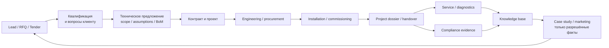
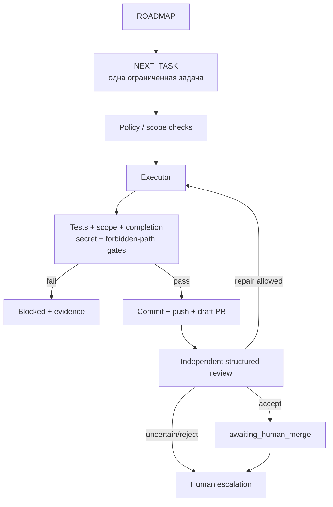
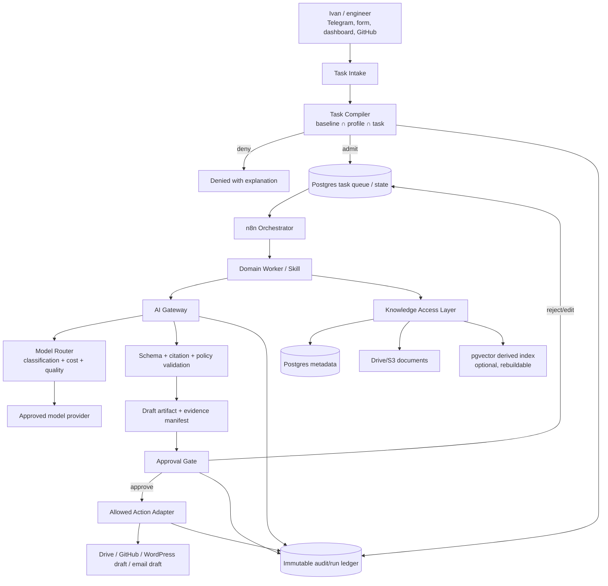
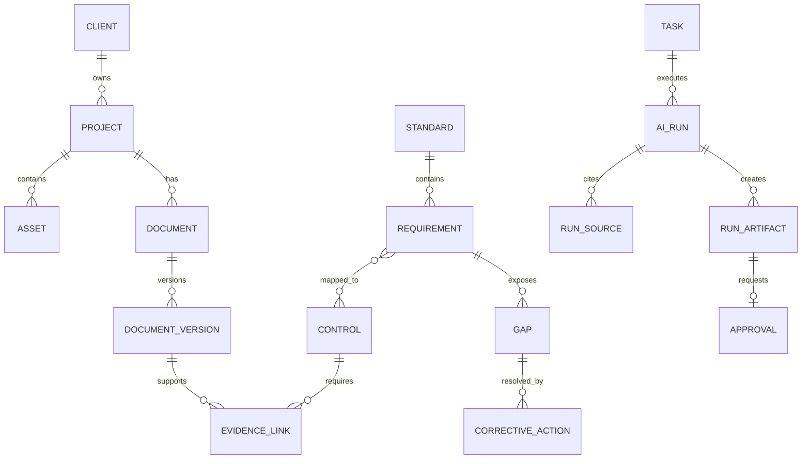
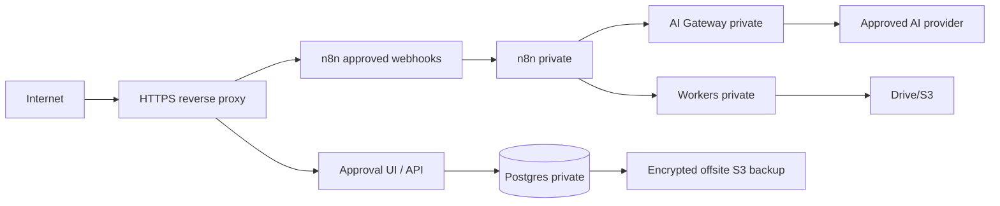

# AdaptEng AI Workforce
## Целевая архитектура, AI-сотрудники и план реализации

> **Версия:** 2.0-draft
> **Обновлено:** 2026-07-23
> **Владелец решения:** Ivan Shyla / AdaptEng
> **Статус:** единый рабочий документ до утверждения архитектуры
> **Область:** архитектура и план; документ ничего не запускает, не деплоит и
> не даёт агентам новых прав

Пока архитектура не утверждена, все изменения плана делаются **только в этом
файле**. После утверждения решения будут разложены на ADR, профили, схемы и
маленькие исполняемые задачи. Этот документ не заменяет
`context/ARCHITECTURE.md`, `context/LOOP_POLICY.md` и другие действующие
политики control-plane.

### Обозначения

- **Факт** — подтверждено текущим кодом, репозиторием или публичным сайтом.
- **Рекомендация** — предлагаемое целевое решение; ещё не реализовано.
- **Открыто** — требуется решение владельца или проверка реальными данными.
- **Запрещено** — действие, которое AI не должен выполнять автономно.

---

## 0. Решение в одном экране

### Что строим

Не чат-бота и не набор несвязанных автоматизаций, а **управляемую цифровую
команду AdaptEng**:

1. человек ставит бизнес-задачу;
2. control-plane проверяет полномочия и собирает ограниченный task contract;
3. профиль выбранного AI-сотрудника задаёт разрешённые данные и действия;
4. сотрудник выполняет одну ограниченную работу;
5. результат проходит детерминированные проверки и независимое ревью;
6. внешнее, необратимое или регулируемое действие ждёт подтверждения человека;
7. результат, источники, стоимость и решение сохраняются в аудите.

### Четыре главных решения

| Вопрос | Рекомендация |
|---|---|
| Какого сотрудника создавать первым? | **CEMS Compliance & Documentation Officer** — специалист по полноте проектной/сертификационной документации и доказательств. |
| Какой первый кейс? | **Project Dossier Completeness**: на одном обезличенном завершённом проекте собрать реестр документов, связать их с требованиями и показать пробелы. Не начинать с «полной автоматической сертификации». |
| Где хранить реализацию? | Новый приватный domain-repo `adapteng-compliance`; общий runtime, БД, n8n, AI Gateway и Approval Gate — в существующем `adapteng-automation-platform`; профиль и enforcement — в `ai-dev-loop-control-plane`. **Репозиторий создаётся по границе доверия, а не на каждого агента.** |
| Нужен ли Coolify? | **Не блокирует офлайн-пилот, но нужен до постоянной 24/7 эксплуатации.** На нём размещать Postgres, n8n, AI Gateway, Approval Gate и workers; сайт оставить на Cloudways. |

### Что необходимо улучшить в текущем агенте

**Да, улучшать нужно.** Его safety spine уже сильный, но бизнес-агент ещё не
готов. Приоритет:

1. завершить review/merge `TASK-016`;
2. реализовать `TASK-017`: preflight, shadow mode, изолированный worktree;
3. добавить artifact validation: output schema, citations, provenance и
   `completion_mode: artifact`;
4. только затем расширить coding task до business task contract;
5. реализовать AI Gateway, Approval Gate и единый run ledger;
6. добавить доказательную память: Postgres + документы + ссылки на источники;
7. ввести eval-наборы и измерять качество/стоимость;
8. только после полезного пилота переносить runtime на Coolify и включать 24/7.

### Главный принцип

> **AI не заменяет инженерное решение, подпись или сертификационный орган.
> AI собирает, проверяет, связывает, черновит и напоминает; человек подтверждает.**

---

## 1. Контекст AdaptEng и где возникает бизнес-ценность

### 1.1 Подтверждённый профиль компании

Публичный сайт AdaptEng описывает практическую инженерную работу с CEMS и
газоаналитическими системами:

- новые системы;
- модернизация;
- commissioning / пусконаладка;
- диагностика;
- field service;
- проекты и reference formats с ограниченным раскрытием.

Это растущая инженерная компания, где значительная часть знания находится у
владельца и инженеров, а результат продаётся и доказывается через документы,
чертежи, сертификаты, измерения, отчёты и историю выполненных работ.

**Важно:** упоминание EN 14181, EN 15267, QAL1/QAL2/QAL3/AST, ISO 9001 и других
стандартов в этом плане означает потенциально релевантные области. Это **не
заявление**, что AdaptEng уже имеет соответствующую сертификацию, аккредитацию
или допуск. Такие утверждения становятся публичными только после проверки
владельцем.

### 1.2 Главные ограничения роста

Для небольшой растущей инженерной компании типичны следующие узкие места:

1. **Founder bottleneck** — важные знания, решения и подтверждения проходят
   через одного человека.
2. **Разрозненные доказательства** — фото, сертификаты, протоколы, чертежи,
   письма и отчёты лежат в разных папках и плохо связаны с проектом/требованием.
3. **Повторное создание документов** — предложения, SOP, чек-листы, отчёты и
   project dossiers каждый раз собираются заново.
4. **Медленный ответ на RFQ/tender** — технические требования приходится
   вручную сравнивать с возможностями компании и комплектом оборудования.
5. **Потеря инженерного знания** — опыт диагностики остаётся в переписке и
   голове специалиста, а не становится повторно используемым активом.
6. **Регулируемый риск** — «быстрый» AI может придумать факт, неверно
   интерпретировать стандарт или раскрыть данные клиента.

AI Workforce должен уменьшать первые пять проблем, **не увеличивая шестую**.

### 1.3 Сквозной процесс компании



### 1.4 Где AI должен помочь в действительности

| Этап | Ручная проблема | Полезная работа AI | Результат для бизнеса |
|---|---|---|---|
| Lead/RFQ | Долго разбирать письмо и вложения | Извлечь требования, язык, сроки, неизвестные данные; подготовить вопросы | Быстрее ответ, меньше пропущенных требований |
| Proposal | Повторяются тексты и матрицы | Черновик scope, assumptions, exclusions, compliance matrix, document request list | Меньше времени владельца на первую версию |
| Project setup | Папки и названия создаются вручную | Создать approved folder template, manifest и checklist | Единый стандарт каждого проекта |
| Engineering | Документы оборудования разрознены | Классифицировать, дедуплицировать, связать с asset/project | Быстрый поиск и меньше ошибок комплектации |
| Commissioning | Отчёт собирается после работ | Подготовить черновик из утверждённых измерений и шаблона | Быстрее handover и invoice readiness |
| Compliance | Не видно покрытия требований | Requirement-to-evidence matrix и gap list | Понятная готовность к аудиту |
| Service | Диагностика остаётся в переписке | Структурировать symptom/cause/action/result | Накопление повторно используемого опыта |
| Marketing | Реальные кейсы долго упаковывать | Переиспользовать только public-approved evidence | Больше качественных кейсов без выдумок |

---

## 2. Что уже построено

### 2.1 Текущая архитектура control-plane

**Факт:** `ai-dev-loop-control-plane` уже реализует контролируемый цикл:



### 2.2 Доказанные возможности

| Возможность | Статус | Доказательство/ограничение |
|---|---|---|
| Одна bounded Python-задача → draft PR → human merge | **Доказано** | Реальный PR #3 |
| Scope/forbidden/secret/completion gates | **Доказано** | Используются в цикле и CI |
| Timeout, lock, watchdog, STOP, recovery | **Доказано** | Phase 2B, merge `8da49ec` |
| Идемпотентность push/PR/review comments | **Доказано** | Phase 2C, merge `1b5a9aa` |
| Структурное review + bounded repair | **Доказано детерминированно** | Merge `1b5a9aa`; live quality локального reviewer не доказано |
| Профиль проекта + fail-closed policy intersection | **Реализовано, ждёт human review** | `TASK-016`, 59 профильных тестов |
| Shadow mode + isolated target workspace | **Не реализовано** | Следующий `TASK-017` |
| Реальный target-repo pilot | **Не доказано** | Phase 3 не завершена |
| Бизнес-документы и persistent knowledge | **Не реализовано** | Нужен domain layer |
| Общий AI Gateway / Approval Gate runtime | **Архитектура принята, runtime не завершён** | ADR-0003 в automation platform |
| 24/7 без logged-in Windows | **Не доказано** | Scheduler использует `Interactive` logon |
| Multi-agent routing / budgets / dashboard | **Не реализовано** | Phase 4 |

### 2.3 Уже существующие активы AdaptEng

| Репозиторий/система | Реальная роль |
|---|---|
| `ai-dev-loop-control-plane` | Safety/control OS и AI Developer |
| `adapteng-automation-platform` | Общая governance/runtime-платформа: GitHub, Postgres design, n8n, AI Gateway/Approval Gate ADR |
| `adapteng-marketing` | Draft-only content system; media intake live, данные/публикация approval-gated |
| `adapteng-website` | Custom WordPress code; production на Cloudways |
| `Kraken` | Отдельный dry-run эксперимент; не core-процесс AdaptEng |

**Коррекция предыдущего подхода:** Kraken не следует считать приоритетным
AI-сотрудником компании. Его нужно держать отдельным экспериментом без доступа
к клиентским, финансовым и compliance-данным AdaptEng.

### 2.4 Главный архитектурный долг

Сейчас governance-паттерны повторяются в нескольких репозиториях. Нельзя
переписывать всё в один монолит. Нужно:

- оставить бизнес-логику в domain-repo;
- оставить runtime-инфраструктуру в `adapteng-automation-platform`;
- вынести общую policy enforcement и run lifecycle в control-plane;
- подключать domain через версионируемый профиль и task contract.

---

## 3. Каким должен быть полноценный AI-сотрудник

AI-сотрудник — это не выбранная модель и не один prompt. Полноценный сотрудник
состоит из девяти обязательных частей:

| Часть | Содержание |
|---|---|
| 1. Mission | Один измеримый бизнес-результат |
| 2. Profile | Данные, пути, capabilities, risk ceiling, gates |
| 3. Skills | Маленькие versioned функции с input/output schema |
| 4. Task contract | Конкретная задача, источники, лимит, owner, due date |
| 5. Memory | Структурированные факты и source references, не «история чата» |
| 6. Tools | Только разрешённые read/write adapters |
| 7. Evaluation | Golden cases, quality score, regression tests |
| 8. Approval | Явная граница автономии и human gate |
| 9. Audit | Кто/что/когда/какой моделью/за сколько/из каких источников |

Если хотя бы одной части нет, это либо assistant/demo, либо небезопасная
автоматизация, но не надёжный цифровой сотрудник.

### 3.1 Уровни автономии

| Уровень | Что разрешено | Пример |
|---|---|---|
| **A0 — Observe** | Только читать разрешённые данные и объяснять | Показать отсутствующие сертификаты |
| **A1 — Draft** | Создавать черновики и рекомендации | Черновик SOP или gap report |
| **A2 — Internal reversible** | Менять внутренний pending-state с логом и rollback | Добавить предложенный тег/задачу |
| **A3 — Human-approved action** | Выполнить внешнее действие только по одноразовому approval token | Создать WordPress draft, отправить approved email |
| **A4 — Autonomous high impact** | **Запрещено** | Самостоятельно подписать, подать, оплатить, удалить, смержить, деплоить |

Первый сотрудник стартует на **A0/A1**. A2 открывается только после пилота.
A3 — после рабочего Approval Gate. A4 не планируется.

---

## 4. Целевая архитектура AI Workforce

### 4.1 Компонентная схема



### 4.2 Ответственность слоёв

| Слой | Владеет | Не владеет |
|---|---|---|
| **Control-plane** | Admission, policy intersection, run identity, retries, evidence, review | Клиентские файлы, runtime credentials |
| **AI Gateway** | Model routing, cost caps, cache, schemas, provider audit | Бизнес-state и внешние действия |
| **Approval Gate** | Pending actions, single-use approvals, decision audit | Генерация контента |
| **n8n** | Оркестрация и расписание | Источник истины, policy decisions |
| **Postgres** | Канонический operational state | Бинарные документы |
| **Drive/S3** | Документы, фото, отчёты, offsite evidence | Workflow state |
| **GitHub** | Код, policy, schemas, templates, sanitized fixtures, controlled text | Secrets, raw client data, DB dumps, licensed standards |
| **Dashboard/Sheets** | Человеческая витрина | Канонические данные |

### 4.3 Общий task contract для бизнес-задачи

Текущий `NEXT_TASK` хорош для кода, но бизнес-сотрудникам нужен расширенный
контракт:

```yaml
task_id: CMP-0001
employee_id: cems-compliance-documentation-officer
task_type: project-dossier-gap-analysis
risk: low
autonomy: A1
owner: ivan
due_at: 2026-08-15T16:00:00Z

inputs:
  project_id: project-demo-001
  source_refs:
    - drive://restricted/project-demo-001
  data_classification: confidential

expected_output:
  schema: project-dossier-gap-report.v1
  artifact_target: drive://drafts/project-demo-001

limits:
  max_model_calls: 20
  max_cost_eur: 5
  max_duration_minutes: 30

capabilities:
  read_source_documents: true
  create_draft: true
  mark_evidence_verified: false
  send_external: false

required_gates:
  - source_citation
  - output_schema
  - cross_client_isolation
  - secret_scan
  - human_review
```

---

## 5. Какие AI-сотрудники полезны AdaptEng

### 5.1 Приоритет строится по бизнес-потоку, а не по моде

Оценка:

- **Value** — экономия времени, revenue impact, сохранение знания;
- **Readiness** — есть ли данные и повторяемый процесс;
- **Risk** — цена ошибки/раскрытия;
- **Dependency** — может ли агент использовать уже созданную базу.

### 5.2 Рекомендуемый штат

| Очередь | Сотрудник | Конкретная работа | Польза | Уровень старта |
|---|---|---|---|---|
| **1** | **CEMS Compliance & Documentation Officer** | Project dossier, evidence register, gap analysis, SOP/checklist drafts, deadlines | Создаёт фундамент знаний и снижает риск/ручной поиск | A0/A1 |
| **2** | **Bid & Proposal Engineer** | Разбор RFQ/tender, compliance matrix, assumptions/exclusions, proposal draft, question list | Быстрее предложения и больше пропускной способности продаж | A1 |
| **3** | **Project Delivery Coordinator** | Project setup, deliverable register, missing-document reminders, handover pack | Меньше потерь документов и задержек handover | A1/A2 |
| **4** | **Service Knowledge Engineer** | Структурирует symptom/cause/action/result, ищет похожие случаи, готовит service-report draft | Повторное использование опыта и быстрее диагностика | A0/A1 |
| Уже есть | **Marketing Evidence Worker** | Из доказательств создаёт draft case/LinkedIn/website package | Growth без выдуманных claim | A1/A3 после approval |
| Позже | **Lead & CRM Assistant** | Классификация inbound, follow-up draft, next action, stale-lead reminders | Не терять входящие возможности | A1/A2 |
| По необходимости | **Recruiting Assistant** | Vacancy/talent monitor, screening draft | Только при реальной потребности найма | A0/A1 |
| Позже | **Finance & Procurement Assistant** | PO/invoice checks, quote comparison, cashflow reminders | Экономия admin-time, но высокий риск | A0/A1 |
| Позже | **AI Workforce Coordinator** | Daily brief, маршрутизация задач, очередь approvals | Уменьшает founder bottleneck после появления 2–3 рабочих специалистов | A0/A1 |

### 5.3 Почему не начинать с «Chief of Staff»

Оркестратор без качественных domain skills и базы знаний только красиво
пересылает слабые результаты. Сначала нужен один специалист с измеримой работой,
затем второй; только после этого имеет смысл общий Workforce Coordinator.

### 5.4 Почему первый — Compliance & Documentation, а не чистый маркетолог

Marketing уже имеет рабочий draft-only pipeline. Первый новый сотрудник должен:

- работать с core CEMS evidence;
- создавать повторно используемую базу для proposal/project/service/marketing;
- давать пользу даже без внешней отправки;
- иметь проверяемый результат;
- быть безопасным на A0/A1.

---

## 6. Первый сотрудник: CEMS Compliance & Documentation Officer

### 6.1 Миссия

> Превращать разрешённые проектные и внутренние документы AdaptEng в
> контролируемый, цитируемый реестр требований/доказательств и подготавливать
> черновики, показывающие, что готово, чего не хватает и кто должен принять
> решение.

Он **не «проходит сертификацию вместо компании»**. Он сокращает подготовку,
устраняет хаос и делает готовность доказуемой.

### 6.2 Первый use case — Project Dossier Completeness

Почему это лучше первого шага «загрузить весь ISO 9001»:

- использует реальные процессы AdaptEng;
- даёт ценность за 2–4 недели;
- результат легко проверить инженеру;
- формирует структуру документов для следующих проектов;
- не требует на старте автоматической юридической интерпретации стандарта;
- создаёт evidence foundation для ISO/EN/QAL work.

#### Preconditions, без которых pilot не стартует

1. Компетентный человек создаёт и утверждает
   `expected_deliverables_profile` для **одного конкретного archetype проекта**.
2. Есть минимум одно реальное завершённое dossier, которое можно сделать
   de-identified копией без нарушения NDA.
3. На **том же dossier** вручную измерен baseline: время inventory, найденные
   gaps и время проверки.
4. Назначен domain reviewer, который размечает golden result.

Synthetic project используется только для contract/security/adversarial tests.
Он **не доказывает** экономию времени или бизнес-пользу.

Если эти четыре precondition нельзя выполнить быстро, первым value-pilot
становится **Bid & Proposal Engineer** на одном реальном обезличенном RFQ:
такие входы часто проще получить, а качество draft измеряется быстрее.

**Вход value-pilot:** одна de-identified копия реального завершённого проекта,
утверждённый список ожидаемых deliverables и шаблон структуры проекта.

**Выход:**

1. `project_manifest`;
2. document inventory с хешами и версиями;
3. dossier completeness matrix;
4. список дубликатов/устаревших версий;
5. gap list с owner/priority/due date;
6. draft request list для недостающих документов;
7. evidence manifest со ссылкой на каждый источник;
8. executive summary на одну страницу.

### 6.3 Следующие навыки

| Skill | Вход | Выход | Обязательная проверка |
|---|---|---|---|
| `document-intake` | Разрешённый файл | Тип, проект, версия, classification, hash, proposed tags | Malware/type/size, duplicate, cross-client |
| `dossier-gap-analysis` | Expected deliverables + inventory | Gap report | Каждая строка имеет source/rule ref |
| `requirement-mapper` | Licensed/approved requirement summary + evidence | Draft mapping | Human verifies interpretation |
| `sop-drafter` | Approved template + controls + AdaptEng facts | SOP draft | No unsupported claims |
| `audit-checklist` | Approved controls + scope | Internal audit checklist | Human scope approval |
| `deadline-monitor` | Approved due dates | Reminders/escalation draft | No external send without approval |
| `project-handover-pack` | Approved document versions | Draft index/pack | Human confirms release set |

### 6.4 Правила, которые нельзя ослаблять

- нет source reference → ответ `unknown/missing`, а не догадка;
- интерпретация стандарта всегда `draft_interpretation`;
- evidence не становится `verified` без человека;
- AI не подписывает и не подаёт документы;
- AI не создаёт публичные claims о certification/experience;
- клиентские документы одного проекта не попадают в контекст другого;
- licensed standard text не коммитится в Git и не отправляется внешней модели
  без разрешения лицензии и data policy;
- числовые измерения не изменяются моделью; допускаются только deterministic
  parse/validation и human-approved calculations.

### 6.5 Рабочий день сотрудника

**Утро (автоматически):**

- проверяет pending inbox;
- показывает просроченные gaps/deadlines;
- формирует daily brief: «3 документа требуют классификации, 2 gaps overdue,
  1 draft ждёт review»;
- ничего не отправляет наружу.

**По задаче владельца:**

```text
"Проверь полноту досье проекта X перед handover"
→ task proposal с источниками, scope, cost limit
→ owner confirms
→ read-only scan
→ structured gap report с citations
→ owner edits/approves
→ approved internal tasks создаются в реестре
```

**Еженедельно:**

- отчёт по coverage, overdue gaps, pending approvals;
- список документов без owner/expiry/version;
- список изменений источников, требующих revalidation.

### 6.6 KPI первого сотрудника

| KPI | Pilot target |
|---|---|
| Source citation coverage | **100%** для factual rows |
| Cross-client leakage | **0** |
| Unsupported certification/public claims | **0** |
| Schema-valid outputs | **100%** |
| Human acceptance with minor edits | ≥ 70% после первых 10–20 кейсов |
| Сокращение времени inventory/gap report | ≥ 30% против baseline после проверки минимум на 3 dossiers; первый dossier — discovery |
| Overdue critical gaps without escalation | 0 |
| Cost per accepted dossier report | Измеряется; лимит утверждается до live |

---

## 7. Взаимодействие человека с AI Workforce

### 7.1 Один inbox, но не один бесконечный чат

Рекомендуемый UX:

- **Telegram bot или простая web-form** — поставить задачу/подтвердить действие;
- **Approval dashboard** — увидеть source refs, diff, стоимость и approve/reject;
- **GitHub PR** — для code/policy/template changes;
- **Drive link** — для draft документов;
- **ежедневная сводка** — только items that need human action.

Чат — интерфейс, но **не память и не источник истины**.

### 7.2 Task lifecycle

```text
proposed
→ admitted
→ queued
→ running
→ validating
→ needs_human_review
→ approved | needs_edit | rejected | expired
→ executed (если действие разрешено)
→ reconciled
```

Любой crash/retry сначала reconciles существующий run; модель не вызывается
повторно только ради восстановления уже созданного результата.

### 7.3 Approval card должна показывать

- что именно произойдёт;
- какие файлы/записи изменятся;
- источники и diff;
- classification данных;
- provider/model;
- стоимость;
- срок действия approval;
- rollback/recovery;
- почему требуется человек.

Approve без этой информации — невалидный.

---

## 8. Границы репозиториев

### 8.1 Правило

> **Не «один репозиторий на сотрудника», а один репозиторий на отдельную
> границу доверия, lifecycle и ownership.**

### 8.2 Целевая карта

| Репозиторий | Владеет | Не хранит |
|---|---|---|
| `ai-dev-loop-control-plane` | Generic runtime, profiles, policy compiler, admission, evidence, reviewer lifecycle | Client documents, domain knowledge, runtime secrets |
| `adapteng-automation-platform` | Coolify/runtime design, Postgres migrations, n8n exports, AI Gateway, Approval Gate, shared audit schemas | Raw client docs, plaintext secrets |
| **`adapteng-compliance` (новый, private)** | Compliance domain schemas, skills, mappings, templates, tests, controlled AdaptEng-authored QMS text | Raw evidence, DB dumps, licensed full standards, credentials |
| `adapteng-marketing` | Marketing policy, skills, schemas, drafts, sanitized evidence rules | Raw confidential project archive |
| `adapteng-website` | WordPress custom code | AI runtime, client evidence |
| `Kraken` | Изолированный dry-run experiment | Любые AdaptEng business/client data |

### 8.3 Почему новый `adapteng-compliance`

- отдельная NDA/data-access boundary;
- отдельный document-control lifecycle;
- проще доказать least privilege;
- compliance-domain changes не смешиваются с runtime/ops;
- можно дать auditor/consultant read-only доступ без доступа к платформенному
  коду;
- отдельный CI/eval набор.

Но runtime не дублируется: Postgres/n8n/Gateway остаются в общей платформе.

---

## 9. Целевая файловая структура

Ниже — **проектируемая**, а не уже существующая структура.

### 9.1 `adapteng-compliance` (Git)

```text
adapteng-compliance/
├── README.md
├── GOVERNANCE.md
├── DATA_CLASSIFICATION.md
├── AGENTS.md
├── docs/
│   ├── architecture/
│   │   ├── domain-model.md
│   │   ├── document-lifecycle.md
│   │   └── evidence-provenance.md
│   ├── decisions/                   # Domain ADR
│   └── runbooks/
│       ├── intake-project-dossier.md
│       ├── verify-evidence.md
│       └── prepare-audit-pack.md
├── catalog/
│   ├── standards/                   # Только metadata/licensed reference
│   │   ├── iso-9001.yaml
│   │   └── en-14181.yaml
│   ├── document-types.yaml
│   └── equipment-types.yaml
├── controls/
│   ├── company-qms/                 # AdaptEng-authored controls
│   ├── project-dossier/
│   └── cems/
├── mappings/
│   ├── controls-to-requirements/
│   └── evidence-to-controls/
├── qms/
│   ├── policies/                    # Controlled company-authored text
│   ├── procedures/
│   ├── work-instructions/
│   └── forms/
├── skills/
│   ├── document-intake/
│   ├── dossier-gap-analysis/
│   ├── requirement-mapper/
│   ├── sop-drafter/
│   └── audit-checklist/
├── schemas/
│   ├── source-document.schema.json
│   ├── evidence-item.schema.json
│   ├── gap-report.schema.json
│   ├── project-manifest.schema.json
│   └── approval-request.schema.json
├── templates/
│   ├── sop/
│   ├── audit/
│   ├── project-dossier/
│   └── handover/
├── policies/
│   ├── claims.yaml
│   ├── retention.yaml
│   ├── model-routing.yaml
│   └── approval-matrix.yaml
├── fixtures/
│   └── sanitized/                   # Synthetic/redacted only
└── tests/
    ├── unit/
    ├── contracts/
    ├── security/
    └── evals/
```

### 9.2 Что никогда не кладётся в Git

```text
NO:
├── full licensed ISO/EN standard PDFs
├── raw client contracts or emails
├── client names mapped to pseudonymous IDs
├── calibration/measurement raw exports with client identity
├── signed certificates and submissions
├── database dumps
├── n8n credentials/execution logs
└── .env, API keys, tokens, passwords
```

### 9.3 Runtime document storage (Drive или S3)

```text
AdaptEng-Controlled/
├── 00_INBOX/
│   ├── company/
│   └── projects/
├── 10_COMPANY_QMS/
│   ├── policies/
│   ├── procedures/
│   ├── forms/
│   ├── approved/
│   └── obsolete/
├── 20_STANDARDS_LICENSED/            # restricted access
├── 30_PROJECTS/
│   └── {project_id}/
│       ├── 00_manifest/
│       ├── 10_scope_contract/
│       ├── 20_design_inputs/
│       ├── 30_drawings_calculations/
│       ├── 40_equipment_certificates/
│       ├── 50_installation/
│       ├── 60_commissioning/
│       ├── 70_qal_ast_compliance/
│       ├── 80_handover_approved/
│       ├── 90_service_history/
│       └── 99_archive/
├── 40_AUDITS/
├── 50_CERTIFICATION/
├── 60_TEMPLATES/
└── 90_BACKUP_EVIDENCE/
```

### 9.4 Именование

```text
AE-{project_id}-{document_id}-{doc_type}-{YYYYMMDD}-v{NN}.{ext}

Пример:
AE-P0007-D0042-COMMISSIONING-REPORT-20260723-v03.pdf
```

Имя содержит только **неизменяемую идентичность версии**. Статус не включается
в имя: переход `REVIEW → APPROVED` не переименовывает файл и не ломает
`source_id`, citations и evidence links. Канонический status хранится в
`core.document_versions`.

Разрешённый lifecycle:

```text
DRAFT → REVIEW → APPROVED → ISSUED → OBSOLETE
```

`APPROVED/ISSUED` может установить только человек или deterministic adapter
после валидного одноразового human approval.

### 9.5 Project manifest

Каждый проект получает machine-readable manifest:

```yaml
schema_version: 1
project_id: P0007
client_ref: C0012
classification: confidential
data_region: eu
owner: ivan
status: active
expected_deliverables_profile: cems-project-v1
source_root: drive://30_PROJECTS/P0007
retention_policy: client-contract-default
ai_access:
  permitted: true
  max_classification: confidential
  external_provider: false
```

Реальное соответствие `client_ref → client name` хранится в restricted store,
не в Git и не в публичном dashboard.

---

## 10. Данные и база знаний

### 10.1 Data ownership

| Тип | Каноническое место | Почему |
|---|---|---|
| Code/policy/schema/template | GitHub | Versioning, review, CI |
| Operational status/tasks/approvals | Postgres | Transactions, queries, history |
| Binary/source documents | Drive или S3 | ACL, large files, lifecycle |
| Credentials | Coolify secret store / approved vault | Никогда не Git/DB text |
| Human dashboard | Sheets/web UI | Представление, не truth |
| Semantic index | pgvector | Производный cache, rebuildable |
| Chat messages | Краткоживущий interface log | Не authoritative memory |

### 10.2 Общая схема Postgres

```text
core.organizations
core.clients
core.sites
core.projects
core.assets
core.documents
core.document_versions
core.source_files
core.tasks
core.task_events
core.approvals
core.audit_events

ai.employees
ai.employee_profiles
ai.skills
ai.skill_versions
ai.runs
ai.run_sources
ai.run_artifacts
ai.calls
ai.cost_ledger
ai.evaluations

compliance.standards
compliance.standard_editions
compliance.requirements
compliance.controls
compliance.requirement_controls
compliance.evidence_items
compliance.evidence_links
compliance.gaps
compliance.corrective_actions
compliance.audits
compliance.deadlines

commercial.opportunities
commercial.requirements
commercial.proposals
commercial.proposal_versions
commercial.assumptions
commercial.exceptions

service.events
service.findings
service.actions
service.knowledge_cases
```

`core.document_versions` — единственный канонический источник файла/версии.
`compliance.evidence_items` — не копия документа, а утверждение вида «эта
версия документа подтверждает control X в scope Y». Связь materialized через
`compliance.evidence_links`; один evidence item может ссылаться на несколько
`document_versions`, а одна версия — поддерживать несколько controls.

### 10.3 Ключевые связи



### 10.4 Обязательные provenance-поля

Каждый AI-вывод, который содержит факт, должен иметь:

- `source_id`;
- `source_version`;
- `source_hash`;
- `page_or_section`;
- `extracted_at`;
- `classification`;
- `project_id/client_ref`;
- `extractor_version`;
- `confidence`;
- `human_verification_status`.

Если источник поменялся, связанные выводы получают `stale` и требуют
revalidation.

### 10.5 Data classification

| Класс | Примеры | AI policy |
|---|---|---|
| **PUBLIC** | Опубликованный сайт, approved case | Разрешён approved provider |
| **INTERNAL** | Шаблоны, внутренние инструкции без client data | Разрешён approved provider по policy |
| **CONFIDENTIAL** | Проектные документы, коммерческие предложения | Только approved provider/region/retention; минимальный context |
| **RESTRICTED** | Client-identifiable evidence, contracts, signed reports | Local/private processing или explicit owner approval |
| **SECRET** | Credentials, tokens, passwords | **Никогда не передаётся модели** |

Для EU-клиентов до live необходимо зафиксировать GDPR/DPA, data region,
retention и список одобренных AI providers. Это governance-требование, не
юридическое заключение.

### 10.6 RAG и «память»

Не строить «вечную память» из всех чатов. Правильная память:

1. structured records в Postgres;
2. source documents в Drive/S3;
3. versioned templates/policies в Git;
4. pgvector — только поисковый индекс;
5. каждый найденный chunk возвращается с source/page/hash;
6. результат без citations не проходит gate.

Vector search добавляется **после** нормальной metadata/schema-модели, а не
вместо неё.

### 10.7 Licensed standards и авторское право

- Не коммитить полные тексты платных ISO/EN стандартов.
- Не копировать стандарт целиком в prompts, fixtures или external model context.
- Хранить metadata, edition, owned summary, control mapping и ссылку на
  лицензированный источник.
- Использовать текст только в рамках купленной лицензии и утверждённой data
  policy.
- Любая AI-интерпретация стандарта остаётся draft и проверяется компетентным
  человеком.

---

## 11. Как улучшить именно текущий AI-агент

### 11.1 Что не нужно переписывать

Сохраняем:

- bounded one-task discipline;
- fail-closed policies;
- human merge;
- secret/forbidden/scope gates;
- resumable state;
- deterministic evidence;
- independent review.

Это сильнее большинства «автономных agent demo».

### 11.2 Что нужно добавить — по порядку

#### A. Сначала завершить безопасное cross-repo исполнение

1. Human review и merge `TASK-016`.
2. `TASK-017`: target discovery, preflight, shadow mode, isolated worktree.
3. Crash/retry/idempotency tests.
4. Policy explain: почему capability/path разрешён или запрещён.
5. Drift detector: profile invalidated при изменении target instructions/tests.

До этого **не подключать** реальный compliance repo к автоматической записи.

#### B. Сначала построить проверку business artifact

До расширения task schema реализовать:

- `completion_mode: artifact`;
- output-schema validation;
- source/citation/provenance gate;
- content-addressed artifact manifest;
- temporary local artifact store для offline tests;
- deterministic completion check, не зависящий от Git diff.

Business task нельзя admit, пока эти поля не потребляются реальным gate.

#### C. Затем расширить task model с кода на бизнес-артефакты

Добавить к contract и валидатору:

- `employee_id`, `task_type`, `business_owner`;
- source references и data classification;
- output schema и artifact target;
- cost/time/model-call budgets;
- autonomy level;
- required approvals;
- business KPI;
- retention policy.

#### D. Реализовать общий AI Gateway

Функции из принятого ADR:

- `extract`, `classify`, `score`, `draft`, `summarize`;
- provider/model routing по classification + quality + price;
- schema validation;
- input hash/cache;
- token/cost ledger и caps;
- prompt/skill version;
- redaction и context minimization;
- provider timeout/retry/circuit breaker.

Прямые model calls из production n8n workflows запрещаются.

#### E. Реализовать Approval Gate

- single-use expiring token (в БД только hash);
- `pending → needs_edit → approved → executed`;
- terminal: `rejected/expired/failed/cancelled`;
- capture approver/time/diff/result;
- fail closed при недоступности;
- никакого «временного bypass» для external/high-impact action.

#### F. Добавить quality engineering

Для каждого skill:

- JSON Schema input/output;
- 10–30 human-labeled golden cases: synthetic для adversarial behavior и
  отдельно approved de-identified real cases для business quality;
- negative/adversarial cases;
- unsupported-claim test;
- prompt-injection document test;
- cross-client isolation test;
- citation completeness test;
- human rubric;
- regression gate при смене модели/prompt.

Модель нельзя менять в production только потому, что новая «кажется умнее».
Она проходит benchmark на тех же cases.

Создание golden cases — отдельная экспертная работа. В Phase A назначается
domain reviewer, а в Phase C планируется его время минимум на 10 размеченных
cases; без этого semantic skill не считается готовым.

#### G. Добавить business observability

Минимальный run ledger:

- task/employee/profile/skill versions;
- exact source hashes;
- model/provider/tokens/cost;
- output schema/citations;
- validation/review/approval;
- human edit/accept/reject;
- duration и business outcome.

#### H. Улучшить reviewer

Локальный Ollama reviewer timed out; поэтому:

- deterministic checks остаются первым слоем;
- semantic review — approved external model или adequately sized server model;
- executor и reviewer не должны быть одной конфигурацией;
- low confidence → человек;
- factual compliance output проверяется по citations, а не «мнению reviewer».

#### I. Добавить защищённый document pipeline

- MIME/type/size allowlist;
- malware scan;
- OCR отдельно от reasoning;
- macro/script stripping;
- file hash/dedup;
- prompt-injection markers;
- classification before model access;
- immutable source version;
- no cross-project retrieval.

### 11.3 Не смешивать dev-loop и runtime AI-сотрудника

Это два связанных, но разных трека:

#### Track A — доказать generic AI Developer loop

Действующий Phase 3 blueprint с `TASK-018/019/020` номинирует Kraken dry-run.
Он проверяет isolated code execution, delivery и reconciliation на
**существующем codebase**. Этот план не переписывает и не «осиротит» уже
утверждённую ladder:

- `TASK-017` остаётся generic;
- `TASK-018/019/020` выполняются по отдельному owner decision на Kraken либо
  заменяются только новой полноценной architecture/task decision;
- Kraken не получает доступ к AdaptEng business data.

#### Track B — построить compliance employee

Новый green-field `adapteng-compliance` сначала создаётся обычными bounded
human/Codex development tasks: schemas, templates, skills и tests. Текущий
executor ограничен существующими Python-файлами и не подходит для первичного
создания этого репозитория.

Сам Compliance Officer работает как **runtime workflow**
`n8n → worker → AI Gateway → validation → Approval Gate`, а не как dev-loop,
который редактирует Git.

Позже, когда control-plane получит `completion_mode: artifact`, создание файлов
и отдельный task contract, его можно использовать для сопровождения
compliance-кода. «Первый полезный бизнес-сотрудник» не означает «первый
Phase 3 code target».

---

## 12. Coolify: нужен ли сервер и как его использовать

### 12.1 Решение

**Coolify не нужен, чтобы сделать offline proof на de-identified real copy.
Coolify нужен до постоянной общей 24/7 эксплуатации.**

Не начинать проект с недель инфраструктуры. Сначала доказать один полезный
workflow локально/в shadow. После value gate развернуть shared runtime.

### 12.2 Что размещать

| Компонент | Решение |
|---|---|
| Postgres | Да, private network, без public port |
| n8n | Да, UI только через protected access; публичны только нужные webhooks |
| AI Gateway | Да |
| Approval Gate/API/UI | Да, protected access |
| Domain workers | Да, отдельные containers, least privilege |
| Redis/queue | Не нужен на пилоте; добавить по measured need |
| pgvector | Extension Postgres после metadata foundation |
| Ollama | Только при GPU/измеренной выгоде; CPU VPS не делать blocker |
| WordPress | **Нет**, оставить на Cloudways и изолировать |
| Git repos | GitHub; runtime получает deploy key с minimum scope |
| Secrets | Coolify secret store/approved vault; никогда в Git |

### 12.3 Pilot topology



### 12.4 Минимальный pilot server

Рекомендация для старта (уточняется нагрузочным тестом):

- EU VPS;
- Ubuntu 24.04 LTS;
- 4 vCPU;
- 8 GB RAM;
- 80+ GB NVMe;
- без GPU;
- отдельный offsite S3-compatible backup;
- SSH keys only, firewall, automatic security updates;
- dashboard/n8n protected VPN/SSO/Cloudflare Access;
- Postgres не публикуется наружу.

Это не HA. Для растущей компании pilot может быть single-node, если:

- есть offsite backup;
- restore проверяется;
- downtime допустим;
- нет автоматического high-impact action.

При критичности БД: вынести Postgres в managed/replicated service и отделить
workers от control services.

### 12.5 Backup/restore

Coolify официально поддерживает scheduled PostgreSQL backup через `pg_dump`
и S3-compatible storage. Архитектурное правило AdaptEng:

- DB backup каждые 6–24 часа (по выбранному RPO);
- Coolify configuration/secret material — encrypted offsite backup;
- документы — отдельная versioning/backup policy;
- ежемесячный restore drill на изолированном окружении;
- backup без успешного restore evidence считается отсутствующим.

Pilot targets:

- **RPO:** 24 часа;
- **RTO:** 8 часов.

После появления live client workflow цели пересматриваются.

### 12.6 Когда переносить сам control-plane

Только когда:

1. `TASK-017` isolation/shadow доказан;
2. первый employee pilot достиг KPI;
3. AI Gateway и Approval Gate работают fail-closed;
4. secrets/backup/restore/monitoring готовы;
5. Linux container acceptance повторяет важные Windows gates;
6. owner approves provider/data policy.

После этого Linux/Coolify снимает текущую зависимость от Windows
`Interactive` logon и даёт реальный 24/7 runtime.

---

## 13. Security, privacy и governance

### 13.1 Threat model

| Риск | Контроль |
|---|---|
| Hallucinated technical/certification claim | Source-required output, schema, human review |
| Cross-client data leakage | Project-scoped retrieval, RLS, negative tests |
| Prompt injection in PDF/email | Documents are untrusted data; no tool instruction from source |
| Secret leakage | Secret store, deny patterns, no model access |
| Wrong/obsolete document version | Hash + version + stale propagation |
| Unauthorized external action | Approval Gate, single-use token, least privilege |
| Runaway cost/loop | Budgets, dedupe, circuit breaker |
| Deleted/corrupt data | Versioning, offsite backup, restore drill |
| Compromised worker | Isolated container/service account, no shared broad credentials |
| Bad model update | Golden evals + canary + rollback |

### 13.2 Role/access model

| Роль | Доступ |
|---|---|
| Owner | Approval всех high-impact действий и policy changes |
| Engineer | Свои проекты, draft/review, evidence proposal |
| Compliance reviewer | Standards/control mapping и verification |
| AI employee | Только профиль + task-scoped temporary access |
| Runtime service | Minimum machine permissions |
| Auditor/consultant | Read-only approved scope, time-limited |

Postgres должен использовать schema-level permissions и, где возможно,
row-level security по `client_ref/project_id`.

### 13.3 Approval matrix

| Действие | AI самостоятельно? |
|---|---|
| Читать разрешённый sanitized/internal источник | Да (A0) |
| Создать draft/gap/task proposal | Да (A1) |
| Обновить pending metadata с rollback | После пилота (A2) |
| Пометить evidence `verified` | **Нет** |
| Подписать/submit certification document | **Нет** |
| Отправить email клиенту | Только одноразовый human approval |
| Опубликовать content | Только human approval; лучше draft adapter |
| Изменить production data/config | Только human approval + отдельный runbook |
| Merge/deploy/billing/DNS/delete | **Нет автономно** |

### 13.4 Kill switch и degraded mode

- один глобальный STOP;
- project/employee circuit breaker;
- Gateway down → AI task pending, не direct-call bypass;
- Approval Gate down → action pending, не auto-execute;
- Postgres down → no writes;
- evidence mismatch/stale → block;
- suspected leakage → stop affected employee, preserve audit, rotate credentials
  out of band, notify owner.

---

## 14. План реализации

### Принцип

Каждый этап маленький, измеримый и обратимый. «Всё сразу на Coolify» и
«сразу 7 агентов» запрещены как преждевременное усложнение.

### Phase A — Утверждение архитектуры и данных

**Работа:**

- утвердить этот документ;
- выбрать один реальный historical project и подготовить de-identified копию;
- утвердить data classification/NDA/provider policy;
- вручную создать и утвердить `expected_deliverables_profile` для его archetype;
- измерить baseline времени и результата ручного dossier inventory **на том же
  project**;
- назначить domain reviewer и зарезервировать время на 10 golden cases.

**Exit gate:** есть de-identified real dataset, human-approved expected profile,
baseline, domain reviewer и письменные data/provider решения. Если этого нет,
проверяется альтернативный pilot Bid & Proposal на реальном de-identified RFQ.

### Phase B — Завершить generic control-plane foundation

**Работа:**

- review/merge `TASK-016`;
- реализовать `TASK-017` preflight/shadow/isolated workspace;
- доказать no-write shadow, cleanup, crash/retry;
- добавить policy explain.

**Exit gate:** неизвестный/грязный/неразрешённый target блокируется до model call.

### Phase C — Создать domain foundation

**Работа:**

- создать private `adapteng-compliance`;
- добавить governance/data classification/schemas/templates;
- добавить профиль сотрудника;
- создать synthetic fixtures для security/contracts и отдельно de-identified
  human-labeled golden cases для quality;
- реализовать deterministic `document-intake`.

**Exit gate:** Git не содержит client/raw/licensed/secret data; fixtures и
profile проходят gates.

### Phase D — Offline MVP первого сотрудника

**Работа:**

- `dossier-gap-analysis`;
- source/hash/version manifest;
- одна de-identified копия реального project (не live connector);
- human rubric и baseline comparison;
- storage-portable repository interface;
- временный local SQLite + content-addressed JSON artifact bundle вне Git;
- output только локальный draft.

Cost сохраняется в local run manifest, если provider возвращает usage; строгий
budget enforcement и канонический cost ledger начинаются в Phase E.

**Exit gate:** discovery на первом dossier показывает корректность и
повторяемость, critical issue = 0. Бизнес-target 30% подтверждается только
после минимум трёх dossiers.

### Phase E — Shared runtime на Coolify

**Entry gate:**

- отдельный audit текущей зрелости `adapteng-automation-platform`;
- AI Gateway и Approval Gate имеют исполняемые contracts/tests либо включены в
  scope Phase E как явная разработка;
- owner подтвердил реалистичный календарь и бюджет.

**Работа:**

- Postgres + n8n;
- AI Gateway + cost ledger;
- Approval Gate;
- private networking/secrets;
- offsite backup + restore drill;
- observability/alerts.

**Exit gate:** no-op + synthetic workflow 24/7 проходит; failure modes fail
closed; restore доказан.

### Phase F — Read-only real-data pilot

**Работа:**

- один approved real project;
- read-only Drive connector;
- RLS/project isolation;
- daily/weekly reports;
- никаких external actions.

**Exit gate:** 2–4 недели без leakage/unsupported claims; measured time saving.

### Phase G — Approval-gated drafts

**Работа:**

- создавать draft SOP/checklist/handover index;
- approval cards;
- versioned document lifecycle;
- human-approved Drive/Git writes.

**Exit gate:** accepted drafts, полный audit, rollback/reconciliation.

### Phase H — Второй сотрудник: Bid & Proposal Engineer

**Работа:**

- RFQ extraction;
- clarification question list;
- compliance matrix;
- assumptions/exclusions;
- proposal draft;
- переиспользование verified compliance/product knowledge.

**Exit gate:** proposal lead time снижен; factual/price claims проверяются
человеком; ничего не отправляется автоматически.

### Phase I — Project/Service agents и Coordinator

Добавлять по одному после измеренного bottleneck. Workforce Coordinator
появляется только когда есть минимум два принятых specialist workflow.

### 90-дневный ориентир

| Период | Результат |
|---|---|
| Days 1–14 | Решения, de-identified real project copy, expected profile, baseline, TASK-016 review |
| Days 15–35 | TASK-017 + domain repo + schemas/fixtures |
| Days 36–55 | Offline dossier MVP + eval |
| Days 56–75 | Coolify shared runtime + restore proof |
| Days 76–90 | Read-only real-data pilot и решение go/no-go |

Сроки — **условный ориентир, не обещание**. Интервал 56–90 дней действует только
если maturity audit подтвердил готовые Gateway/Approval contracts. Если сегодня
существует только ADR, график re-baseline после оценки объёма. Exit gates важнее
календаря.

---

## 15. Как измерять пользу и не строить «театр AI»

### 15.1 До пилота измерить baseline

- сколько часов занимает inventory project dossier;
- сколько времени уходит на поиск документа;
- сколько документов обнаруживаются поздно;
- сколько времени занимает первая версия proposal/SOP/checklist;
- сколько задач ждут только владельца;
- стоимость текущей ручной работы.

### 15.2 Business scorecard

| Категория | Метрика |
|---|---|
| Speed | Lead time до первого полезного draft |
| Capacity | Принятых artifacts в месяц |
| Quality | Acceptance rate, edit distance, factual corrections |
| Evidence | Citation coverage, stale sources, missing documents |
| Risk | Leaks, unsupported claims, unauthorized actions |
| Cost | AI + infra + human review cost per accepted artifact |
| Founder leverage | Часы владельца на artifact до/после |
| Revenue support | Proposal turnaround и opportunities supported |

### 15.3 Простая экономика

```text
monthly_value =
  verified_hours_saved × loaded_hour_cost
  + measured_revenue_contribution
  - model_cost
  - infrastructure_cost
  - human_review_cost
  - maintenance_cost
```

«Количество токенов», «число агентов» и «число automation runs» не являются
бизнес-ценностью.

### 15.4 Go/no-go первого пилота

**Go**, если:

- 100% factual rows имеют citations;
- нет critical security/privacy issue;
- ≥ 70% outputs принимаются с небольшими правками после learning period;
- ручное время сокращено минимум на 30%;
- стоимость понятна и ограничена;
- инженер хочет использовать workflow снова.

**No-go/redesign**, если:

- источники часто отсутствуют/неструктурированы;
- review занимает столько же, сколько ручная работа;
- модель придумывает technical facts;
- невозможно гарантировать client isolation;
- Coolify/AI cost выше полезного эффекта;
- процесс ещё не повторяем даже вручную.

---

## 16. Основные риски плана

| Риск | Как не допустить |
|---|---|
| Слишком много агентов сразу | Один specialist workflow до доказанной пользы |
| Infra-first | Offline MVP до Coolify deployment |
| Repo sprawl | Repo по trust boundary, profiles по сотрудникам |
| «RAG решит всё» | Сначала metadata/schema/provenance |
| Слепое доверие LLM | Citations + deterministic gates + human |
| Copyright standards | Metadata/mapping, licensed access, no full text in Git |
| Реальные данные в Git/CI test | Только synthetic fixtures; de-identified golden set хранится restricted вне Git/CI |
| Founder остаётся bottleneck | Approval cards, daily action-only brief, измерять review time |
| Слишком строгий процесс не используется | UX: один inbox, быстрые drafts, minimum required fields |
| Vendor lock-in | AI Gateway, portable schemas, provider benchmarks |
| Single VPS failure | Offsite backup + restore; managed DB при росте |

---

## 17. Решения владельца

До реализации нужно зафиксировать:

- [ ] **Первый сотрудник:** CEMS Compliance & Documentation Officer.
- [ ] **Первый use case:** Project Dossier Completeness на одном
  реальном de-identified завершённом проекте; synthetic — только tests.
- [ ] **Репозиторий:** новый private `adapteng-compliance`.
- [ ] **Два трека:** текущий Phase 3 dev-loop ladder не смешивается с runtime
  Compliance Officer; изменение Kraken target — только отдельным решением.
- [ ] **Ground truth:** domain reviewer утверждает
  `expected_deliverables_profile` и 10 golden cases.
- [ ] **Data policy:** PUBLIC / INTERNAL / CONFIDENTIAL / RESTRICTED / SECRET.
- [ ] **NDA:** anonymize-by-default или explicit client consent.
- [ ] **AI provider policy:** какие классы данных можно отправлять какому
  provider, region и retention.
- [ ] **Licensed standards policy:** какие документы куплены и как разрешено их
  обрабатывать.
- [ ] **Coolify:** после offline value gate; выбрать EU VPS и бюджет.
- [ ] **Pilot RPO/RTO:** 24h / 8h либо другое.
- [ ] **Owner/reviewer:** кто подтверждает technical/compliance interpretation.

---

## 18. Следующий конкретный шаг

Пока работаем только в этом документе. После его утверждения:

1. оформить отдельную bounded task на review/merge `TASK-016`;
2. выполнить `TASK-017` без изменения реального target;
3. подготовить de-identified копию реального project dossier, expected profile
   и baseline;
4. обычной bounded development task создать `adapteng-compliance` foundation,
   не выдавая green-field repo за Phase 3 runtime target;
5. выполнить offline MVP и value gate;
6. Coolify разворачивать после offline value gate, maturity audit
   Gateway/Approval и отдельного owner approval.

---

## 19. Источники и проверяемые предпосылки

### Внутренние источники

- `context/ARCHITECTURE.md`
- `context/LOOP_POLICY.md`
- `context/QUALITY_GATES.md`
- `context/CURRENT_STATUS.md`
- `context/ROADMAP.md`
- `docs/PHASE3_IMPLEMENTATION_BLUEPRINT.md`
- `adapteng-automation-platform/README.md`
- `adapteng-automation-platform/docs/architecture.md`
- `adapteng-automation-platform/docs/decisions/ADR-0003-ai-gateway-approval-gate.md`
- `adapteng-automation-platform/docs/DOMAINS.md`
- `adapteng-marketing/STATUS.md` (обновлён 2026-07-20)
- `adapteng-website/README.md`

### Публичные источники

- [AdaptEng](https://adapteng.com/) — публичный профиль CEMS/газоанализ
- [Coolify: Database Backups](https://coolify.io/docs/databases/backups) —
  scheduled PostgreSQL backups и S3-compatible storage

### Предпосылки, требующие подтверждения

- реальные текущие certification goals AdaptEng;
- купленные лицензии на стандарты;
- состав и качество исторических project dossiers;
- client NDA/consent requirements;
- предпочтительный AI provider и бюджет;
- существующий VPS/Coolify runtime;
- ответственный technical/compliance reviewer.

---

_Этот файл остаётся единственным рабочим документом архитектуры AI Workforce до
явного утверждения владельцем. Утверждение плана не разрешает production access,
external submissions, autonomous merge/deploy или обработку реальных
конфиденциальных данных._
