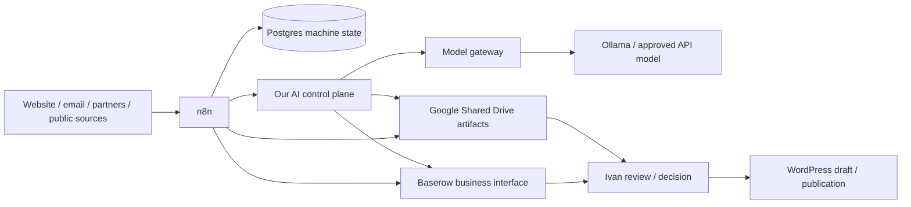

# AdaptEng Company Operating System

> **Версия:** 2.0 — implementation-ready
> **Дата:** 2026-07-23
> **Владелец:** Ivan Shyla
> **Горизонт:** первые 90 дней новой компании
> **Статус:** утверждённая база; изменения только через PR в этот файл

## 0. Итоговое решение

AdaptEng строит небольшую промышленную компанию, которой сначала управляет один
человек. Поэтому база должна быть простой в ежедневном использовании, но не
создавать миграционный тупик при росте.

Приняты пять решений:

1. **Собственную CRM сейчас не строим.** Бесплатный self-hosted Baserow будет
   единым операционным интерфейсом: клиенты, возможности, проекты, задачи,
   документы, контент и состояние автоматизаций.
2. **Google Workspace Business Standard становится корпоративным
   хранилищем.** Zoho остаётся почтой; MX не меняется. Shared Drive сразу
   подключается к n8n для источников, drafts, review и approved artifacts.
3. **Существующие автоматизации не переписываем.** Их последовательно
   подключаем к Baserow и новому Shared Drive, а затем переносим с n8n Cloud на
   уже подготовленный self-hosted n8n.
4. **Используем собственный `ai-dev-loop-control-plane`.** Новый OpenAI Agent
   или другая агентная платформа не нужны. OpenAI, Claude, Gemini или Ollama —
   только сменные модели, которые наш агент может вызывать как reasoning engine.
5. **Первый новый бизнес-режим агента — создание контролируемых артефактов.**
   Сначала он помогает существующим case/article workflows создавать drafts;
   затем подключаются lead triage и поиск возможностей.

Ежедневные точки входа:

| Задача | Интерфейс |
|---|---|
| Что требует внимания сегодня | Baserow view `00 — Today` |
| Клиенты, partners, leads и opportunities | Baserow view `10 — Pipeline` |
| Проекты, service cases и evidence | Baserow view `20 — Delivery` |
| Кейсы, статьи и drafts | Baserow view `30 — Content` |
| Документы | Google Shared Drive по ссылке из Baserow |
| Ошибки и состояние автоматизаций | Baserow view `40 — Systems` |
| Срочные alerts и approval | Telegram + email |
| Код, contracts и архитектура | GitHub |



### 0.1 Карта репозитория (operating structure)

Этот файл — «почему» и план. Операционный слой живёт рядом в папках и
обновляется теми же PR:

- `registry/` — живой индекс сервисов, workflow, хранилищ и окружений
  (id/имена, без секретов);
- `runbooks/` — повторяемые процедуры (n8n, миграции, backup/restore, ротация
  секретов, инциденты);
- `decisions/` — ADR-журнал уровня компании (плюс ссылки на платформенные ADR);
- `ai/` — точки встраивания AI, guardrails, выбор модели с проверенными ценами,
  контроль затрат;
- `owner/` — действия только для владельца и карта доступов по именам.

§11 «Current status» остаётся авторитетным, если индекс расходится с ним.
Границу «индекс, а не реализация» фиксирует `decisions/0001`.

---

## 1. Зафиксированный контекст компании

### 1.1 Компания

- Сейчас договоры заключаются через Czech OSVČ.
- Целевая основа — новая Czech s.r.o.; data model заранее поддерживает обе
  legal entities.
- Adaptive Engineering Solutions — самостоятельная новая компания.
- Arnex не является частью AdaptEng, не имеет общего Company OS и не получает
  доступ к данным. Текущие отношения с Arnex — внешний контракт OSVČ.
- На старте в системе работает только Иван (один interactive user). Второй
  аккаунт оформляется не как рабочий user, а как break-glass super-admin через
  бесплатный Cloud Identity Free (без Workspace-лицензии, без доступа к business
  data), см. §4.1. Общий пароль не используется.

### 1.2 Рынок и язык

- Основной рабочий и публичный язык — English.
- География продаж — Европа.
- Czech — второй приоритетный язык и локальный рынок.
- Русский контент сайта может поддерживаться, но не определяет коммерческий
  приоритет.

### 1.3 Приоритет услуг

1. CEMS Reliability / subscription support.
2. Diagnostics / field service.
3. Commissioning.
4. Compliance and documentation support.
5. Modernization.
6. CEMS/AMS engineering and new systems.

Первый целевой клиент — industrial plant, которому нужен удалённый и выездной
support CEMS. Второй целевой сегмент — OEM/integrator, которому нужен
региональный partner, commissioning или service coverage.

AdaptEng не заявляет:

- accredited laboratory work;
- certification authority;
- сертификацию, аккредитацию, references или company experience, пока claim не
  подтверждён владельцем.

### 1.4 Текущая стадия

- Active leads, opportunities, projects и service cases пока отсутствуют.
- Есть личная partner network, но company relationship register ещё не создан.
- Lead/follow-up/outcome нигде системно не фиксируются.
- Existing documents still need controlled migration from personal Google Drive
  and OneDrive. Google Workspace Business Standard is active; the
  organization-owned Shared Drive `AdaptEng Company` and all eight standing
  folders were provisioned live and re-verified read-only on 2026-07-26.
- Full departure from personal Drive is **not complete**: current MM
  media/content workflows still reference legacy personal folders, and the live
  media-worker still uses its old service account. `CASE-2026-001` is a separate
  read-only media inventory (intake marker, case note, 4 HEIC and 2 MOV files);
  none of that CASE media was imported. The repository-merged approved-source
  foundation instead governs only the exact three-JSON `ART-2026-001` /
  `SRC-2026-001` article metadata package. Automation-platform PR #89 was
  independently reviewed and squash-merged as
  `dbcf806ea7714b8e2a7415ae6cd788491924178d` (tree
  `8fc649a97963f38ce0a7592001a7fea4834eceea`) on 2026-07-29, but it is
  **not live**. No workflow dispatch, migration, Drive upload, Baserow write,
  model call, publication or deployment occurred. Owner Manager/recovery and
  break-glass acceptance remain open.
- DNS resolves and both Baserow and n8n serve trusted Let's Encrypt TLS behind
  Traefik (certificates issued 2026-07-25, valid to 2026-10-23); the first admin
  is created and the Company OS schema is provisioned live (workspace AdaptEng OS
  → database Company Operations, 8 tables, 107 fields, 10 views; idempotency
  verified), so the remaining Baserow gap is off-host restore evidence.
- Target account list и keyword set ещё не созданы.
- Формальной AI/data policy пока нет.
- Финансовый register и отдельная accounting integration пока не нужны.
- **Job Monitor / job-search**, **English Coach / English-learning** and
  **Kraken** are excluded personal projects. They must not migrate into Company
  OS, company Shared Drive/Baserow/Postgres/n8n, AI employees, company budgets
  or the operational roadmap. Company authority retains aggregate exclusion and
  isolation evidence only, never operational company rows.
- Any currently shared personal-project credential or store must be separated in
  place without copying personal payloads, history or other personal data into a
  company system. This is boundary remediation, not a Company OS cutover.

### 1.5 Цели

Через 30 дней:

- все активные задачи, сервисы, репозитории и автоматизации понятны из одного
  интерфейса;
- company documents больше не создаются в personal storage;
- existing case/article automations создают drafts в company storage;
- собственный агент используется для развития системы и имеет первый
  `business_artifact` shadow flow.

Через 90 дней:

- работает единый цикл `source → draft → review → approved/published`;
- website lead попадает в pipeline не позднее чем за один день;
- минимум один production workflow перенесён на self-hosted n8n;
- AI cost ограничен, а AI output регулярно используется;
- система не становится дорогой инфраструктурой без поддержки новых клиентов.

---

## 2. Нужна ли CRM

### 2.1 Решение

Полноценная CRM сейчас **не нужна**: клиентов нет, sales team отсутствует, а
главная потребность — видеть в одном месте relationships, opportunities,
projects, actions, documents и content.

Собственная CRM сейчас также **не нужна**. Она потребует:

- отдельный frontend и authentication;
- permissions, backup, migrations и audit;
- постоянную разработку вместо поиска клиентов;
- дублирование функций, которые уже даёт Baserow.

Выбор: **Baserow self-hosted Free**.

- программная лицензия — €0;
- коммерческое использование разрешено;
- core features и API подходят одному пользователю;
- данные остаются на существующем Hetzner/Coolify;
- n8n может читать и обновлять records через API;
- при росте данные можно перенести в dedicated CRM или custom app.

Это не «покупка CRM», а лёгкий data interface поверх процессов компании.

### 2.2 Когда пересматривать решение

CRM/custom UI оценивается заново, только если выполнены минимум два условия:

1. в pipeline одновременно более 100 active opportunities;
2. работают минимум два sales/service users с разными permissions;
3. требуется автоматическая email/telephony history;
4. Baserow views перестают поддерживать ежедневный процесс;
5. нужен client portal;
6. стоимость paid Baserow features выше стоимости более подходящего решения.

До этого отдельную CRM и custom frontend не создавать.

---

## 3. Baserow: единый рабочий интерфейс

### 3.1 Граница ответственности

```text
Baserow     = понятное человеку business state
Postgres    = machine state, runs, dedup, outbox, cost, audit
Drive       = документы и drafts
n8n         = orchestration
GitHub      = code, schemas, policies
WordPress   = published website content
```

Baserow не хранит raw media, большие документы, secrets или полный automation
log. Он хранит status, owner, next action, stable ID и ссылку на artifact.

«Contracts» в зоне GitHub означает **API/data contracts, schemas и policies**.
Подписанные договоры, КП и клиентские evidence живут в Shared Drive (§4), а не в
Git. CI/deploy/restore evidence — GitHub Actions logs и Postgres, не Baserow.

### 3.2 Один workspace

```text
Workspace: AdaptEng OS
Database:  Company Operations
```

На старте создаются восемь таблиц.

**Аллокация stable ID.** Human-readable коды (`AE-ORG-0001` и т. д.) выдаёт один
аллокатор — Baserow-adapter в `automation-platform` через Postgres-счётчик, а не
Baserow autonumber. Это исключает коллизии при параллельном создании, повторном
импорте и restore. Коды immutable; для внутренних связей adapter использует
Baserow `record_id`. Отдельный UUID не вводится, пока миграция из Baserow этого
не потребует (отложено, см. §3.5).

#### `Organizations`

| Поле | Тип/правило |
|---|---|
| `organization_id` | `AE-ORG-0001`, immutable |
| `name` | required |
| `organization_roles` | multi-select: prospect / client / partner / OEM / supplier / integrator / other |
| `country` | ISO country |
| `preferred_language` | EN / CZ / other |
| `website` | URL |
| `relationship_status` | new / active / dormant / closed |
| `owner` | Ivan |
| `source_ref` | required |
| `last_contact_at` | optional |
| `next_action_at` | projection (см. §3.4) |

#### `People`

| Поле | Тип/правило |
|---|---|
| `person_id` | `AE-PER-0001` |
| `organization` | relation |
| `name` | required |
| `role` | job/relationship role |
| `email` / `phone` | personal data |
| `language` | preferred |
| `contact_source` | website form / personal network / public business / outbound / partner |
| `lawful_basis` | legitimate interest / consent / contract / unknown |
| `do_not_contact` | bool; set on objection; blocks outreach/marketing |
| `collected_at` | optional |
| `last_contact_at` | optional |
| `next_action_at` | projection (см. §3.4) |

#### `Opportunities`

Lead, partner approach и RFQ используют одну таблицу. Отдельный tender module
появится только при реальном объёме.

| Поле | Тип/правило |
|---|---|
| `opportunity_id` | `AE-OPP-0001` |
| `organization` / `contact` | relations |
| `type` | lead / partner / service / RFQ / tender |
| `source_channel` | website / email / referral / LinkedIn / outbound / portal |
| `service_line` | один из approved services |
| `lifecycle` | open / closed (независимо от stage) |
| `stage` | new / qualifying / proposal / negotiation / won / lost / parked |
| `fit` | unknown / low / medium / high |
| `deadline` | optional; **required для type = RFQ / tender** |
| `next_action` / `next_action_at` | projection (см. §3.4) |
| `source_ref` | required |
| `loss_reason` | required when lost |

`stage = qualifying` требует обязательной Action (go/no-go). `won` закрывает
opportunity (`lifecycle = closed`) и конвертируется в запись `Projects_Cases`;
`lost`/`parked` тоже переводят `lifecycle = closed`. Partner-подход и commercial
lead различаются полем `type`, а не отдельным pipeline.

Default go/no-go criteria:

- fit approved service line;
- Europe/Czech delivery feasibility;
- technical competence and partner coverage;
- required references/certifications;
- deadline feasibility;
- commercial value and risk;
- evidence/data availability.

Иван принимает финальное решение.

#### `Projects_Cases`

| Поле | Тип/правило |
|---|---|
| `work_id` | `AE-PRJ-0001` или `AE-CAS-0001` |
| `organization` | relation |
| `opportunity` | relation |
| `type` | project / reliability / diagnostic / commissioning / internal |
| `legal_entity` | OSVČ / s.r.o. |
| `stage` | new / planned / active / waiting / review / closed / archived |
| `service_line` | required |
| `owner` | Ivan |
| `drive_folder_id` / `drive_url` | required after creation |
| `evidence_status` | none / collecting / review / approved / restricted |
| `next_action` / `next_action_at` | projection (см. §3.4) |

#### `Actions`

| Поле | Тип/правило |
|---|---|
| `action_id` | `AE-ACT-0001` |
| `linked_organization` | relation, nullable |
| `linked_opportunity` | relation, nullable |
| `linked_work` | relation, nullable |
| `linked_content` | relation, nullable |
| `linked_document` | relation, nullable |
| `linked_system` | relation, nullable |
| `action_type` | decide / contact / prepare / review / publish / fix |
| `description` | one concrete action |
| `owner` | Ivan or automation |
| `due_at` | required |
| `status` | open / in_progress / blocked / done / cancelled |
| `outcome` | required when done/cancelled |
| `created_by` | human / workflow / agent + run ID |

Минимум одна relation обязательна. Отдельные nullable relations (а не
polymorphic `type/id`) дают фильтрацию Actions по каждой сущности и referential
integrity в Baserow.

#### `Documents_Evidence`

| Поле | Тип/правило |
|---|---|
| `document_id` | `AE-DOC-0001` |
| `linked_work` | optional relation |
| `document_type` | contract / input / drawing / report / photo / certificate / other |
| `drive_file_id` / `drive_url` | pointer, not copied binary |
| `version` | required |
| `status` | draft / review / approved / issued / obsolete |
| `classification` | public / internal / confidential / restricted |
| `source_ref` / `sha256` | required for evidence |
| `verified_by` / `verified_at` | human only |

#### `Content_Items`

Это интерфейс для существующих case/article/LinkedIn/WordPress automations.

| Поле | Тип/правило |
|---|---|
| `content_id` | `AE-CNT-0001` |
| `content_group_id` | `AE-CGR-0001`; общий ID темы/кейса для связанных channel outputs |
| `content_type` | case / article / social_post / project_page / other |
| `channel` | WordPress / LinkedIn / other |
| `language` | EN / CZ / RU |
| `linked_work` | optional |
| `source_refs` | required |
| `status` | intake / source_ready / generating / draft / review / approved / published / archived / failed |
| `planned_at` | optional publication/review date |
| `drive_folder_id` / `draft_url` | required after intake |
| `wordpress_draft_id` | optional |
| `published_url` | required when published |
| `approval_id` / `approval_by` / `approval_at` | read-only projection from Postgres approval ledger |
| `automation_run_id` | latest run |

#### `Systems_Automations`

| Поле | Тип/правило |
|---|---|
| `system_id` | stable slug |
| `name` | service/workflow name |
| `domain` | company / website / marketing / automation / agent / utility; excluded personal projects are never rows |
| `repository` | GitHub URL |
| `runtime` | Cloudways / n8n Cloud / Coolify / GitHub / other |
| `status` | live / pilot / blocked / paused / retired |
| `source_of_truth` | explicit |
| `owner` | Ivan / repository |
| `last_success_at` | workflow/service |
| `health` | healthy / warning / failed / unknown |
| `next_action` | projection (см. §3.4) |
| `next_review_at` | required for non-healthy |
| `backup_evidence` | link/date |

### 3.3 Views

Baserow Free использует простые filtered grid views, без custom dashboard.

1. `00 — Today`: overdue + next seven days.
2. `01 — Ivan Decision`: opportunities/content/actions waiting for decision.
3. `10 — Pipeline`: open opportunities sorted by next action.
4. `11 — Partners`: active/dormant partner relationships.
5. `20 — Delivery`: active projects/cases.
6. `21 — Evidence Gaps`: missing or unverified documents.
7. `30 — Content Drafts`: draft/review/approved content.
8. `31 — Content Calendar`: filtered grid by planned date.
9. `40 — Systems`: live/pilot/blocked services.
10. `41 — Automation Errors`: failed/stale workflows.

### 3.4 Daily routine, владение полями и projection

`Actions` — единственный источник задач. `00 — Today` и `01 — Ivan Decision` —
это views таблицы `Actions` (Baserow view всегда одно-табличная), с
lookup-полями на связанные сущности. `next_action`/`next_action_at` в
`Organizations`, `People`, `Projects_Cases`, `Opportunities`,
`Systems_Automations` — **projection** самой ранней открытой связанной Action, а
не отдельно редактируемое поле. Правило: **каждая ситуация «нужно решение/review»
= ровно одна открытая Action**, чтобы не появилось два конкурирующих списка задач.

**Владение полями (защита от затирания ручных правок).** У каждой таблицы поля
делятся на две группы:

- **workflow-owned** — `*_id`, `source_ref`, `automation_run_id`,
  `drive_folder_id`/`drive_url`, `wordpress_draft_id`, approval-projection,
  `next_action*`. Adapter обновляет их upsert'ом всегда.
- **human-owned** — `stage`, `lifecycle`, `fit`, `evidence_status`,
  `relationship_status`, `outcome`, `do_not_contact`, ручные заметки. Workflow
  заполняет их **только при создании записи**; при последующих прогонах patch
  этих полей запрещён (никакого last-write-wins поверх ручных решений).

Иван открывает только:

1. `00 — Today`;
2. `01 — Ivan Decision`;
3. `30 — Content Drafts`, если есть review.

Запись без открытой Action не считается active. Telegram/email сообщает только об
ошибке или требуемом решении, но не заменяет Baserow.

### 3.5 Отложенные расширения data model

Чтобы не усложнять старт, следующие сущности **не создаются сейчас** и вводятся
только по явному триггеру:

| Расширение | Триггер ввода |
|---|---|
| Отдельная таблица `Sources` | Пока используем `source_ref` как URI (`drive://`, `email://`, `web://`, `github://`, `baserow://`) + JSON-манифест в Drive/Postgres. Таблица — когда источников на item станет много и нужен реестр licence/retrieved_at |
| Canonical `entity_uuid` отдельно от display code | Только при миграции из Baserow или мульти-adapter записи |
| Таблица `Relationships` (роль по проекту/периоду) | Когда роль организации зависит от конкретного проекта, а не общая |
| Таблица `Channel Publications` | Когда одна тема регулярно переиздаётся на несколько каналов и нужен per-publication receipt отдельно от `Content_Items` |
| Таблица `Services/Subscriptions` | Когда recurring сервисов станет несколько и `Systems_Automations` перестанет хватать для invoice/renewal |
| Расширенные GDPR-поля (`marketing_permission`, `privacy_notice_version`, `retention_review_at`, `objection_at`) | При запуске исходящего маркетинга или due-diligence клиента |

До триггера эти данные покрываются существующими полями и манифестами.

---

## 4. Корпоративное хранилище и drafts

### 4.1 Выбор тарифа

Приобрести **Google Workspace Business Standard** для одного company user.

- 2 TB pooled storage по официальной pricing page;
- Shared Drives поддерживаются;
- объёма достаточно для фото, видео, project artifacts и drafts;
- увеличение числа users автоматически увеличивает pooled storage.

Business Starter технически поддерживает Shared Drives, но его 30 GB слишком
мало для существующего media workflow. Точный локальный price и VAT фиксируются
в `Systems_Automations` при покупке.

Zoho продолжает принимать email. Для запуска Workspace:

1. подтвердить domain TXT;
2. не менять MX;
3. создать company account;
4. создать Shared Drive;
5. проверить ownership и recovery;
6. только потом подключить n8n.

**Break-glass super-admin.** Помимо основного company user создаётся один
отдельный super-admin на бесплатном **Cloud Identity Free** (не занимает платный
Workspace seat, без почтового ящика и доступа к бизнес-данным). Он существует
только чтобы восстановить доступ, если основной аккаунт потерян/заблокирован.
Хранится с 2FA и recovery-кодом офлайн. Это единственный второй interactive
user; повседневно не используется. См. §1.1 и `COS-001`.

### 4.2 Один Shared Drive

```text
AdaptEng Company/
├── 00_Case_Uploads/          # existing live intake contract; не переименовывать
├── 01_Inbox/                 # controlled new inputs
├── 10_Company/               # legal entity, policies, approved claims
├── 20_Commercial/            # proposals and partner/RFQ artifacts
├── 30_Projects_Cases/        # delivery and evidence
├── 40_Content/               # cases, articles, channel drafts
├── 50_Templates/             # approved templates
└── 90_Archive/               # closed/obsolete records
```

Live root:
`company-drive://AdaptEng-Company`. Governed folder aliases, daily upload rules
and the personal-Drive transition procedure are in
[`runbooks/company-drive.md`](runbooks/company-drive.md).

Не создавать отдельный Shared Drive для каждого domain или клиента на старте.
Restricted finance/legal drive появится при создании s.r.o. и выборе accounting
process.

### 4.3 Project/case folder

```text
30_Projects_Cases/
└── AE-CAS-0001_short-name/
    ├── 01_Source/
    ├── 02_Working/
    ├── 03_Drafts/
    ├── 04_Approved/
    └── 05_Evidence/
```

Пустые подпапки не создаются заранее: n8n создаёт их при первом artifact данного
типа. Folder ID и URL сохраняются в `Projects_Cases`.

### 4.4 Content folder

```text
40_Content/
└── AE-CGR-0001_short-title/
    ├── 01_Source/
    ├── 02_Drafts/
    ├── 03_Review/
    ├── 04_Approved/
    └── 05_Published/
```

Одна folder используется для всех channel outputs одной темы, но каждый output
получает отдельный `Content_Items` record и lifecycle. Например, WordPress case
page и LinkedIn post имеют разные `content_id`, `status` и `published_url`, но
одинаковые `content_group_id`, source set и Drive folder.

### 4.5 Versioned `START HERE` usage notes

Task `drive-folder-usage-notes` defines one concise, versioned `START HERE` note
for each of the eight canonical Shared Drive work areas and for every generated
`AE-CAS-NNNN_short-name` / `AE-CGR-NNNN_short-title` folder. The note states:
purpose; allowed and disallowed inputs; naming and required metadata; one correct
placeholder-only example; current manual/live/planned automation; trigger,
actions and output; approvals/PII rules; and owner/contract version.

Priority is `01_Inbox`, then the `30_Projects_Cases` generated-folder contract,
then the `40_Content` generated-folder contract, followed by the remaining
canonical work areas. Management must be idempotent: resolve by parent logical
alias/pattern plus title, create only when missing, keep exactly one note and
update only a versioned managed section. Never duplicate the note, include
secrets, credentials, assigned/live IDs (including provider/resource IDs), live
payloads or PII, or overwrite human-authored content outside the managed
section. Ambiguous duplicates or
missing/malformed managed markers fail closed for manual reconciliation.

This PR records the architecture and backlog only. It does not place or update a
live Drive note; live placement is a separately approved task. The complete
contract is in [`runbooks/company-drive.md`](runbooks/company-drive.md).

### 4.6 Что является draft

Runtime draft не коммитится в Git.

- human-readable draft — Google Doc;
- media и source package — Drive files;
- schema/manifest/citations — JSON artifact рядом с draft;
- status/owner/link — Baserow;
- run/model/cost/audit — Postgres;
- sanitized fixtures/examples — domain repository;
- published truth — WordPress или native channel.

Approval создаёт versioned content-addressed snapshot/export в `04_Approved`.
SHA-256 snapshot, source hashes и approval ID записываются в Postgres audit.
Draft service account не получает update/delete capability для approved
artifacts. Это tamper-evident approval record, а не обещание физического WORM:
любое ручное изменение инвалидирует hash и блокирует publication до нового
approval. Изменение после approval создаёт новую version.

---

## 5. Подключение n8n к Baserow и Drive

### 5.1 Credential model

Для Google Drive automation:

1. создать отдельный Google Cloud project;
2. включить Drive API;
3. создать service account для n8n;
4. добавить draft service account в `AdaptEng Company` с минимальной ролью,
   достаточной для создания source/draft folders and files, но без Manager
   access и без права изменять approved artifacts;
5. ограничить `04_Approved` через limited-access folders: Ivan + отдельный
   approval-adapter service account; draft account туда не входит;
6. approval credential доступен только approval sub-workflow и используется
   после проверки canonical Postgres approval;
7. credentials хранить в n8n/Coolify secret store;
8. Drive ID и root folder IDs хранить как non-secret config;
9. не использовать personal OAuth Ивана как постоянный runtime credential.

n8n официально поддерживает Google Service Account и Shared Drive operations.

Для Baserow:

- отдельный API token для n8n;
- отдельный token для agent action adapter;
- tokens не передаются модели;
- write operations ограничиваются нужными tables.

### 5.2 Общий workflow contract

```yaml
work_item:
  id: AE-CNT-0001
  group_id: AE-CGR-0001
  type: case
  channel: WordPress
  schema_version: "1.0"
  source_refs:
    - drive://file-id
  baserow_record_id: "..."
  drive_folder_id: "..."
  requested_action: create_draft
  idempotency_key: sha256:...
  classification: internal
  approval_required: true
```

Любой workflow:

1. принимает или создаёт stable ID;
2. проверяет idempotency key;
3. создаёт/обновляет Baserow record — но при update патчит **только
   workflow-owned поля** (§3.4); human-owned поля пишутся лишь при создании
   записи и никогда не перезаписываются повторным прогоном;
4. использует Drive folder ID, а не поиск по названию;
5. пишет machine run в Postgres;
6. создаёт draft, но не `approved/published`;
7. уведомляет только после успешной записи state;
8. при retry reconciles существующий result.

### 5.3 Case automation

Существующий media intake сохраняется и подключается к Company OS:

```text
CASE-* + READY_FOR_INTAKE.json in 00_Case_Uploads
→ n8n intake
→ live media worker
→ EXIF/GPS removal + validation
→ отдельные Baserow Content_Items для каждого channel output + linked Project/Case
→ content Drive folder
→ approved sources copied/referenced in 01_Source
→ our agent creates case + LinkedIn + WordPress drafts
→ Google Doc(s) in 02_Drafts
→ Ivan review
→ approved snapshot
→ WordPress draft
→ Ivan publish
→ published URL and outcome recorded
```

Raw media и client-confidential evidence не передаются модели без classification
и explicit approval.

**As-built transition state (2026-07-27):** the corporate folders exist, but
active n8n Cloud MM-01 and the live media-worker still read legacy personal
Drive bindings. The now-frozen MM-Visual/MM-41/MM-42 definitions retain those
legacy references, but their relevant entry/worker nodes are disabled and they
are unpublished. Preserve the source until the governed service-account copy,
inactive shadow, controlled canary and rollback proof complete. New company
uploads go only to the corporate Shared Drive.

### 5.4 Article automation

```text
approved source/radar item
→ Baserow Content_Item
→ source links/snapshots in 01_Source
→ our agent creates article + channel drafts with citations
→ Google Docs in 02_Drafts
→ Ivan review
→ 04_Approved
→ WordPress draft + LinkedIn draft
→ manual publication
→ published URLs recorded
```

Existing article schemas/prompts остаются в `adapteng-marketing`; runtime state
и drafts переезжают из случайных Sheets/files в Baserow + Shared Drive.

### 5.5 Website lead automation

После стабилизации content flows:

```text
Fluent Form
→ existing WordPress entry (fallback)
→ n8n webhook
→ dedup/correlation ID
→ Organization/People/Opportunity upsert
→ Action due within one day
→ Telegram/email alert
→ Ivan response
→ outcome recorded
```

Website forms не принимают confidential attachments, пока не реализован
quarantine pipeline.

### 5.6 Approval experience

Иван открывает draft по Drive link и принимает одно из решений:

```text
Approve → Needs edit → Reject
```

Decision отправляется через protected n8n form или Telegram button с
одноразовым expiring token. Token hash, approver, timestamp, artifact hash and
decision записываются в Postgres approval ledger. Затем outbox:

1. обновляет read-only approval projection в Baserow;
2. при `Approve` создаёт content-addressed snapshot в limited-access
   `04_Approved`;
3. создаёт WordPress/email draft, если action allowlisted;
4. сохраняет execution receipt.

Ручное изменение Baserow `status` не является approval. Это даёт удобный
one-click интерфейс без покупки Baserow paid automation features.

---

## 6. Active platform and repository boundaries

### 6.1 Active systems

| System | Role now | Decision |
|---|---|---|
| Cloudways WordPress | Live website and published content | Keep |
| GoDaddy | Domain and DNS | Keep |
| Zoho | Mail/SMTP | Keep; no Gmail migration |
| Google Workspace | Company documents; Shared Drive provisioned | Keep; finish owner/recovery acceptance |
| Hetzner + Coolify | Self-hosted runtime | Keep |
| `adapteng_ops` Postgres | Runs, audit, dedup, cost and canonical approval ledger | Keep |
| n8n Cloud | Current authority for legacy company MM/LM content/media; aggregate audit also observes excluded Job Monitor and English Coach workloads | Keep only during staged **company** migration; personal projects have no Company OS cutover |
| self-hosted n8n | Live partial authority: AUT-001 and WEB-002 run here; target for company workflows | Repoint deployment to `main`; migrate gradually |
| Baserow self-hosted Free | Human Company OS interface; healthy with trusted Let's Encrypt TLS; Company OS schema provisioned live (8 tables, 107 fields, 10 views) | Off-host export/restore; AUT-001 adapter now writing to the Company Operations database (internal-only Coolify service, synthetic `AE-*` canary proven live 2026-07-25; **self-hosted EU n8n → governed adapter integration LIVE pure-internal 2026-07-25** — `AE-SYS-baserow-adapter` created then idempotent governed re-run over the internal `coolify` network (adapter alias `adapteng-baserow-adapter`, no public exposure), read back from `Systems_Automations`) |
| `mm-media-worker` | Live media worker on Coolify; HTTP health 200 | Replace old `media-worker@adapteng.iam.gserviceaccount.com` / personal-Drive binding only after snapshot + canary |
| Telegram + email | Alerts and approval notification | Keep |
| GitHub | Code, contracts, architecture and evidence | Keep |

Retired infrastructure is not part of active architecture and is not a rollback
target.

### 6.2 Repository ownership

| Repository | Owns |
|---|---|
| `adapteng-company-os` | This architecture, company-wide ownership and status |
| `adapteng-automation-platform` | n8n exports, Postgres migrations, deployments, AI Gateway, adapters and runbooks |
| `ai-dev-loop-control-plane` | Generic agent admission, execution, evidence, validation and review lifecycle |
| `adapteng-marketing` | Marketing schemas, prompts/skills, media worker and content rules |
| `adapteng-website` | WordPress theme/plugin, forms contract and Cloudways deployment |
| [`PalinaRuban/adapteng`](https://github.com/PalinaRuban/adapteng) | **LEGACY NON-AUTHORITATIVE SNAPSHOT** — personal-account June-2026 WordPress/Azure copy; not active Company OS, production source or rollback |
| [`Ivan-Shyla/Kraken`](https://github.com/Ivan-Shyla/Kraken) | **EXCLUDED PERSONAL TRADING PROJECT** — link retained only as aggregate boundary evidence; no Company OS authority, runtime, data, operational row, budget or roadmap role |

Job Monitor/job-search, English Coach/English-learning and Kraken are personal
projects outside Company OS. Record only aggregate exclusion/isolation evidence;
do not mirror their operational status or create `Systems_Automations` or other
company rows for them. They must not use company Shared Drive, Baserow, Postgres,
n8n, AI employees or budgets. Separate any currently shared credential or store
within the personal boundary and revoke the company/shared binding after proof,
without copying personal data into company systems. Kraken may contribute only a
separately reviewed, data-free generic pattern; that review does not authorize
code, configuration, data or runtime migration.

`PalinaRuban/adapteng` is a personal-account June-2026 WordPress/Azure snapshot
with no active authority. It is not active Company OS and is not a production,
content, architecture or rollback source. The public site runs on a separate
nginx/Cloudways path; the legacy Azure hostname no longer resolves and its last
deployment workflow failed. Legacy PR #3 exact head
`9b9d9e99859370a4d43d563870d1028725171348` received bounded immutable
**REVIEW CLEAN** and was guarded squash-merged as `main` commit
`9c8acd166bf57dc416ed6de86ced8f0b26ac3eb5` at
`2026-07-28T10:43:33Z`. `candidate-policy` succeeded;
`trusted-base-policy` was skipped only for the expected one-time bootstrap.

Retain only the custom theme, brand/license provenance and historical runbook.
Migrate structured, approved business knowledge from the current live
CMS/database; exclude WordPress core, plugins, runtime, credentials and PII.
The guarded merge completes repository containment on current `main`, including
the current-tree sensitive-file/deployment cleanup and archive/rotation guards.
It does **not** clean Git history, rotate provider credentials, archive the
repository or make it live-ready: `history-clean=false`,
`credential-rotations-complete=false`, `archived=false` and
`live-ready=false`. Historical values remain compromised; complete owner-only
provider rotations and verify the old values fail without claiming that work
occurred here. Do **not** rewrite history yet. Archive only after a fresh
encrypted export of the current CMS, database and media plus company ownership
transfer. Repository containment does not admit this legacy snapshot into
Company OS authority.

### 6.3 Домены автоматизаций и их принадлежность

Repository baseline — `adapteng-automation-platform/n8n/workflow-index.json`
(82 exports after the latest ratified additions). It is currently **not** a
complete live source of truth. A fresh live audit on 2026-07-27 reconfirmed
89 non-archived workflows / 33 active; reversible freeze-now actions then
produced **89 non-archived / 31 active / 58 inactive**, with 14 live-only and
7 repo-only entries. The verified active-count safety-freeze chain is
**42 → 40 → 38 → 37 → 36 → 35 → 34 → 33 → 31**. This drift must be reconciled
before cutover.

Repository containment evidence advanced on 2026-07-28:
`adapteng-automation-platform` PR #85 exact head
`a88ba7e3f76e6a192ee687ef7d55aa50fc575fc1` received independent
**REVIEW CLEAN** and was guarded squash-merged to automation `main` as
`99f4d88e867cb874cf8821de14ddea1b882b5560` at
`2026-07-28T07:26:18Z`. The merge commit, not an earlier PR head, is the current
repository evidence. It does not reconcile the live drift, alter the verified
**89 / 31 / 58** state, or close authenticated MCP/live exposure. No supported
live availability change or explicit MCP allowlist verification is recorded.

Historical execution evidence showed that the legacy chain had created WordPress
pages 878, 880, 882, 884 and 891; page 891 had reached `publish` without the
current approval/media gates. All five pages are now in WordPress Trash, their
`Case_Content` rows are `blocked`/`quarantined`, Cloudways cache purge run
`30228283077` succeeded, and both the pretty permalink and `?page_id=891` return
HTTP 404. Completed remediation workflow `QMqxSBRhaIfzYNTy` is sealed and
archived. The audit also found two duplicate sets of four unattached public JPEG
derivatives (WordPress media IDs 886–889 and 893–896) uploaded before the
human media/redaction gate. Exact-removal execution `15211` deleted all eight;
their REST and original-file URLs now return 404 while the four source HEIC
files remain untouched in Drive. Completed media-remediation workflow
`VZPWhwGDol0h1ECt` is sealed and archived. Both safety workflows are excluded
from the 89 non-archived workflow count.

The gateway freeze covered live-only workflow `d1SDcRTgMqS9Zvgi` (Claude n8n
MCP Gateway), which is not Company OS authority and had no execution after
2026-07-10. Its HTTP method was fixed to GET, but the AI could choose any n8n API
GET path and responses had no endpoint allowlist or redaction, so execution
payloads/PII could be disclosed to external Claude. This is a **broad-read
confidentiality/exfiltration risk, not arbitrary write**. Previous active version
`51f02adb` is retained; draft `de142f7b` has the MCP trigger disabled; the
workflow is unpublished and production execution is rejected.

Three further legacy approval/publish workflows are frozen. MM-ZH-02
`J5SpIS8Ye8JHViFi` accepted an approval route from any email sender based only on
a subject substring. MM-04 `4D9UBruS1ZhLn1pS` directly synchronized
`Approval_Log` into `Content_Drafts`; latest execution `15214` read 30 stale
smoke approval rows but updated 0. MM-05 `o9Lj7F9WbhFSCARq` was a scheduled,
non-idempotent `Publish_Plan` builder; execution `15216` found 0 approved drafts.
All entry triggers are disabled, all three workflows are unpublished, and
production execution is rejected. Treat legacy `Approval_Log`, `Content_Drafts`
and `Publish_Plan` as **forensic-reconciliation-required** before archive or
canonical migration 003 cutover.

Direct `gpt-5-mini` analyzer MM-22 `clPtSQwzze8DHEvp` is also frozen because it
bypassed the canonical gateway, ledger/caps, AG-008 controls and governed
Company Drive. Its Manual and Execute Workflow triggers and model node are
disabled; it is unpublished and production execution is rejected. Prior active
version `72869463` and freeze draft `28a7ef72` are retained, together with six
historical runs and their data.

The latest reversible freeze added two company workflows.
MM-Visual-Evidence-Intake `uBVRMTCKwnUG91kU` had a published Telegram route
without a principal allowlist and could reach media-worker before its
disconnected marker/schema/ready branch. Immutable containment preserves
published version `dda7f039-764c-449d-9f0e-4c8badb44919` and moves to draft
`3093a3bf-0567-4cb3-9956-56020dc4713c`; live state is `active=false` with
`active_version_id=null`. Manual, Telegram and worker nodes are disabled and
the workflow is unpublished. Never reactivate it until a founder/principal
allowlist precedes every command and media-worker is reachable only from
validated-ready output. MM-08 Lead Intake & Triage
`RAPjKSnj6EY7axtb` was an unauthenticated public write ingress with zero
executions and no proven dependency. Its webhook and lead-write nodes are
disabled and it is unpublished. Immutable containment preserves active version
`644416d5-7f7f-4fa0-b02f-a8c787752617` and moves to draft
`37817f58-e6fb-4876-a076-497ab776413c`; live state is `active=false` with
`active_version_id=null`. The prior active version and version history remain
retained as rollback evidence against the containment draft. Any reactivation/
replacement requires named accountable owner Ivan, explicit owner approval,
authentication, schema validation, rate control and stable deduplication.

Defense-in-depth changes did not affect the count: already-inactive MM-10
`39CAjeKcZD64VM25` and MM-29 `at9H54krWF9ULdtT` now also have their Manual,
Schedule and approval-write nodes disabled. Their retained drafts are
`22776538-c4eb-4ea3-98e8-eeb1de8c6ea7` and
`1ca9a60e-9c4f-425c-980f-fedc24d85bf2`; both remain `active=false` with
`active_version_id=null`, and prior history is retained.

Manual-mode and production probes for the five earlier frozen workflows
(`d1SDcRTgMqS9Zvgi`, `J5SpIS8Ye8JHViFi`, `4D9UBruS1ZhLn1pS`,
`o9Lj7F9WbhFSCARq`, `clPtSQwzze8DHEvp`) reject before creating an execution.
Both newly frozen workflows also reject in manual and production modes with
`execution_id=null`; the post-freeze execution count is zero. This verifies the
reversible freezes are fail-closed in both modes.

Systemic MCP exposure remains **unresolved**. The audited workflows still had
**Available in MCP** enabled because the available workflow-update API rejected
that unsupported field; the failed update did not change availability. Under
official n8n semantics, instance-level MCP, per-workflow availability and an
authenticated user together expose supported workflows. Turning **Available in
MCP** off does not stop normal webhook, schedule, manual or internal triggers.
The owner must disable instance-level MCP globally or change per-workflow
availability through a supported UI/API, then verify that the effective
exposure is an explicit allowlist only.

Do **not** freeze MM-18 now: recent successful webhooks prove it is the current
website lead path. Keep it until a new immutable review-clean WEB-002 producer
head plus actual producer T1-T4, atomic no-dual-write cutover and rollback proof
are complete. Before any later **company-workflow** freeze decision, repair
MM-20/MM-24 approval, dependency and idempotency controls and make MM-07
allowlist logging redacted. Personal-project workflow remediation stays outside
the Company OS operational roadmap.
This repository update records supplied live evidence only: it performed no
payload or credential review, model call, publication, website cutover or other
live mutation.

A one-time read-only audit by workflow `Q2PmbE2VDffRl1iT` (execution `15547`)
found 179 `Approval_Log` rows, all synthetic `APPROVE` smoke:
177 `TYPE` self-loop rows plus 2 `TEST123` rows, all dated 2026-06-12.
`Content_Drafts` has 19 rows, all pending (18 `pending_approval`, 1
`pending_manual_review`), with zero approved or package-ready. `Publish_Plan`
has 0 rows. Temporary cleanup workflow `a3luyFSBH9xRELDW` dry-run `15548`
matched exactly those 179 `TYPE`/`TEST123` smoke rows; live execution `15549`
deleted exactly 179 row ids 1–179; verification `15550` matched 0. The 19 pending
`Content_Drafts` and empty `Publish_Plan` were untouched. No current real draft
was promoted. Both the cleanup workflow and read-only audit workflow are
archived. This evidence reinforces the freeze: synthetic/unauthenticated
approval state must not feed the direct status sync or non-idempotent plan
builder; remaining draft lineage still requires reconciliation before migration
003 cutover.

| Домен | Группа | Registry evidence | Принадлежность | Правило |
|---|---|---:|---|---|
| Company workflows | MM / LM | 46 / 14 active in Cloud | AdaptEng business | Подключается к Company OS (§5): Baserow/Drive/agent |
| Excluded personal n8n projects | Job Monitor / English Coach | 35 exports / 17 active (aggregate audit partition only) | Outside Company OS | Boundary evidence only; no operational company rows, resources or cutover |
| Excluded personal trading project | Kraken | Aggregate exclusion/isolation evidence only | Outside Company OS | No company integration; only separately reviewed data-free generic patterns |
| Utility / gateway | EXP / gateway | 1 repo baseline; 0 active (1 live-only gateway frozen) | Utility | classify explicitly; never silently becomes company authority |

Только company-домены **Marketing Machine / Lead Monitor** относятся к
промышленной бизнес-автоматизации AdaptEng, и именно их §5 подключает к Baserow,
Shared Drive и нашему агенту.

Правила для исключённых личных проектов:

- Company OS хранит только aggregate exclusion/isolation evidence; никаких
  per-workflow или operational company rows, включая `Systems_Automations`;
- Job Monitor/job-search, English Coach/English-learning и Kraken не используют
  company Shared Drive, Baserow, Postgres, n8n, AI employees или budgets и не
  входят в operational roadmap;
- любой общий credential/store разделяется внутри personal boundary без копии
  payloads, history или других personal data в company systems;
- company self-hosted n8n cutover для этих проектов запрещён;
- из Kraken допускается только separately reviewed data-free generic pattern,
  без переноса кода, конфигурации, данных или runtime.

Это сохраняет фокус Company OS на промышленном бизнесе. Until the 14/7 drift is
resolved, report both repository and live counts rather than claiming one total.

### 6.4 n8n Cloud cutover

Не выполнять big-bang migration.

```text
DNS/TLS
→ import one low-risk workflow disabled
→ add credentials manually
→ shadow/no external write
→ compare records and artifacts
→ enable self-hosted workflow
→ disable Cloud twin
→ seven-day observation
→ record evidence
```

Порядок (company workflows):

1. read-only marketing/content workflow (наименьший риск);
2. article/content workflow;
3. case/media workflow;
4. website lead intake;
5. approval/publishing workflows.

Исключённые личные проекты (§6.3) не являются cutover targets. Не импортировать
Job Monitor или English Coach в company self-hosted n8n; разделять возможные
общие credentials/store на personal стороне без копирования personal data.

Company paused/experimental workflows переносятся только после решения `keep /
merge / archive / delete`.

---

## 7. Собственный AI agent

### 7.1 Agent и model — разные вещи

```text
Agent = task intake + permissions + state + skills + tools + validation + review
Model = сменный reasoning engine внутри agent
```

`ai-dev-loop-control-plane` — наш agent/control plane. Он уже доказал bounded
code task → tests → draft PR → review → human merge.

OpenAI в предыдущей версии означал только возможного поставщика модели, а не
замену нашего агента. В этой архитектуре:

- новый OpenAI Agent SDK не вводится;
- отдельная agent platform не покупается;
- текущий control plane расширяется;
- model provider выбирается по quality/cost benchmark;
- provider можно менять без изменения business workflow.

### 7.2 Два режима одного control plane

#### `code_change` — уже работает

```text
bounded task
→ policy/scope
→ isolated worktree
→ executor
→ tests/gates
→ draft PR
→ independent review
→ human merge
```

Этот режим используется сразу для реализации всего backlog Company OS.

#### `business_artifact` — contracts merged, **REJECT_LIVE**

```text
BusinessTaskEnvelope
→ policy/data/cost admission
→ read approved sources
→ run one domain skill
→ schema/citation/secret gates
→ ArtifactEnvelope
→ Baserow pending state + Drive draft
→ Ivan review
→ approved action adapter
→ execution receipt
```

Business task не создаёт Git branch и не считается завершённым по Git diff.

Read-only production audit verdict: **REJECT_LIVE**. Control-plane main
`affe6ea1e4d522be0df0641e98a08e20a84549ae` contains deterministic
AG-001/002/003/006/007 contracts and acceptance only — no business worker, real
provider or Drive runtime. Reproduced P0 bypasses: the task envelope is optional
and can be unvalidated; completion accepted missing `no_external_action` plus a
synthetic `approval_id`; and the in-memory `ModelGateway` allowed actual cost
above the cap and drove the remaining budget negative.

AG-008 owns those deterministic fixes. It does not provide a live business
runtime: `adapteng-automation-platform` must still deploy and wire persistent
Postgres cost reservation/reconciliation, a real EU Vertex adapter, Drive
adapters, orchestration, canonical approval and deployment. Until all of that is
accepted, Company OS has repository components, **not deployed/working business
AI**.

### 7.3 Business artifact building blocks

| ID | Изменение | Done when |
|---|---|---|
| `AG-001` | `completion_mode: business_artifact` | Existing code mode unchanged; artifact mode schema-valid |
| `AG-002` | `BusinessTaskEnvelope` | Sources, class, capabilities, limits and approvals validated fail-closed |
| `AG-003` | `ArtifactEnvelope` | Artifact URI/hash, citations, schema, model usage and evidence digest required. **Repository implementation merged:** control-plane PR #36 (`affe6ea1e4d522be0df0641e98a08e20a84549ae`). |
| `AG-004` | Postgres run adapter | Task/run/outcome reconciles idempotently in `adapteng_ops` |
| `AG-005` | Baserow/Drive action adapters | Only pending/draft writes; no direct approve/publish |
| `AG-006` | Linux container acceptance | Same critical gates pass on Coolify runtime |
| `AG-007` | Business eval harness | Synthetic security set + approved representative quality set |
| `AG-008` | Production admission/action/cost hardening | Completion validates the full task envelope; draft artifacts require human review + `no_external_action`; synthetic `approval_id` and approval/publish/send fields fail; actual cost cannot exceed the cap or drive budget negative. **Open — AG-008 owns deterministic fixes after the REJECT_LIVE audit; it does not supply the persistent business runtime.** |

Generic agent lifecycle остаётся в control-plane. Domain schemas/prompts остаются
в marketing/website/automation repositories. Approval decision записывается
только в Postgres ledger; Baserow получает read-only projection через outbox.
Action adapter проверяет canonical Postgres approval ID/token, а не Baserow
status.

`AG-003` proves offline canonical envelope integrity: required schema identity,
exact logical artifact URI/hash cross-binding, recomputed evidence digest,
complete envelope self-hash excluding only its own `sha256`, finite non-negative
`cost_eur` and fail-closed completion. It does not prove that persisted artifact
bytes match the envelope; storage and action binding remain `AG-004`/`AG-005`.

### 7.4 Model access

Canonical `services/ai-gateway` в `adapteng-automation-platform` остаётся
provider-pluggable model adapter нашего агента. PR-B merged in
automation-platform PR #71 (`60bc443a4599d205fc24fb9172a2967ae5e8b409`):
repository implementation and migration 005 are ready, but migration 005 is
**not live-applied** and no model/deploy/live call occurred.

Two-pass review fixed the approval token being parsed but not passed to the
typed verifier, and divergent duplicate `call_id` behavior that mapped to HTTP
502. Final repository behavior threads the token into the verification boundary;
any reused `call_id` fails closed as HTTP 409 without a second provider call.
Unit and real PostgreSQL concurrency/cap semantics, repository validation,
Validate Repo and hard-fail secret scan are green.

Live enablement still requires a real EU Vertex client and GCP service account,
composition with the canonical approval adapter (its `VerificationRequest`
still lacks the token and token consumption currently lives in `decide`), a
concrete pending writer, Coolify/Traefik/secrets/FX configuration and pricing
recheck. `external_draft_dispatcher` remains `None`.

The automation platform must also make persistent Postgres cost
reservation/reconciliation authoritative and deploy the EU Vertex adapter,
Drive adapters, orchestration and approval composition. Deterministic
control-plane fixes alone cannot change the **REJECT_LIVE** verdict.

Gate-0 decision dated 2026-07-25 selects the first **paid pilot candidate**, not
a deployed/default model. Availability and prices were re-verified from official
Google documentation on 2026-07-27:

| Candidate | Availability / endpoint | Standard non-global rates per 1M tokens | Representative call |
|---|---|---:|---:|
| Vertex AI `gemini-3.1-flash-lite` | **GA**; EU multi-region; location `eu`; `https://aiplatform.eu.rep.googleapis.com` | $0.275 text/image/video input; $0.55 audio input; $0.0275 cached text input; $1.65 text output/reasoning | 20k text input + 4k text output = $0.0121 before FX |

The candidate remains contingent on ratified `AG-007`/`AI-001` quality,
citation and safety proof. Gateway requirements:

- first model operation is schema-valid, side-effect-free `draft` for `AI-001`;
- first exact approval-gated action is `external_draft.create`, limited to
  pending/draft Baserow state; it can never publish or send;
- schema validation, provider/model version, timeout/retry/circuit breaker and
  fail-closed budget admission;
- hard caps of **€0.10/call, €1/day and €10/month**;
- USD→EUR conversion uses an explicit operator-configured FX rate and `as_of`;
  missing/stale FX fails closed rather than silently assuming a dynamic rate;
- token/cost/run ledger stores counts, price inputs and outcome, but not raw
  model input/output;
- project cache is disabled as a live gate; no implicit caching, Search/Maps
  grounding, request-response logging or global-endpoint fallback.

Privacy baseline for paid Google Cloud terms: Google does not train on
inputs/outputs without permission, and the EU multi-region keeps ML processing
within the EU. Zero-data-retention-compatible configuration must be verified
before any real call.

Alternatives remain fallback-only after the same quality proof. First-party
Anthropic inference is US/global. OpenAI regional processing requires approved
data controls and approximately 10% regional-processing uplift. Local Ollama
remains classify/extract-only where measured quality and hardware permit, and
is not approved for 24/7 use on the current company Hetzner host.

Бюджеты моделей разделены на два независимых:

- **`dev_model_budget`** — подписка/квота владельца для code_change режима
  (агентское программирование в `ai-dev-loop-control-plane` токеноёмкое). Это
  расход владельца на разработку, **вне** €10 runtime-cap; иначе первый же
  code_change backlog его исчерпает.
- **`runtime_model_cap` = €10/month** — только на business_artifact runtime
  (drafts/classify/extract через gateway), отдельно от server и Workspace. Cap
  дополняется лимитами €0.10/call и €1/day и fail-closed FX admission: при
  исчерпании/невалидном FX task становится `pending`, direct-call bypass
  запрещён. Увеличивается только после accepted outputs.

### 7.5 Первый business skill

Первый skill — **Content & Case Draft Assistant**, потому что:

- media/article/case automation уже существует;
- owner явно хочет drafts в новом storage;
- работа draft-only и легко проверяется;
- нет необходимости ждать real RFQ/project dossier;
- результат помогает website и company presence.

Inputs:

- approved source refs;
- marketing schemas and style;
- approved claims;
- target language/channel;
- Baserow content record and Drive folder.

Outputs:

- article/case/LinkedIn/WordPress draft;
- citations/source manifest;
- unsupported/missing claims list;
- no external send or publish.

Pilot exit:

- 20 representative drafts;
- 100% schema-valid;
- 100% factual statements traceable to source or marked unknown;
- no unsupported company claim;
- at least 70% accepted with reasonable edits;
- human review faster than writing from zero;
- cost visible and within cap.

### 7.6 Следующая очередь

1. Content & Case Draft Assistant.
2. Website Lead Triage Assistant.
3. Opportunity/Partner Radar after target account list exists.
4. RFQ Copilot after first real de-identified RFQ.
5. Project Dossier Assistant after first completed AdaptEng project.

Не строить multi-agent coordinator, пока минимум два skills не проходят value
gate.

### 7.7 Autonomy

| Level | Allowed |
|---|---|
| `A0` | Read approved data and explain |
| `A1` | Create internal/Google/WordPress/email draft and proposed action |
| `A2` | Update reversible Baserow pending state after successful pilot |
| `A3` | Exact allowlisted action after one-time founder approval |
| `A4` | Autonomous high-impact action — prohibited |

Владелец разрешил после pilot:

- internal drafts;
- pending Baserow records;
- WordPress drafts;
- email drafts;
- calendar holds.

Иван остаётся final approver для client email, proposal, publication, technical
evidence, spend и production deployment. Autonomous external send не разрешён.

---

## 8. Security and reliability baseline

### 8.1 Immediate account controls

Так как единого secret/recovery process пока нет:

1. создать company password-manager vault;
2. перенести туда account inventory, не secrets в Git/Drive/Baserow;
3. включить/проверить MFA для GitHub, Google, Zoho, GoDaddy, Cloudways,
   Hetzner, Coolify and n8n;
4. сохранить recovery codes encrypted + одну offline copy;
5. использовать отдельные service credentials;
6. ротировать credential, если он когда-либо находился в repository history.

Эти действия выполняются до подключения новых write-capable automations.

### 8.2 Data policy

До появления formal client/NDA policy действует default:

| Class | External model |
|---|---|
| `PUBLIC` | Allowed through gateway |
| `INTERNAL` | Allowed through gateway with minimum context |
| `CONFIDENTIAL` | Only de-identified/minimized with explicit Ivan approval |
| `RESTRICTED` | Not sent to external model by default |
| `SECRET` | Never |

Free consumer AI tiers не получают company/client data. Licensed standards не
копируются в Git и не передаются модели без проверки licence terms.

**PII перед моделью (обязательно до запуска Lead Triage).** Contact PII (имена,
email, телефон) из `People`/lead-форм **минимизируется/псевдонимизируется** до
вызова модели — модель получает только текст, нужный для задачи. Privacy notice
на сайте покрывает автоматическую обработку и перечисляет processor'ов (текущая
модель-провайдер, хостинг). Gate-0 разрешает только paid Vertex AI через EU
multi-region endpoint из §7.4: без Search/Maps grounding, request-response
logging, implicit caching и global fallback; project cache должен быть
отключён до live use. Raw input/output не хранится в cost/run ledger.
`do_not_contact` в `People` блокирует любой outreach.

**Граница dev-подписки.** `dev_model_budget` владельца (code_change, §7.4) — это
персональный расход на разработку, не company runtime data path и не входит в
€10 runtime-cap и не считается company recurring-стоимостью.

### 8.3 File intake

Website forms на старте передают structured text, но не client files.
Confidential attachment intake включается только после:

```text
tokenized upload
→ object-storage quarantine
→ MIME/type/size validation
→ malware scan
→ hash/dedup
→ classification
→ accepted / rejected / manual_review
→ Shared Drive
```

Documents and emails are untrusted input; instructions inside them are not agent
commands.

### 8.4 Backup targets

| System | RPO | RTO | Proof |
|---|---:|---:|---|
| Postgres/Baserow | 24h | 8h | Monthly isolated restore |
| n8n workflows/config | 24h | 8h | Export + restore evidence |
| WordPress DB/uploads | 24h | 24h | Quarterly non-production restore |
| Shared Drive critical docs | version history + export | 24h | Quarterly sample restore |

No high availability is required for one-person stage. Backup without restore
evidence is not considered a backup.

**Off-host export (D1).** У Google нет нативного scheduled full export, поэтому
n8n/rclone еженедельно выгружает `10_Company` и все `04_Approved` в off-host
Hetzner storage bucket с **отдельными credentials** (не тот же service account,
что у draft-adapter). Это защищает от потери Workspace-аккаунта. Проверенный
restore этого экспорта — часть Quarterly sample restore.

**Backup-before-Baserow-deploy.** До первого write-capable подключения n8n к
Baserow должен существовать проверенный restore Postgres/Baserow (иначе первый
же automation-прогон пишет в незабэкапленный store).

---

## 9. Cost model

### 9.1 New incremental costs

| Item | Pilot decision |
|---|---|
| Google Workspace Business Standard | Active; one user, 2 TB; approximately €13.80/month in the current architecture snapshot |
| Baserow self-hosted Free | €0 software; existing server |
| n8n Community self-hosted | €0 software; existing server |
| Coolify | Existing |
| Hetzner server | Existing; upgrade only after measured resource pressure |
| AI API (runtime) | Gate-0 candidate is paid Vertex AI in EU multi-region; €0.10/call, €1/day and €10/month caps; no actual runtime spend/model call yet |
| Backup/object storage | Storage Box BX11 is planned at €3.20/month but is not evidenced as purchased and is not actual spend |

Owner `dev_model_budget` (code_change, §7.4) — персональная подписка на
разработку, **не** company recurring cost и не входит в суммы ниже.

The previous €30 AI cap did **not** include server or Workspace and was therefore
ambiguous. It is replaced by the explicit €10 model-only runtime pilot cap.

Current evidenced new recurring spend is approximately **€13.80/month** for
Workspace. The €10 runtime model amount remains a fail-closed cap, not evidenced
spend. Baserow/n8n/Coolify add no software fee and currently use existing server
resources. Storage Box BX11 remains planned, not purchased, and no new server is
approved until the existing host is measured.
Existing Hetzner/Cloudways/Zoho costs remain current company costs and must be
entered from actual invoices rather than estimated web prices.

Before Baserow deployment, record current CPU/RAM/disk for seven days. If
sustained load or swap makes co-location unsafe, upgrade the existing Hetzner
server rather than create a second platform.

### 9.2 Spend rule

New recurring service is approved only if it:

1. removes a measured limitation;
2. has an owner and cancellation path;
3. records actual invoice/renewal;
4. is reviewed after 30/90 days;
5. supports client acquisition, delivery or risk reduction.

Official references used for this decision:

- Google Workspace plans/storage:
  <https://workspace.google.com/pricing?hl=cs>
- Baserow self-hosted/free deployment:
  <https://baserow.io/user-docs/set-up-baserow>
- n8n Community Edition:
  <https://docs.n8n.io/hosting/community-edition-features/>
- Vertex AI generative AI pricing:
  <https://cloud.google.com/vertex-ai/generative-ai/pricing>
- Vertex AI locations and multi-region endpoints:
  <https://docs.cloud.google.com/gemini-enterprise-agent-platform/resources/locations>
- Vertex AI data residency:
  <https://cloud.google.com/vertex-ai/docs/general/data-residency>
- Vertex AI zero data retention and training/privacy controls:
  <https://docs.cloud.google.com/vertex-ai/generative-ai/docs/vertex-ai-zero-data-retention>

---

## 10. Implementation backlog

### 10.1 Days 1–7: company ownership and storage

| ID | Repository/system | Work | Definition of done |
|---|---|---|---|
| `COS-001` | Google Workspace | Buy Business Standard, verify domain, keep Zoho MX; create Cloud Identity Free break-glass admin | Company login works; MX unchanged; break-glass admin has 2FA + offline recovery codes. **Partial:** Business Standard is active; break-glass/MFA/recovery inventory remains open. |
| `COS-002` | Google Drive | Create `AdaptEng Company` structure | Organization owns Shared Drive; Ivan has Manager/admin access and tested recovery; folders match §4. **Live-provisioned and re-verified:** sanctioned provisioning created the drive/eight folders; a 2026-07-26 dry run reported the drive and every folder `EXISTS`. Only owner Manager/recovery/break-glass acceptance remains open. |
| `drive-folder-usage-notes` | Google Drive + automation | Add one versioned `START HERE` usage note to every canonical work area and generated `AE-CAS`/`AE-CGR` folder | Repository contract approved in §4.5; live placement is separate from PR #11. Prioritize `01_Inbox`, `30_Projects_Cases`, then `40_Content`. Notes cover purpose, input rules, naming/metadata, one placeholder-only example, automation/trigger/actions/output, approvals/PII and owner/version; updates are idempotent, duplicate-free, secret/assigned-ID/PII-free and preserve all human content outside managed sections. |
| `SEC-001` | Accounts | Password manager, MFA and recovery inventory | Every critical system has status/owner/recovery |
| `OPS-001` | Hetzner/Coolify | Record 7-day resource baseline | CPU/RAM/disk/swap known |
| `OPS-002` | n8n | Create Drive service account credential | Credential/folder access is proven; file copy is not. **Controlled folder smoke passed:** automation-platform PR #69 (`ff5ccc0cbd84870e455173ff83865ccd9a47f623`) used approved `01_Inbox`; folder create/reuse/subfolder reuse/owned cleanup/missing verification passed (61 tests, 1 production-unsafe base-structure skip). It did not prove file/tree listing, copy, pending-artifact creation or partial-failure replay. The SA and locked Coolify B64/delegated-user config are provided, but no accepted Drive implementation PR or live copy exists. |

### 10.2 Days 4–14: one-person interface

| ID | Repository/system | Work | Definition of done |
|---|---|---|---|
| `COS-003` | Baserow/Coolify | Deploy self-hosted Free with private/protected access | Login, HTTPS, backup and health work. **Deployed, not accepted:** service is healthy and the daily backup command produced a verified archive; public DNS resolves (A record `37.27.213.220`) and the app answers over HTTPS with a trusted Let's Encrypt certificate (`CN=baserow.adapteng.com`, issued 2026-07-25, valid to 2026-10-23; obtained via a Coolify redeploy after ACME had failed during the earlier NXDOMAIN window), `/` → `/login` → `/signup` → 200. The first admin is created and verified (it authenticated the COS-004 schema run); off-host export/restore remains open. |
| `COS-004` | Baserow | Create eight tables and ten views | Schema matches §3; no sample PII. **Live and accepted:** the sanctioned provisioner (automation-platform PR #61) ran against live Baserow via the dispatch-only workflow added in PR #76 and created workspace `AdaptEng OS` → database `Company Operations` → 8 tables, 107 fields, 10 views (plus 15 view filters and 5 sorts); a second run reported `created=0 / existed=147`, proving idempotency and persistence. No sample PII was written. |
| `COS-005` | Baserow | Load systems, repos and known partners | Today/Systems views are useful; seeded `Systems_Automations` includes Zoho SMTP (email drafts/alerts), n8n Cloud, self-hosted n8n, Postgres, Cloudways, Hetzner/Coolify |
| `SEC-002` | Accounts/n8n/Postgres | Enforce excluded-personal-project boundary | Job Monitor/job-search, English Coach/English-learning and Kraken have no Company OS operational rows, runtime, data, AI employee, budget or roadmap role. Separate any shared credential/store within the personal boundary without copying personal data. **Repository guard merged:** automation-platform PR #72 (`2f054680842a691de632f19b02eff22fe1616160`) enforces export/index/classification consistency and credential/resource boundary rules; the exact `ISO-1` waiver expires 2026-08-08. Aggregate isolation proof and live credential/store separation remain open; this is not a migration task. |
| `BIZ-001` | Baserow (Days 8–21) | 10 outreach Actions from known European network | 10 `Actions` with `due_at`; each has recorded `outcome`; doubles as real UAT of Pipeline/Actions views |
| `AUT-001` | automation-platform | Versioned Baserow adapter | Upsert by stable ID is idempotent; patches only workflow-owned fields (§3.4). **Repository implementation merged:** adapter library PR #59; read-only live binding PR #77 (`6e46d6fd89d1e3efaff00dac58cd8d5b55d0c8e3`) captured and committed the `Company Operations` table ids (workspace `AdaptEng OS` id 161 → database id 260; ORGANIZATION=842, PERSON=843, OPPORTUNITY=844, PROJECT/CASE=845, ACTION=846, DOCUMENT=847, CONTENT/CONTENT_GROUP=848, SYSTEM=849) with a field-parity report showing zero missing live fields. **Built, verified, merged:** PR #78 (`7926e807642b9186ebf24201b210793a094635b5`) wraps the library in an authenticated internal HTTP service (`POST /v1/upsert` + `/healthz`, constant-time bearer, fail-closed) plus a guarded, idempotent on-start migration (`RUN_MIGRATIONS_ON_START`) that applies the drift-tested stable-id allocator DDL on first deploy; 54 mock-only tests, `validate_repo` and secret-scan pass. **Live row-writing proven 2026-07-25:** owner provided a `Company Operations`-scoped Baserow token (create/read/update, no delete — verified least-privilege) and a fresh `adapteng_ops` backup; the service runs on Coolify as an **internal-only** app (uuid `rrzq6gk3qpjfwuphvj1vsfzq`), applied migration `001_id_allocator` on first boot, and a synthetic `AE-*` canary over the live HTTP path created `AE-ORG-0001` in Baserow with the stable id minted by the Postgres allocator (independently read back). Contract confirmed by the canary: **the stable `business_id` is the idempotency key** — a bare COUNTER create without `business_id` intentionally allocates a fresh id, so retry-safe callers must reserve/supply `business_id` (migration 004 reservation). Post-canary the public URL was removed (internal-only restored, verified 503) and `ADAPTER_SERVICE_TOKEN` rotated. Remaining: wire the self-hosted EU n8n to the internal service — **done and proven 2026-07-25:** using the owner-provided self-hosted n8n REST API key, an encrypted `httpHeaderAuth` credential (holding the rotated bearer, never inline) and a governed webhook workflow (`NsWG1hD8VmIRRwCv`, Webhook → HTTP Request) upserted `kind=system` `AE-SYS-baserow-adapter` end-to-end (self-hosted n8n → TLS → bearer-authed adapter → Postgres allocator + Baserow). The first call returned `created=true`; repeat calls returned `created=false` with `skipped_human_owned=[name,domain,repository,runtime,status,source_of_truth,owner]`, proving field-ownership governance live; the row was independently read back from `Systems_Automations` (table 849). Because n8n runs as an isolated Docker-compose stack, the adapter was first reached over a temporary bearer+TLS URL for the initial proof, then re-internalized (public URL removed, verified 503). **Network hardening COMPLETE 2026-07-25:** the self-hosted n8n compose stack was connected to the adapter's predefined `coolify` Docker network and the adapter was given a stable network alias `adapteng-baserow-adapter`; the workflow now calls `http://adapteng-baserow-adapter:8080/v1/upsert` **pure-internally** (no public exposure — adapter `fqdn=''`, returns 503 to the public) and is **active**, with a live webhook call returning the governed `created=false` (human-owned fields skipped; n8n execution `success`). That call exercised the then-configured `BASEROW_API_TOKEN`; current credential status is superseded by the ?11 **COMPROMISED** action, and no rotation completion is claimed. **Webhook secured 2026-07-25:** the public trigger now requires an n8n `httpHeaderAuth` header credential — unauthenticated calls receive HTTP 403 while authenticated calls return the governed 200 — and the workflow is left **active** as the operational governed integration. The 2 canary rows and WEB-002 synthetic rows were deleted and independently verified on 2026-07-26; only Coolify API-token rotation remains. |
| `AUT-002` | automation-platform | Shared Drive folder adapter | Folder creation by stable ID is idempotent. **Repository implementation merged:** automation-platform PR #59; controlled `01_Inbox` live smoke passed in PR #69 (`ff5ccc0cbd84870e455173ff83865ccd9a47f623`), while production-unsafe base-structure apply remains intentionally skipped. |

### 10.3 Days 8–30: connect existing automations

| ID | Repository/system | Work | Definition of done |
|---|---|---|---|
| `MKT-001` | marketing + automation | Connect live case media intake to `Content_Items` and Drive folders | One reconciled, sanitized case reaches draft review. **Compatibility foundation merged:** marketing main `d7e87897c066e1aad1114b61f15f40a7c73903ee` contains PR #11's canonical package correction; automation-platform PR #75 (`e74e0896a848716af9fc425e4f29840ba3cfc715`) adds the sanitized inactive/MCP-disabled consumer export, canonical 25-field mapping and no-blank Sheet branches. The live worker is healthy but still uses the old SA/personal Drive. `CASE-2026-001` is the first governed raw-source/case migration and evidence-bounded deterministic case draft. Governed Drive implementation/review is in progress; **no controlled copy has begun**, and all media/publication remain fail-closed pending live Sheet-vs-Git reconciliation. |
| `MKT-002` | marketing + automation | Connect article flow to `Content_Items` and Drive | **Approved-source import foundation repository-merged, not live:** automation-platform PR #89 was independently reviewed and squash-merged as `dbcf806ea7714b8e2a7415ae6cd788491924178d` (reviewed/merged tree `8fc649a97963f38ce0a7592001a7fea4834eceea`). Its bounded workflow admits exactly three immutable Git-byte JSON objects for `ART-2026-001` / `SRC-2026-001`, uses the allocator-returned `AE-CGR` identity, performs sealed Drive upload, verifies exactly 2 folders / 3 files on replay, and emits boolean/count-only receipts. It creates no Baserow row and excludes AI/model calls, publication, media binaries and extra historical files. Migrations `007_source_identity_reservation.sql` and `008_drive_bridge_replay_reservations.sql` are merged but unapplied; unrelated `008_ai_gateway_runtime_hardening.sql` is forbidden for this workflow. PR #89 triggered no dispatch or live write. |
| `MKT-003` | marketing + Drive | Define limited-access approved folders, snapshot hash and publish receipt | Approved/published status cannot be set by model or draft credential |
| `N8N-001` | DNS/Coolify | Finish self-hosted n8n access | TLS/health/UI verified; exactly two governed workflows (AUT-001, WEB-002) are active and proven. **Repository governance merged:** automation-platform PR #58 (`a9f60f9bc12f3bc51d7956a48f1a3ef039d56cb7`) added hard-fail secret/deploy validation, ADR-0009 and as-built/recovery Coolify docs. Remaining: repoint live Coolify source from `palinaruban-repo-status-review` to `main`, verify auto-deploy, then shadow/cut over MM workflows. |
| `N8N-002` | automation-platform | Ratify company workflow inventory and exclusions | MM/LM company workflows are classified keep/merge/archive/delete. Excluded personal projects are represented only by aggregate isolation evidence, never operational company rows or cutover targets. **Taxonomy ratified:** automation-platform PR #60 (`af36d3a`); the `SEC-002` repository guard is merged, while live shared-credential/store separation remains open. |
| `N8N-003` | automation-platform | Shadow first read-only workflow | No duplicate/external write; outputs reconciled |

### 10.4 Days 15–45: extend our agent

| ID | Repository/system | Work | Definition of done |
|---|---|---|---|
| `AG-001` | ai-dev-loop-control-plane | Add business artifact schemas | CI passes; code mode unchanged. **Repository implementation merged:** control-plane PR #33. |
| `AG-002` | ai-dev-loop-control-plane | Add artifact completion/evidence lifecycle | Non-Git task completes by artifact gates. **Repository implementation merged:** control-plane PR #33. |
| `AG-003` | ai-dev-loop-control-plane | Add artifact envelope | Artifact URI/hash, citations, schema, model usage and evidence digest are required. **Merged:** control-plane PR #36 (`affe6ea1e4d522be0df0641e98a08e20a84549ae`); independent 32-file review was clean and post-merge CI/Gitleaks passed. This proves offline envelope integrity, not persisted bytes. |
| `AG-004` | automation-platform | Add Postgres run adapter | Task/run/outcome reconciles idempotently in `adapteng_ops`. **Repository implementation merged:** automation-platform PR #65; live wiring remains open. |
| `AG-005` | automation-platform | Add pending-only Baserow/Drive adapters | Agent cannot approve or publish. **Repository implementation merged:** adapter PR #63 and canonical approval ledger/outbox PR #68 (final head `a27de9627f15a6d6d7e3f4177d43321499d92cff`, merge `7ec0342673e9fcce73d985ca23718987afb72d81`) with hash-only one-time expiring tokens, atomic decision+outbox, `SKIP LOCKED` leases, bounded retry/dead-letter and PII-minimized non-authoritative Baserow projection. Migration 003 is **not live-applied**. |
| `AG-006` | ai-dev-loop-control-plane | Linux/Coolify acceptance | Critical safety tests pass in container. **Repository implementation merged:** control-plane PR #34. |
| `AG-007` | ai-dev-loop-control-plane | Business eval harness | Synthetic security set and approved representative quality set. **Harness merged:** control-plane PR #35; founder-approved representative inputs and real eval remain open. |
| `AG-008` | ai-dev-loop-control-plane | Harden production completion boundary | Full task envelope is mandatory/validated; content/case drafts require human review + no external action; approval/publish/send fields are rejected; actual cost cannot exceed the local test cap. **Open:** 2026-07-26 audit reproduced all four failures; fix PR in progress. |

### 10.5 Days 30–60: first business AI pilot

| ID | Repository/system | Work | Definition of done |
|---|---|---|---|
| `AI-001` | marketing/control-plane | Content & Case Draft skill | Inputs/outputs follow schemas. **Repository implementation merged:** marketing PR #19 (`5b9af0e`), deterministic draft-only behavior with 106 tests. The two firsts are explicit: `CASE-2026-001` is the first governed raw-source/case migration plus evidence-bounded deterministic case draft, not the live model proof; exact public package `ART-2026-001` using `SRC-2026-001` is selected for the first live model-backed Company Drive proof. CASE media/publication remain blocked pending live Sheet-vs-Git reconciliation. Remaining live gates: governed Company Drive write path, `AG-007` ratification, EU Vertex privacy/cache/FX proof, gateway deployment and measured inactive call. |
| `AI-002` | automation-platform | 20-case shadow eval | Pilot gates in §7.5 measured |
| `AI-003` | Baserow | Review/outcome capture | Accept/edit/reject and time saved recorded |
| `AI-004` | Owner | Go/no-go | Continue only if useful and within cost |

### 10.6 Days 45–75: leads and self-hosted runtime

| ID | Repository/system | Work | Definition of done |
|---|---|---|---|
| `WEB-001` | website + automation | Versioned `lead.created` contract | Source, consent, language, service and correlation ID. **Cutover held:** website PR #78 head `b0e3a656cf6659b893810e11a15b9f515527ab79` is historical last-reviewed evidence only; `1baedaf732088edcc3fa4e40892d23d42b140d7b` is the historical seven-issue-blocked delivery/data-race head. Current GitHub head `a23b194fb72aed51941d9cb1c288cbc7eb2f66a0` remains draft, unmerged and undeployed and awaits fresh independent review. No review-clean or cutover-ready claim is made. Require an exact-head independent review-clean result plus actual producer T1-T4, atomic no-dual-write cutover, rollback proof and reconciliation evidence. |
| `WEB-002` | website + Baserow | Form → Opportunity → one-day Action | Three synthetic leads, no loss/duplicate. **Repository identity merged:** automation-platform PR #70 (`cc5e5e7bb41e1b0605f781482e17e163d7015fcf`) adds migration 004 and PII-minimized `form_id:submission_id`/`sitelead_wp_*` reservation; first call reserves, exact retry duplicates, either-key collision conflicts. PostgreSQL 16 CI passed 7/7, including 32 concurrent calls with exactly one reservation. **LIVE PROVEN 2026-07-25 (governed lead-intake pipeline):** migration 004 applied to live `adapteng_ops` (`public.lead_identity_reservation` + `reserve_lead_identity(...)`), and a self-hosted EU n8n workflow (`05ytz5If9kHUOYuA`, header-authenticated webhook, **active, pure-internal**) turns a `lead.created` webhook into a governed Organization → Person → Opportunity → one-day-follow-up Action upsert through the internal adapter, made retry-safe by reserving a stable `business_id` from the reservation authority. Four synthetic end-to-end tests passed with independent Baserow read-back: **T1** create (4 entities `created=true`); **T2** exact replay idempotent (identical stable ids, all `created=false`, zero duplicates); **T3** the reservation function returns `conflict` for a valid-but-inconsistent `(submission, canonical)` pair (routed to HTTP 409; malformed canonicals rejected earlier); **T4** no-loss — an injected mid-chain write failure now returns **HTTP 500** so the producer retries, and the retry completes exactly the missing entities (`opportunity`/`action` `created=true`) without re-creating org/person, every synthetic id appearing exactly once in Baserow. A pre-existing n8n defect was caught and fixed en route: with `responseMode=responseNode`, a node error before the Respond node returned an empty **HTTP 200** (silent lead loss); explicit per-node error outputs to a `Respond500` node restore fail-closed retry semantics. |
| `INT-001` | automation-platform | Read-only integrity/reconcile check governed by **ADR-0011** | Compares Baserow↔Postgres↔Drive and emits deterministic **read-only** findings — **no writes, no `Action` creation, no live schedule ever** in the merged foundation. Turning a finding into an `Action`, the live schedule, the n8n workflow, live manifest wiring and deployed credentials are each deferred to a **separate approved PR**; never pilot-blocking. **Read-only foundation merged:** automation-platform PR #74 (`05d3fa4483634051dd39c19a98fe922835e1b1ec`) adds migration 006, fail-closed source snapshots and deterministic findings. Migration 006 is not live-applied; live sources, schedule and `Action` creation remain owner/approved-PR gated, and no AI/write path exists. |
| `N8N-004` | automation-platform | Cut over selected content workflow | Cloud twin disabled; seven-day evidence |
| `N8N-005` | automation-platform | Cut over lead workflow last | Fallback and rollback proven |

### 10.7 Days 60–90: value and next choice

1. Expand the partner/account list (seeded early in `COS-005`) and continue the
   outreach started in `BIZ-001` — commercial motion runs from Days 8–21, not
   from Day 60.
2. Add Opportunity/Partner Radar only after sources/keywords are approved.
3. Prepare s.r.o. document area and legal entity migration fields.
4. Run restore drills.
5. Review actual recurring cost.
6. Select next agent from real bottleneck, not roadmap ambition.

### 10.8 Dependency order

```text
Workspace (active) → Shared Drive/eight folders live + re-verified
                   → company SA + actual B64/delegated-user config supplied
                   → PR-A typed copy/artifact library + Google client
                   → deterministic partial-failure replay + dispatch/CLI
                   → PR-A review → PR-B authenticated internal HTTP service
                   → separately approved controlled copy
                   → rewire MM workflows → owner recovery/break-glass acceptance

Baserow service (healthy) → DNS/TLS/admin (done) → schema live run (done)
                         → off-host export/restore proof
                         → write-capable adapters → case/article integration

SEC-002 repository guard (merged) → verify live credentials/stores + remediate ISO-1
                                  → connect company automations

self-hosted n8n DNS/TLS → inactive shadow → content cutover → lead cutover

CASE governed raw-source migration/deterministic draft → Drive implementation/review
                                                      → controlled copy (not begun)
                                                      → Sheet-vs-Git reconciliation
                                                      → sanitized draft review

exact ART-2026-001/SRC-2026-001 three-JSON import → repository foundation merged
                                                     → backup + isolated restore
                                                     → migration rehearsal
                                                     → zero-write preflight
                                                     → reviewed expected writes
                                                     → five-phase controlled run
                                                     → zero-duplicate replay

separate model-backed draft proof → AG-007/privacy/FX gates → inactive A0/A1 shadow
                                  → measured eval → live pilot

approval/outbox repository → migration 003 live plan/restore gate → live wiring

AI Gateway repository → migration 005 backup/restore gate + controlled apply
                      → EU Vertex/approval/writer wiring
                      → Coolify/Traefik/secrets/FX → inactive measured call

lead contract + repository identity → migration 004 live plan/restore gate
                                    → origin auth + retention proof
                                    → duplicate/conflict HTTP 409 mapping
                                    → durable crash-after-reservation reconciliation
                                    → inactive self-hosted shadow + synthetic E2E
                                    → historical last-reviewed producer evidence only
                                    → historical seven-issue-blocked producer head
                                    → current draft awaits fresh independent review
                                    → exact-head independent review-clean result
                                    → actual WordPress T1-T4 canary
                                    → atomic flag cutover, no dual-write + rollback proof
                                    → seven-day reconciliation → retire MM-18 last
```

---

## 11. Current status

| Component | Verified status through 2026-07-30 | Next milestone / constraint |
|---|---|---|
| Overall stage | **Operational foundation + controlled migration.** Company-owned Baserow, the Shared Drive folder skeleton, Postgres, internal Baserow adapter and two governed self-hosted workflows are live. The exact-three `ART-2026-001` / `SRC-2026-001` approved-source import foundation is repository-merged through automation-platform PR #89 / `dbcf806ea7714b8e2a7415ae6cd788491924178d`, but no governed Drive file import runtime or business AI is live. Repository readiness is not live readiness. Read-only GitHub metadata on 2026-07-29 found all three rollout environments absent, no workflow run, and the required rollout secret/variable names incomplete; even zero-write phases are unsafe to dispatch. | Configure and accept the documented pgBackRest physical/WAL backup path first; create the three environment-scoped least-privilege rollout environments and configure every required name; then run zero-write preflight, review expected writes, authorize the five-phase controlled run and prove zero-duplicate replay. Keep the separate `CASE-2026-001` media lane blocked. |
| Company Workspace / Drive | Business Standard active (~€13.80/month public reference; invoice/VAT authoritative). `AdaptEng Company` Shared Drive and all eight canonical folders are organization-owned, live and re-verified by sanctioned dry run. Direct links and upload rules: `runbooks/company-drive.md`. | Full personal-account exit is **not complete**: current MM workflows and media-worker still use legacy personal bindings. Owner must verify Manager/recovery/break-glass access. |
| Drive folder usage notes | Task `drive-folder-usage-notes` is an approved repository contract for exactly one versioned `START HERE` note in every canonical work area and generated `AE-CAS`/`AE-CGR` folder. No note was placed or changed live by PR #11. | Implement and approve live placement separately. Start with `01_Inbox`, `30_Projects_Cases`, then `40_Content`; prove idempotent create/update, no duplicates/secrets/assigned IDs/PII and preservation of human-authored content outside managed sections. |
| Drive implementation | Automation-platform PR #89 is independently reviewed and repository-merged at `dbcf806ea7714b8e2a7415ae6cd788491924178d`; its merge tree exactly matches reviewed tree `8fc649a97963f38ce0a7592001a7fea4834eceea`. The bounded approved-source path admits only the exact immutable three-JSON `ART-2026-001` package, takes its `AE-CGR` identity dynamically from the allocator, seals the Drive upload, verifies exactly 2 folders / 3 files on replay, and emits boolean/count-only receipts. Baserow rows, AI generation/model calls, publication, media binaries and extra historical files are outside scope. This is repository readiness only: no dispatch, migration, upload, write, model call or deployment occurred. GitHub metadata shows `approved-assets-migrations`, `approved-assets-preflight` and `approved-assets-import` do not exist; no Migrate Approved Assets run exists; all required rollout secrets are absent; `GOOGLE_CLOUD_PROJECT` and `GOOGLE_DRIVE_SCOPE` are absent while only repository-wide `GOOGLE_WORKSPACE_ADMIN` exists. | Do not dispatch even a zero-write phase. First prove the three environment-scoped least-privilege configurations, including approved-source delegated-user variable `GOOGLE_WORKSPACE_ADMIN`; then complete the proposed-not-configured pgBackRest backup/restore acceptance in `runbooks/backup-and-restore.md` before preflight and reviewed writes. |
| CASE media inventory | `CASE-2026-001` remains a read-only inventory of an intake marker, case note, 4 HEIC images and 2 MOV videos. It is separate from the `ART-2026-001` exact-three article metadata package, and no CASE media was imported by PR #89. The originals remain untouched; media and publication stay fail-closed pending live Sheet-vs-Git reconciliation. | Keep the CASE lane separate. Any future company-SA media copy, Baserow/Drive pointer or publication step requires its own reviewed authorization and replay proof after reconciliation. |
| ART approved-source package | **Foundation merged, import not run:** exact public article metadata package `ART-2026-001` / `SRC-2026-001` comprises only `SRC-2026-001-source.json`, `SRCREV-2026-001-source-review.json` and `ART-2026-001-radar-item.json`. Importing these source records would not be a model-backed draft proof and does not authorize republication. Company OS has made no live model call. | Complete the controlled import gates independently of AI. A later model-backed draft still requires `AG-007`, AG-008, privacy/cache/FX, canonical gateway/ledger/caps and separate approval; never route around frozen MM-22. |
| Baserow | Healthy over trusted TLS; `AdaptEng OS / Company Operations` live (8 tables, 107 fields, 10 views). Internal governed adapter live. A literal API-token value was removed from current tracked files but remains in Git history and is therefore **COMPROMISED**; owner revoke/rotate and old-value failure verification are pending, and rotation is not claimed complete. Fourteen synthetic proof rows remain deleted; the separate temporary cleanup token was revoked and verified 401. | **Owner only, urgent:** revoke the compromised value at the provider, install a least-privilege replacement, verify the old value fails, and record only a redacted name/fingerprint. Do not rewrite history. Complete the off-host export/restore drill. |
| Postgres `adapteng_ops` | Live, internal-only PostgreSQL 16 in Coolify resource `adapteng-ops-db` on Hetzner local Docker storage. Migration **001** (stable ID allocator) and **004** (lead identity reservation) are applied and used. Repository implementations 002/003/005/006 plus `007_source_identity_reservation.sql` and `008_drive_bridge_replay_reservations.sql` are merged but unapplied (`live:false`). The latter two are the only migrations permitted for the approved-source import; `008_ai_gateway_runtime_hardening.sql` is unrelated and explicitly forbidden. The selected design is operator-managed pinned pgBackRest 2.59.0 physical base backup + continuous WAL using provider-managed private B2 EU Central object storage, restored on a clean disposable PostgreSQL-only Hetzner server. **It is documented, not configured or rehearsed, and is not provider-managed PostgreSQL backup.** Coolify's `pg_dump`, a manual logical dump, the Baserow all-in-one backup and a running-host snapshot do not satisfy the contract. | No dispatch or migration until exact runtime/catalog compatibility; a fresh selected full with post-backup `check`, parsed `verify` status `ok`, WAL health, 12-full expiry and complete provider-cost proof; independent A pre-migration restore; B exact sealed apply plus explicit DML transaction rollback with zero durable synthetic state; C independent re-restore ending in B's exact migrated catalog state; cleanup; and reviewed digest-only `PASS` exist. Do not enable bucket Object Lock or apply unrelated migrations through this workflow. |
| Platform governance evidence | Current live authority remains the evidence in this table: Postgres is operational truth; Company Drive is artifact authority; Baserow is the human projection. Company Shared Drive and the Baserow skeleton are live; migrations 001/004 are applied; the internal adapter plus AUT-001/WEB-002 are live and proven; n8n Cloud is 89 non-archived / 31 active / 58 inactive after the reversible freeze. PR #89 adds repository readiness only and does not override live evidence. | Still open: the approved-source import gates; compromised Baserow token owner remediation; GitHub controls below; workflow-to-credential binding isolation and second-admin continuity; base vendor cost/renewal/SLA evidence; media implementation consolidation; MCP exposure closure; and live rollout of repo-only migrations. |
| GitHub repository controls | Re-verified 2026-07-27: `main` is **unprotected** in `Ivan-Shyla/adapteng-company-os`, `adapteng-automation-platform`, `ai-dev-loop-control-plane`, `adapteng-marketing`, `adapteng-website` and legacy `PalinaRuban/adapteng`. The five active repositories remain in a personal namespace; company ownership is not evidenced. A minimal protection attempt for Company OS through the GitHub administration API returned 404; **no settings changed and protection is not enabled**. | In each active repository's Settings/Rules, require a PR with 0 required approvals, conversation resolution and linear history; block force-push and deletion; pin no required checks yet. Apply to the five active repositories now and to legacy only after containment. Separately isolate the shared deploy key and deliberately close stale PRs. |
| Governed Baserow adapter | Live internal-only on Coolify (`adapteng-baserow-adapter:8080`), bearer-authenticated and field-ownership proven; no public FQDN. Explicit-`business_id` upserts and WEB-002's migration-004 reservation path are replay-safe. PR #89's approved-source import intentionally creates no Baserow row; Baserow remains only the human projection. | Keep approved-source import Baserow writes at zero. Any later content-row projection needs separate governance after the allocator-returned `AE-CGR` identity and Drive evidence exist. Rotate the owner Coolify API token after launch work ends. |
| self-hosted n8n | Healthy on `n8n.adapteng.com`; exactly two active governed workflows: AUT-001 Systems Registry and WEB-002 Lead Intake. Both call the internal adapter; WEB-002 passed create/replay/conflict/no-loss E2E. Excluded personal projects are not cutover candidates. | Live Coolify source still points at `palinaruban-repo-status-review`, not `main`; repoint and verify auto-deploy before wider **company MM/LM** migration. |
| n8n Cloud | Still authoritative for most company Marketing Machine/Lead Monitor flows. The aggregate audit also includes excluded Job Monitor/English Coach workloads, but they have no Company OS authority, operational rows or cutover. A fresh live audit reconfirmed **89 non-archived / 33 active**; reversible freeze-now actions then produced **89 non-archived / 31 active / 58 inactive** versus 82 repository exports, with drift still 14 live-only / 7 repo-only. The active-count freeze chain is **42 → 40 → 38 → 37 → 36 → 35 → 34 → 33 → 31**. Automation-platform PR #85 reviewed head `a88ba7e3f76e6a192ee687ef7d55aa50fc575fc1` received independent **REVIEW CLEAN** and was guarded squash-merged as automation `main` commit `99f4d88e867cb874cf8821de14ddea1b882b5560` at `2026-07-28T07:26:18Z`; this is merged repository evidence only and does not alter the live counts or close authenticated MCP/live exposure. MM-Visual-Evidence-Intake `uBVRMTCKwnUG91kU` preserves published version `dda7f039-764c-449d-9f0e-4c8badb44919` and is contained in draft `3093a3bf-0567-4cb3-9956-56020dc4713c`; MM-08 `RAPjKSnj6EY7axtb` preserves active version `644416d5-7f7f-4fa0-b02f-a8c787752617` and is contained in draft `37817f58-e6fb-4876-a076-497ab776413c`. Both are `active=false` with `active_version_id=null`; production and manual probes have `execution_id=null`, and the post-freeze execution count is zero. MM-08's prior active version and version history remain retained as rollback evidence. Defense-in-depth drafts are MM-10 `22776538-c4eb-4ea3-98e8-eeb1de8c6ea7` and MM-29 `1ca9a60e-9c4f-425c-980f-fedc24d85bf2`; both remain inactive with prior history retained. Earlier frozen paths and legacy approval cleanup remain recorded in §6.3. Systemic MCP exposure is **not resolved**: audited workflows still have **Available in MCP** enabled because the available update API rejected that unsupported field. This repository PR records supplied evidence only; it performed no payload/credential review, model call, publication, website cutover or live mutation. | Keep every frozen path inactive. Disable instance-level MCP globally or change per-workflow availability through a supported UI/API, then verify an explicit allowlist only. Never reactivate MM-Visual until a founder/principal allowlist precedes all commands and media-worker is reachable only from validated-ready output. MM-08 reactivation/replacement requires named accountable owner Ivan, explicit owner approval, authentication, schema validation, rate control and stable deduplication. Do not freeze MM-18 while it remains the proven website lead path; retire it only after an exact-head independent review-clean result plus actual producer T1-T4, atomic no-dual-write cutover, reconciliation and rollback proof. Before further company-workflow freeze decisions, repair MM-20/MM-24 approval/dependency/idempotency and MM-07 redacted allowlist logging. Excluded personal projects remain outside this roadmap; separate any shared credential/store in place without copying personal data. |
| Website | `adapteng.com` is live on Cloudways. Website PR #78 head `b0e3a656cf6659b893810e11a15b9f515527ab79` is historical last-reviewed evidence only; `1baedaf732088edcc3fa4e40892d23d42b140d7b` is the historical seven-issue-blocked delivery/data-race head. Current GitHub head `a23b194fb72aed51941d9cb1c288cbc7eb2f66a0` remains **draft, unmerged and undeployed** and awaits fresh independent review. No review-clean or cutover-ready claim is made. Model-provider legal placeholders remain unpublished. | Do not merge or cut over the current head. Require an exact-head independent review-clean result, then actual WordPress/Fluent Forms producer T1-T4, atomic no-dual-write cutover, seven-day reconciliation and rollback proof before retiring MM-18. |
| Legacy website repository | `PalinaRuban/adapteng` remains a personal-account June-2026 WordPress/Azure snapshot: **not active Company OS, not authoritative production and not rollback**. PR #3 exact head `9b9d9e99859370a4d43d563870d1028725171348` received bounded immutable **REVIEW CLEAN** and was guarded squash-merged as `main` commit `9c8acd166bf57dc416ed6de86ced8f0b26ac3eb5` at `2026-07-28T10:43:33Z`; `candidate-policy` succeeded and `trusted-base-policy` skipped only for the expected one-time bootstrap. Repository containment is complete, but `history-clean=false`, `credential-rotations-complete=false`, `archived=false` and `live-ready=false`. The public site remains on the separate nginx/Cloudways path. | Keep the legacy repository excluded from Company OS authority. Owner-rotate the historically exposed DB/auth/deployment/mail credentials and verify old values fail; do not claim rotation or history cleanup and do not rewrite history yet. Retain only theme + brand/license provenance + historical runbook, migrate approved structured knowledge from the live CMS/database, exclude core/plugins/runtime/credentials/PII, and archive only after a fresh encrypted CMS/database/media export and company ownership transfer. |
| Media/content | `mm-media-worker` is live/HTTP-healthy but still uses a legacy personal Drive binding; active MM-01 and the worker still point to personal Drive, while frozen MM-Visual/MM-41/MM-42 preserve legacy references only. Implementation remains split among the live `adapteng-marketing` worker, n8n Cloud MM workflows and the merged-but-unimported governed consumer. The legacy chain historically created n8n/WordPress drafts and two duplicate sets of four public CASE-2026-001 JPEGs; pages are contained and all eight public derivatives are now deleted/404, with Drive originals untouched. No canonical corporate Drive draft or governed live copy exists. CASE-2026-001 metadata conflicts: Git says redaction resolved, later live Sheet says `needs_redaction_review`; media publication remains blocked. | Name the canonical implementation/owner; review Drive PR-A, then stack PR-B; import the governed consumer; separately approve one source-preserving copy; reconcile human media/redaction status; then rewire and canary the media/content path. |
| Public perimeter regression | Fresh read-only 2026-07-27 checks: Baserow `/login` 200; unauthenticated table-842 rows API 401; self-hosted n8n `/healthz` 200; media-worker `/healthz` 200; website root 200. WordPress media REST IDs 886–889 and 893–896 remain 404; exact REST requests for pages 878/880/882/884/891 return non-public 401 (trash/private), consistent with the prior public-URL 404 evidence. **No recurrence.** | Keep anonymous API access denied and rerun the perimeter checks after perimeter-affecting deploys; investigate any regression before cutover. |
| AI agent | **REJECT_LIVE.** Code-change mode is delivering repository work, but control-plane main `affe6ea1e4d522be0df0641e98a08e20a84549ae` has deterministic AG-001/002/003/006/007 only — no business worker, real provider or Drive runtime. The audit reproduced an optional/unvalidated task envelope, completion accepting missing `no_external_action` plus synthetic `approval_id`, and an in-memory `ModelGateway` allowing actual cost above cap and negative remaining budget. AG-008 owns deterministic fixes; canonical AI Gateway/migration 005 remain repo-only and no live model call occurred. Exact proof input `ART-2026-001`/`SRC-2026-001` remains selected and separate from the blocked CASE media path. Official Google docs re-verified `gemini-3.1-flash-lite` as GA in EU multi-region (`eu`, `https://aiplatform.eu.rep.googleapis.com`); Standard non-global rates are $0.275/M text-image-video input, $0.55/M audio input, $0.0275/M cached text input and $1.65/M text output/reasoning ($0.0121 for the 20k+4k reference before FX). | Do not present this as deployed/working AI. Land AG-008, then deploy persistent Postgres cost reservation/reconciliation, the EU Vertex adapter, Drive adapters, orchestration, canonical approval and runtime; ratify `AG-007`, verify Vertex IAM/live endpoint access plus ZDR/cache-off/FX, and keep hard caps at €0.10/call, €1/day and €10/month before the exact inactive proof. |
| Excluded personal projects | Job Monitor/job-search, English Coach/English-learning and Kraken personal trading are outside Company OS. Only aggregate exclusion/isolation evidence is retained; there are no operational company rows or company runtime/data/budget/roadmap roles. | Separate any shared credential/store within the personal boundary without copying personal data. Do not cut over to company n8n. Kraken may contribute only a separately reviewed data-free generic pattern. |
| Backup/security | Fresh `adapteng_ops` backup exists (2026-07-25 13:31, 35.21 KB, Coolify + owner copy). Synthetic rows are closed, but the Baserow token incident is reopened because a literal value remains in Git history; current tracked files are sanitized and owner rotation is pending. | Owner revoke/rotate the compromised Baserow token and verify the old value fails; do not rewrite history. Prove restore in scratch; complete Workspace recovery/MFA; rotate the chat-exposed n8n management key and Coolify API token after launch work; record actual service invoices. |
| Costs | Self-hosted n8n Community, Baserow Community and current Coolify add €0 software fee; Hetzner infrastructure is paid. Workspace is paid. Cloudways, n8n Cloud, Zoho, GoDaddy and Hetzner are paid/account-specific. AI is pay-as-you-go but has made no runtime call. Actual base cost, renewal/cancellation dates and SLA/support terms are not yet evidenced across the vendor set. | Record invoices, renewal/cancellation dates and SLA/support terms; public list prices are not accounting truth. Storage Box BX11 remains planned, not evidenced as purchased. |

The §13 foundation Definition of Done is not met: the company Drive itself is
ready, but personal-Drive workflow cutover, first corporate draft, business AI
pilot, restore drill and owner recovery acceptance remain open.

---

## 12. Update protocol

### Weekly PR

Update only:

1. `Current status`;
2. completed backlog rows/evidence;
3. new blocker with owner and next action;
4. actual recurring cost if changed.

When live reality changes, update the operating layer in the **same** PR:
`registry/*.yaml` (what exists / where / status), `runbooks/*` (how), and
`owner/action-items.md` (what the owner must do). Names and ids only — never
secret values. This is not a competing plan; it is the index that §11 governs.

Do not create `ARCHITECTURE_v3`, amendment or competing plan.

App workflow `Weekly Company OS status`
(`5f501c9b-f912-4a92-b822-ec57259c440c`) is enabled Mondays at 09:00 local for
evidence-only repository refresh; it reuses an open status PR, never mutates
live systems and never auto-merges. Its first scheduled run has not occurred yet.

### Monthly review

- active services and owners;
- n8n Cloud/self-hosted drift;
- Baserow records without next action;
- Drive artifacts without Baserow link;
- agent acceptance, cost and human review time;
- backup/restore evidence;
- accounts/MFA/recovery;
- unused services/workflows to pause.

### Kill/redesign criteria

Pause a workflow/agent if:

- Иван не uses output;
- review time is not lower than manual work;
- records or files duplicate another source of truth;
- it produces activity but no client/action/outcome;
- maintenance exceeds benefit;
- a deterministic workflow solves the task better;
- cost grows without new clients or operational value.

---

## 13. Definition of done for the first base

The Company OS foundation is complete when:

1. company documents and new drafts are in company-owned Shared Drive;
2. Baserow shows every active relationship, opportunity, project, action,
   content draft and system issue;
3. existing case/article automations use stable IDs and create Drive drafts;
4. at least one workflow is safely running on self-hosted n8n;
5. the existing AI control plane supports a bounded business artifact;
6. Content & Case Draft Assistant passes its pilot;
7. Ivan remains the only final approver for external/high-impact actions;
8. monthly incremental cost is visible and justified;
9. backup restore has been demonstrated;
10. a new person can understand the company system in under one hour — evidenced
    by a written onboarding walkthrough (in `README.md`) that was actually
    followed once and links into this document's §3–§5.

The competitive advantage is not a large number of agents. It is a connected
industrial operating loop in which every source becomes a controlled record,
every document has an owner and status, every draft is reviewable, every
automation is observable, and AI can accelerate work without becoming the
source of truth or authority.
