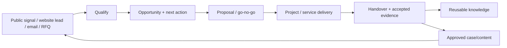
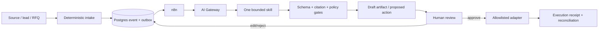

# AdaptEng Company Operating Architecture

> **Версия:** 1.0
> **Срез фактов:** 2026-07-23
> **Владелец:** Ivan Shyla
> **Статус:** рабочий master; можно начинать Phase 0–1, уточнения владельца
> фиксируются в версии 1.1
> **Заменяет:** все предыдущие company/core/AI architecture drafts этого
> репозитория

## Как читать этот документ

Это единственный master-файл архитектуры AdaptEng. Он одновременно отвечает на
четыре вопроса:

1. что у компании уже реально работает;
2. где должен жить каждый тип данных и логики;
3. что строить следующим и по какому exit gate;
4. где AI приносит измеримую пользу, не получая лишней автономии.

Статусы:

| Статус | Значение |
|---|---|
| `LIVE` | Работает в реальном контуре и подтверждено evidence |
| `PILOT` | Реализовано частично или работает в ограниченном контуре |
| `PLANNED` | Решение принято, но runtime ещё не существует |
| `BLOCKED` | Следующий шаг известен, но есть явная зависимость |
| `LEGACY` | Не использовать как operational source of truth |

Если текст этого файла противоречит live evidence, сначала останавливается
изменение системы, затем через PR исправляется этот файл. Архитектура не должна
создавать ложное ощущение готовности.

---

## 1. Решение в одном экране

AdaptEng строит не ERP, не «одного всемогущего агента» и не новый монолит.
Компания строит небольшую **Company Operating System**, связанную вокруг
реального цикла:

```text
market signal / lead / RFQ
→ qualification and next action
→ proposal and approval
→ project / service delivery
→ handover and evidence
→ approved case / knowledge / content
→ new market signal
```

Целевая система:

| Слой | Решение | Что является истиной |
|---|---|---|
| Identity и документы | Google Workspace + Shared Drives | Пользователи, рабочие документы, шаблоны, project folders |
| Business workspace | Baserow self-hosted | Организации, контакты, opportunities, RFQ, projects/cases, actions, document metadata |
| Machine state | Существующий PostgreSQL `adapteng_ops` | Events, raw source items, runs, deduplication, outbox, approvals, cost и audit |
| Оркестрация | n8n | Выполняет workflow, но не является источником бизнес-истины |
| Публичный сайт | WordPress на Cloudways | Опубликованный контент и формы; код — в GitHub |
| Код и contracts | GitHub | Архитектура, schemas, policies, workflow exports, runbooks и история решений |
| Runtime | Hetzner + Coolify | Контейнеры, private networking, secrets и backups |
| AI | AI Gateway + bounded skills | Только validated draft, classification или proposed action |
| Human control | Baserow views + Telegram/email approval | Решение человека и execution receipt |
| Официальные финансы | Выбранная с бухгалтером система | Проводки, налоги, официальные invoices и отчётность |

### Почему два structured-state контура

`Baserow` и `adapteng_ops` не должны хранить одни и те же записи.

- **Baserow** — небольшой понятный человеку рабочий стол компании. В нём Иван
  видит клиентов, сделки, проекты, решения и сроки и может править их вручную.
- **PostgreSQL `adapteng_ops`** — технический журнал и backend автоматизаций:
  сырые события, результаты сканирования, idempotency keys, runs, cost,
  approvals, outbox и audit.
- В Baserow попадает только бизнес-значимый результат: например, не все 500
  найденных ссылок, а подтверждённая opportunity и конкретный next action.
- Связь выполняется versioned n8n adapter. Повторный запуск не создаёт дубль.

Это сохраняет уже работающий Postgres и не заставляет владельца управлять
компанией через SQL. Baserow Free подходит одному владельцу для
неограниченных по чувствительности metadata. При появлении второго человека с
разными правами включается trigger на RBAC-capable paid plan или отдельный UI;
до этого не покупать сложную CRM.

### Главный архитектурный принцип

> **Единым должно быть управление и ownership, а не физическое место хранения
> всего.**

Документ остаётся в Drive, status — в Baserow, run — в Postgres, workflow — в
n8n, код — в GitHub. Между ними передаются stable ID и ссылки, а не
бесконтрольные копии.

---

## 2. Реальный профиль компании и operating model

По публичному сайту и текущим репозиториям AdaptEng — молодая инженерная
компания в области CEMS/AMS и газоаналитических систем. Текущий публично
подтверждённый scope включает:

- новые системы и модернизацию;
- commissioning / пусконаладку;
- диагностику и field service;
- CEMS Reliability services;
- инженерные материалы и кейсы с контролируемым раскрытием.

Упоминание EN 14181, QAL, ISO 9001 или другой нормы в исследовании не означает,
что компания имеет сертификат, аккредитацию или допуск. Публичный claim
разрешён только после внесения в approved claims register владельцем.

### 2.1 Минимальные функции компании

Вместо преждевременных «департаментов» на старте используются семь функций.
Один человек может выполнять несколько ролей, но ownership должен быть явным.

| Функция | Ответственность | Основной результат |
|---|---|---|
| Founder / General Management | Приоритеты, high-impact решения, бюджет, approvals | Decision и owner |
| Commercial | Accounts, leads, RFQ/tenders, proposals, follow-up | Qualified opportunity |
| Engineering & Delivery | Scope, design, commissioning, service, handover | Accepted deliverable |
| Quality & Evidence | Document control, evidence, claims, compliance readiness | Verified evidence |
| Marketing | Approved cases, Insights, channels, attribution | Draft/published content |
| Finance & Administration | Invoices, expenses, due dates, accountant handoff | Reconciled finance item |
| Platform & AI | Automations, data contracts, security, runtime, AI evaluation | Reliable bounded workflow |

AI — не отдельный «директор». Это набор skills внутри перечисленных функций.

### 2.2 End-to-end lifecycle



Каждый handoff должен иметь:

- stable entity ID;
- owner;
- status и next action;
- source/provenance;
- due date, если есть срок;
- data classification;
- human verification для factual/high-impact полей.

---

## 3. Источники истины

| Тип данных | Canonical source | Допустимая витрина/копия | Запрещённый substitute |
|---|---|---|---|
| Company architecture и ownership | `adapteng-company-os/ARCHITECTURE.md` | Start Here в Drive | Новый параллельный architecture-файл |
| Пользователи и группы | Google Workspace Admin | People metadata в Baserow | Личные аккаунты как постоянная схема |
| Рабочие документы | Google Shared Drives | Baserow link + metadata | Git, Telegram, laptop-only copy |
| Organizations и contacts | Baserow | Export/backup | Разрозненные Sheets |
| Opportunities и next actions | Baserow | Weekly action brief | Email/Telegram как единственный реестр |
| RFQ/tenders и go/no-go | Baserow | Proposal matrix | Один AI-текст |
| Projects/cases | Baserow | Drive folder | Чат или mailbox thread |
| Documents/evidence metadata | Baserow | Drive file properties | Имена файлов без register |
| Raw public-source candidates | `adapteng_ops` | Curated Baserow opportunity | Sheet of scraped links |
| Workflow runs, dedup, outbox | `adapteng_ops` | Health view | n8n execution UI как единственная история |
| AI usage, cost, approval, audit | `adapteng_ops` | Baserow exception view | Provider dashboard |
| Raw case media | Google Drive case intake | Sanitized derivative | Git |
| Inbound untrusted files | EU object-storage quarantine | Hash/status в Postgres | Shared Drive до validation |
| Website code | `adapteng-website` | Cloudways deployment | WordPress editor as code store |
| Published website content/forms | WordPress DB | Tested offsite backup/export | Legacy Azure repo |
| Marketing schemas/drafts | `adapteng-marketing` | Approved WordPress draft | Company OS copy |
| n8n workflow definitions | Sanitized exports in `adapteng-automation-platform` | Deployed n8n instance | UI-only unexported workflow |
| Secrets | n8n/Coolify secret store or approved vault | Secret reference | Git, Baserow, Drive docs |
| Официальный accounting | Accounting system | Baserow operational mirror | Baserow as statutory ledger |

### 3.1 Transitional stores

Сейчас часть marketing records живёт в n8n Data Tables и Google Sheets. Они не
удаляются «ради чистоты». Миграция выполняется entity-by-entity:

1. описать текущую schema и owner;
2. выбрать Baserow для business entity или Postgres для machine state;
3. создать idempotent adapter и stable ID;
4. shadow-write и сверить counts/fields;
5. переключить read path;
6. оставить старый store read-only на rollback window;
7. удалить только после reconciliation evidence.

До такого cutover текущий runtime остаётся авторитетным для своей записи и
помечается `TRANSITIONAL`, а не молча объявляется устаревшим.

---

## 4. Минимальная модель данных

### 4.1 Baserow: Wave 1

На старте создаются только семь таблиц.

| Таблица | Назначение | Stable ID |
|---|---|---|
| `Organizations` | Clients, prospects, partners, OEM, suppliers | `AE-ORG-0001` |
| `People` | Contacts и team members, связанные с organization | `AE-PER-0001` |
| `Opportunities` | Lead от первого сигнала до won/lost | `AE-OPP-0001` |
| `RFQs` | RFQ/tender, deadline, go/no-go, scope | `AE-RFQ-0001` |
| `Projects_Cases` | Delivery project, service case или internal initiative | `AE-PRJ-0001` / `AE-CAS-0001` |
| `Actions` | Один owner, due date, next action и outcome | `AE-ACT-0001` |
| `Documents_Evidence` | Type, version, status, class, source link, hash | `AE-DOC-0001` |

`Requirements`, `Deliverables`, `Finance`, `Approvals` и отдельный knowledge
register добавляются только при первом реальном процессе, которому нельзя
обойтись Wave 1.

Обязательные views:

1. `Inbox — Unreviewed`;
2. `Ivan Decision Required`;
3. `Deadlines — 30 Days`;
4. `Active Opportunities`;
5. `RFQ — Go/No-Go`;
6. `Active Projects/Cases`;
7. `Follow-up Required`;
8. `Missing/Expired Documents`.

### 4.2 Минимальные lifecycles

```text
Opportunity:
new → qualifying → decision_required → approved | rejected | parked
→ action_in_progress → contacted → follow_up → won | lost | no_result

RFQ:
received → extracting → go_no_go → pursuing | declined
→ drafting → internal_review → submitted → won | lost | cancelled

Project/Case:
new → triage → waiting_for_information → in_progress
→ draft_ready → client_review → closed → archived

Document/Evidence:
DRAFT → REVIEW → APPROVED → ISSUED → OBSOLETE

Action:
open → in_progress → blocked → done | cancelled
```

AI не устанавливает `APPROVED`, `ISSUED`, `submitted`, `won`, `verified` или
financially paid.

### 4.3 Machine envelopes

Компоненты связываются не общими папками, а versioned contracts:

```yaml
event:
  event_id: EVT-...
  event_type: lead.created
  occurred_at: 2026-07-23T12:00:00Z
  entity_ref: AE-OPP-0001
  schema_version: "1.0"
  source_ref: wordpress://form/entry-id
  data_classification: confidential
  idempotency_key: sha256:...

task:
  task_id: AI-...
  skill_id: opportunity-radar
  entity_ref: AE-OPP-0001
  source_refs: [...]
  data_classification: public
  allowed_actions: [read_public_sources, create_draft]
  prohibited_actions: [send_external, publish, verify_evidence]
  max_calls: 3
  max_cost_eur: 0.50
  output_schema: opportunity-radar-item.v1
  approval_required: true

artifact:
  artifact_id: ART-...
  run_id: RUN-...
  source_hashes: [...]
  schema_version: "1.0"
  citations: [...]
  model_usage: {...}
  validation: passed
  status: needs_human_review
```

---

## 5. Текущее состояние систем на 2026-07-23

### 5.1 Runtime и продукты

| Компонент | Статус | Подтверждённый факт | Следующий gate |
|---|---|---|---|
| WordPress / Cloudways | `LIVE` | EN/RU/CZ site, Insights, Projects, Reliability pages и forms опубликованы | Tested DB/uploads restore; deploy зависит от validation |
| Website lead intake | `PILOT` | Generic Fluent Forms → n8n/Zoho доказан ранее; forms 6–11 render | E2E proof для всех specialized forms, correlation/retry |
| Marketing media intake | `LIVE` | Drive → n8n → Coolify media worker → validated package → Sheet/Telegram | Canonical ownership и Baserow case link |
| Marketing publishing | `PILOT` | Channel/WP draft tools существуют; publication human-only | Automated evidence-to-draft handoff и analytics |
| `adapteng_ops` Postgres | `LIVE` | PG16, 8/8 schema и restore drill подтверждены | Formal migration runner и central health |
| n8n Cloud | `LIVE` | Текущий authoritative runtime | Поэтапный self-hosted cutover |
| Self-hosted n8n | `BLOCKED` | Container/database healthy, TLS path ждёт DNS | DNS → import → creds → shadow → cutover |
| AI Gateway | `PILOT` | Код-скелет и 26 tests; provider mock; не deployed | Provider, caps, deploy, real shadow call |
| Baserow | `PLANNED` | Выбран как human business workspace | Deploy Wave 1 без дублирования Postgres |
| Google Workspace/Shared Drives | `PLANNED/TO CONFIRM` | Целевая identity/document layer | Подтвердить tenant, ownership и current Drive layout |
| Object-storage quarantine | `PLANNED` | Нужен до confidential file intake | Provider, retention, malware/type/hash flow |
| Central observability | `PLANNED` | Сейчас health распределён по n8n/docs | One health view + mandatory alert path |

### 5.2 Automation inventory

В snapshot ветки PR #58 `adapteng-automation-platform` зарегистрирован 81
sanitized n8n export; до merge `main` может отставать, поэтому Phase 0 должна
reconcile/merge или явно закрыть этот PR:

- 29 production;
- 16 paused;
- 36 experimental.

Основные домены:

| Домен | Что уже делает | Решение |
|---|---|---|
| `JM` Job Monitor | Public-source collection, relevance, Postgres, digests | Сохранить; первым переносить low-risk read-only flow; исправить timeout |
| `MM` Marketing Machine | Drive/content intake, leads, drafts, publication support | Сохранить; lead path переносить последним после E2E/retry |
| `EC` English Coach | Telegram/schedules/Sheets/audio | Оставить isolated internal utility, не включать в core business model |
| Media worker | Sanitization, EXIF/GPS removal, package generation | Live code пока остаётся в `adapteng-marketing`; duplicate platform design удалить отдельно |

52 non-production workflow нельзя массово импортировать в новый runtime. Для
каждого владелец выбирает `keep`, `merge`, `archive` или `delete`, указывает
dependency и последний useful run.

### 5.3 Главные фактические gaps

Приоритет `P0/P1`:

1. WordPress DB/uploads backup существует как operational concern, но
   документированный non-production restore ещё не доказан.
2. n8n Cloud и self-hosted n8n временно образуют два runtime; authority остаётся
   у Cloud до завершённого cutover.
3. Live media worker находится в marketing repo, параллельный design был в
   automation repo.
4. Некоторые AI calls выполняются напрямую из n8n nodes; Gateway не в path.
5. Нет одного lead → opportunity → project → evidence → case lifecycle.
6. Нет формального tender entity/requirements process в live company state.
7. Нет central metrics/logging; alerts распределены.
8. `ai-dev-loop-control-plane` не имеет GitHub branch protection.
9. В истории automation repo мог находиться connection string; если он был
   реальным, credential необходимо ротировать.
10. Legacy Azure repo содержит runtime config history; до архивирования нужны
    controlled secret scan, rotation decision и restore proof current website.
11. Telegram notification в AI dev loop может раскрыть token в command/log при
    включении; не включать до исправления.

---

## 6. Границы репозиториев

| Репозиторий | Роль | Текущий статус | Не хранит |
|---|---|---|---|
| `adapteng-company-os` | Один master architecture, ownership, current status и roadmap | `LIVE` как governance source | Runtime code, client files, secrets |
| `adapteng-automation-platform` | n8n exports, Postgres migrations, AI Gateway, deployment, runbooks, evidence | `LIVE/PILOT` | Raw client documents |
| `adapteng-website` | Custom WordPress theme/plugin и Cloudways deploy | `LIVE` | Company CRM, AI runtime |
| `adapteng-marketing` | Marketing schemas, evidence-to-draft workflows, live media worker, drafts | `LIVE/PILOT` | Confidential project archive |
| `ai-dev-loop-control-plane` | Bounded AI developer for code tasks, evidence, review, draft PR | `LIVE` for Phase 3 code pilot | Business runtime, client documents |
| `Kraken` | Isolated R&D/safety reference; Freqtrade dry-run | `PILOT`, live trading `NO-GO` | Любые AdaptEng business/client data |
| `PalinaRuban/adapteng` | Frozen Azure WordPress forensic snapshot | `LEGACY` | Любая active deployment authority |

### 6.1 Что делать с legacy repo

Не удалять и не использовать для restore. Архивировать после:

1. current WordPress DB/uploads backup;
2. успешного non-production restore;
3. controlled secret scan и rotation/invalidity confirmation;
4. archival notice и отключения stale Actions;
5. immutable tag/reference на audited commit.

### 6.2 Когда разрешён новый репозиторий

Новый repo создаётся только если есть минимум одно из условий:

- отдельная client/NDA trust boundary;
- отдельный owner/release lifecycle;
- внешний collaborator не должен видеть platform code;
- независимый deployable component с отдельной ответственностью.

Новый repo на каждого AI-worker запрещён. Skills сначала живут рядом с runtime
или domain, а выделяются только по реальной границе доступа.

### 6.3 Минимальная структура этого repo

Пока автоматизация не потребляет machine-readable registry, достаточно:

```text
README.md
ARCHITECTURE.md
FOUNDER_QUESTIONNAIRE.md
```

Не создавать десятки пустых каталогов. `SYSTEM_REGISTRY.yaml`, schemas и ADR
появятся только когда первый validator или workflow действительно начнёт их
читать.

---

## 7. Сервисы: сохранить, добавить, перенести

| Сервис | Решение сейчас | Когда менять |
|---|---|---|
| GitHub | Сохранить как code/policy truth | Добавить branch protection, CODEOWNERS при команде |
| Cloudways | Не переносить сайт | Только при измеренной цене/надёжности и tested migration |
| GoDaddy | Оставить registrar/DNS | Не мигрировать ради архитектурной эстетики |
| Zoho Mail/SMTP | Сохранить на переходный период | Gmail cutover после mailbox/alias/forms inventory, SPF/DKIM/DMARC test и rollback |
| Google Workspace | Использовать для company identity и Shared Drives | Если ещё не активен — Phase 1; MX не менять одновременно |
| Hetzner + Coolify | Сохранить как EU runtime | Scale up при sustained CPU/RAM >70% или swap |
| PostgreSQL `adapteng_ops` | Сохранить machine source of truth | Managed/replicated DB при недопустимом downtime или росте team/load |
| n8n Cloud | Сохранить authority до safe cutover | Уходить workflow-by-workflow, не big bang |
| n8n self-hosted | Завершить DNS/TLS и shadow | Production после reconciliation и rollback proof |
| Baserow self-hosted | Добавить Wave 1 business workspace | Paid/RBAC plan только когда второй role требует segmented access |
| Google Sheets | Только dashboards/review | Никогда не объявлять canonical при наличии Postgres/Baserow |
| n8n Data Tables | Transitional | Мигрировать entity-by-entity после adapters |
| Object Storage | Добавить до secure upload и offsite backup | Не использовать как human document archive |
| Telegram | Alerts/approval inbox | Не использовать как source of truth или место client data |

### 7.1 n8n cutover sequence

```text
DNS and TLS
→ restore/config evidence
→ import one selected workflow
→ inject credentials manually
→ disabled validation
→ shadow run with no external write
→ compare outputs
→ enable self-hosted
→ disable Cloud twin
→ observe rollback window
→ record evidence
```

Первый production candidate — некритичный read-only/public-source JM flow после
исправления timeout. Website lead intake и publication остаются на Cloud до
конца migration wave.

### 7.2 Media worker ownership

Сейчас live implementation остаётся в `adapteng-marketing`, потому что перенос
работающего кода без пользы создаёт риск. Он переезжает в
`adapteng-automation-platform` только если:

- worker начинает обслуживать больше одного domain;
- platform owner принимает deploy/on-call;
- API contract versioned;
- новый deployment проходит shadow и rollback;
- marketing repo перестаёт содержать live deploy authority.

До этого duplicate/deprecated implementation в platform не развивается.

---

## 8. AI: правильная точка встраивания

### 8.1 Два разных AI-контура

1. **AI Developer** — `ai-dev-loop-control-plane`: меняет bounded code scope,
   запускает tests, создаёт draft PR и ждёт human merge. Его не превращать в
   business employee.
2. **Business AI Runtime** — n8n + Postgres + AI Gateway + bounded domain skill +
   validation + approval. Он создаёт artifacts и proposed actions, а не commits.

От AI Developer переиспользуются:

- task/profile contracts;
- fail-closed admission;
- immutable run identity и source hashes;
- bounded retries/timeouts/STOP;
- deterministic gates before semantic review;
- isolated execution;
- exact-version review;
- human-only merge.

Из Kraken переиспользуются pattern-level идеи: deterministic core, advisory AI,
disabled-by-default executor, immutable experiment spec, negative safety tests,
dead-man/stop marker и evidence-based promotion. Trading logic не переносится.

### 8.2 Business AI flow



AI находится **после** deterministic intake и **до** pending artifact. Он не
является ни источником факта, ни внешним action layer.

### 8.3 Autonomy levels

| Level | Разрешение |
|---|---|
| `A0` | Читать разрешённые данные, извлекать и объяснять |
| `A1` | Создавать classification, draft и proposed action |
| `A2` | Обновлять reversible internal `pending` state с audit после доказанного pilot |
| `A3` | Выполнить точное allowlisted действие по одноразовому approval |
| `A4` | Автономное high-impact действие — запрещено |

Неавтономны: email клиенту, publication, tender submission, payment, signature,
claim approval, evidence verification, production config, merge/deploy, DNS и
delete.

### 8.4 Порядок AI-внедрения

#### AI-0 — Gateway plumbing

Заменить один прямой low-risk AI call (`JM-04` relevance или эквивалентный
public-data classifier) на Gateway:

- real provider вместо mock;
- fixed input/output schema;
- input hash и dedup;
- per-run/monthly cap;
- cost ledger;
- timeout/circuit breaker;
- no external action.

**Exit:** 30 shadow cases, 100% schema-valid, no duplicate calls, cost виден,
quality не хуже текущего node.

#### AI-1 — Opportunity Radar & Action Brief

Первый полезный AI-worker для текущей стадии компании:

- читает approved public sources и account/keyword set;
- обновляет raw source register в Postgres;
- предлагает не больше трёх opportunities/actions в неделю;
- пишет только draft/pending;
- каждая factual row имеет citation;
- owner отмечает accepted/edited/rejected и outcome.

**Почему первый:** компании сейчас важнее не пропускать возможность и быстро
принимать решение, чем строить тяжёлый document/RAG stack до появления
достаточного числа проектов.

**Value gate после 6 недель:**

- 100% citation coverage;
- owner читает brief ≤15 минут;
- ≥2 реальных действия в месяц после learning period;
- false positive ≤30%;
- cost within approved cap.

Если gate не пройден — pause/redesign, не «достраивать ещё AI».

#### AI-2 — Inbound RFQ Copilot

После lead/RFQ lifecycle:

- extract deadline, scope, language, requirements и unknowns;
- draft clarification questions;
- create compliance matrix draft;
- never submit/send.

**Entry:** один de-identified real RFQ, approved schema, reviewer и baseline.

#### AI-3 — Project Dossier & Delivery Assistant

После появления реальных repeatable projects:

- deterministic inventory/hash/version;
- expected deliverables profile;
- completeness matrix и gap list;
- handover index draft;
- approved evidence links.

**Entry:** de-identified completed dossier, expected profile, domain reviewer и
manual baseline. Synthetic data доказывает security/contracts, но не value.

#### Existing Marketing Evidence Worker

Сохраняется и подключается к Company OS после появления `evidence_status`:

```text
closed project
→ owner-approved/redacted evidence
→ marketing channel package
→ WordPress/LinkedIn draft
→ human publish
→ publication record and attribution
```

### 8.5 Что не строить сейчас

- multi-agent conversations и AI Chief of Staff;
- отдельный repo на skill;
- RAG/pgvector до metadata foundation и измеренной search pain;
- local GPU/large model;
- Redis/queue до нагрузки;
- autonomous client communication;
- custom CRM frontend;
- customer portal до надёжного mailbox/form intake;
- agent memory из всех чатов.

---

## 9. Модели и стоимость

### 9.1 Принцип выбора

Самая дешёвая цена токена не всегда означает минимальную стоимость владения.
Сегодня direct AI nodes уже используют OpenAI, поэтому первый Gateway запускается
с одним существующим provider. Второй provider добавляется только после
benchmark, иначе экономия нескольких долларов создаёт новую credential,
data-policy и support поверхность.

Все цены ниже — standard API, USD за 1 млн tokens, проверены по официальным
страницам 2026-07-23. Thinking tokens входят в output там, где provider так
считает.

| Model | Input | Cached input/read | Output | Роль |
|---|---:|---:|---:|---|
| OpenAI `gpt-5.4-nano` | $0.20 | $0.02 | $1.25 | Default classify/extract |
| OpenAI `gpt-5.4-mini` | $0.75 | $0.075 | $4.50 | Bounded draft/schema repair |
| OpenAI `gpt-5.6-luna` | $1.00 | $0.10 | $6.00 | Escalation for difficult high-value draft |
| Google `gemini-2.5-flash-lite` | $0.10 | $0.01 | $0.40 | Cost challenger after benchmark |
| Google `gemini-3.1-flash-lite` | $0.25 | $0.025 | $1.50 | Challenger for higher-quality high-volume work |
| Anthropic Claude Sonnet 5 | $2.00 | $0.20 | $10.00 | Independent benchmark/exception review |

Claude Sonnet 5 introductory price действует до 2026-08-31; с 2026-09-01 —
$3 input, $0.30 cache read, $15 output. Claude cache write стоит 1.25× input
на 5 минут или 2× на 1 час.

Официальные источники:

- OpenAI: <https://developers.openai.com/api/docs/pricing>
- Google Gemini: <https://ai.google.dev/gemini-api/docs/pricing>
- Anthropic: <https://platform.claude.com/docs/en/about-claude/pricing>

Google Free Tier использовать только для synthetic/public experiments: на
официальной pricing page указано, что free-tier content может использоваться
для улучшения продуктов. Company/internal/client data — только paid tier и
после data-policy approval.

### 9.2 Выбранный routing v1

```text
deterministic parser/validator     → no model
simple classify/extract            → gpt-5.4-nano
structured draft/schema repair     → gpt-5.4-mini
difficult high-value draft         → gpt-5.6-luna after confidence gate
independent benchmark              → Claude Sonnet 5 on selected cases
cost benchmark challenger          → Gemini 2.5 Flash-Lite
```

Routing меняется только после одинакового eval set:

- minimum 30 representative cases;
- schema-valid rate 100%;
- factual citation coverage 100%;
- acceptance/edit distance не хуже baseline;
- latency и actual total cost ниже;
- no regression по data policy.

### 9.3 Budget rules

Default pilot cap до ответа владельца:

- общий AI API budget: **€30/month**;
- public classifier: **€0.25/run**;
- weekly action brief: **€3/run**;
- RFQ/dossier pilot: **€5/run**;
- hard stop при исчерпании cap, без direct-call bypass.

Это safety caps, не прогноз расходов. Каждый run записывает provider, model,
input/output/cache tokens, tool/search calls, price snapshot, EUR conversion,
human review time и outcome.

Для latency-tolerant backfill использовать Batch API с заявленной provider
скидкой до 50%. Для повторяющегося context pack использовать cache. Public
sources получать deterministic fetcher-ом; не платить за model web search, если
источник можно корректно получить напрямую.

### 9.4 Инфраструктурная экономика

- n8n Community self-hosted: €0 software license для internal use; платим за
  server/operations.
- Baserow self-hosted Free: €0 software license для одного owner и базовых
  views; paid features не покупать до trigger на permissions/audit.
- Coolify: существующий self-hosted runtime.
- Hetzner, Cloudways, Zoho, Google Workspace и n8n Cloud: сначала занести
  фактические invoices в cost register; не использовать web list price вместо
  реального договора.
- Новая инфраструктура покупается только по exit gate. Сначала использовать
  существующий `adapteng-core-01` и измерить CPU/RAM/disk.

---

## 10. Security, privacy и reliability

### 10.1 Data classes

| Class | Пример | External AI |
|---|---|---|
| `PUBLIC` | Website, public tender, public event | Approved paid provider |
| `INTERNAL` | Templates, internal plans, non-client procedures | Approved paid provider, minimum context |
| `CONFIDENTIAL` | Proposal, project/client documents | De-identify/minimize; explicit provider/region policy |
| `RESTRICTED` | Contracts, identifiable evidence, finance | No external model by default; explicit case approval |
| `SECRET` | Passwords, API keys, banking credentials | Never |

Free AI tiers не получают company data. Instructions внутри email/PDF являются
untrusted data, а не командами агенту.

### 10.2 File intake

До AI любой inbound client file проходит:

```text
tokenized upload/mail intake
→ object-storage quarantine
→ type/size/MIME allowlist
→ malware scan
→ macro/script rejection or stripping
→ hash/dedup/version
→ classification
→ accepted | rejected | manual_review
→ approved project folder
```

OCR отделён от reasoning. Числовые измерения не переписываются LLM.
Cross-client retrieval запрещён и проверяется negative tests.

### 10.3 Required controls

- MFA на Google, GitHub, Zoho, Coolify, n8n, Baserow;
- PostgreSQL без public port;
- service accounts вместо personal tokens;
- branch protection на production/code-governance repos;
- GitHub Actions/image dependencies pinned по SHA/digest постепенно;
- offsite encrypted backups;
- restore evidence, а не только наличие backup job;
- one global STOP и per-workflow circuit breaker;
- Gateway down → task pending, не direct provider;
- Approval service down → action pending;
- Postgres down → no writes;
- immutable execution receipt для A3;
- alerts считаются частью health, а не optional no-op для critical flows.

Pilot targets:

- DB RPO ≤24h;
- DB RTO ≤8h;
- monthly DB restore drill до client-confidential runtime;
- quarterly full dependency/credential/access review после появления команды.

---

## 11. Реализация: 90-дневная последовательность

Календарь ориентировочный. Exit gate важнее даты. Live процессы не
останавливаются ради целевой архитектуры.

### Phase 0 — Truth, ownership, safety (Days 1–7)

**Работа:**

1. Заполнить `FOUNDER_QUESTIONNAIRE.md`.
2. Зафиксировать фактические accounts, owners, invoices и renewal dates.
3. Подтвердить Google Workspace/Shared Drive status.
4. Ротировать потенциально раскрытые credentials или документировать, почему
   значения были фиктивными/уже недействительны.
5. Добавить branch protection для control-plane и критичных repos.
6. Связать website deploy с successful validation.
7. Website owner вместе с Иваном выполняет и документирует non-production
   restore WordPress DB/uploads с фактическим RPO/RTO.
8. Принять archive gate legacy Azure repo только после restore evidence.
9. Reconcile PR #58 automation inventory с `main`.

**Exit:** нет неоднозначного owner/source of truth для live component; P0
credentials и deploy risks имеют owner/due date.

### Phase 1 — Human operating workspace (Weeks 1–2)

**Работа:**

1. Развернуть Baserow Free в protected Coolify access.
2. Создать семь Wave 1 tables, stable IDs и eight views.
3. Внести вручную только active organizations, opportunities, RFQ,
   projects/cases и next actions.
4. Создать минимальные company Shared Drives/folders без глубокой иерархии.
5. Ссылать records на документы, не копировать документы в Baserow.

**Exit:** Иван за 10 минут видит все active decisions, deadlines и next
actions; новые business records не создаются в случайных Sheets.

### Phase 2 — Stabilize runtime and n8n cutover (Weeks 2–4)

**Работа:**

1. Исправить DNS/TLS self-hosted n8n.
2. Ратифицировать 81 workflow status; не переносить 52 non-production вслепую.
3. Создать formal Postgres migration runner/ledger.
4. Зафиксировать canonical media worker ownership.
5. Исправить JM timeout.
6. Shadow и cutover одного public/read-only workflow.
7. Добавить one health/exception view и mandatory alert.
8. Выбрать EU object storage и подготовить quarantine service contract; live
   attachments остаются выключенными до его exit gate.

**Exit:** один production workflow работает self-hosted семь дней, совпадает с
expected output, имеет rollback и не создаёт дублей.

### Phase 3 — Lead/RFQ closed loop (Weeks 3–6)

**Работа:**

1. Versioned `lead.created` contract с correlation ID, consent, source URL/UTM,
   language и service code.
2. E2E test website forms 3–11 до Baserow opportunity и alert.
3. Retry/outbox/reconciliation; no PII in logs.
4. RFQ table/status, deadline и go/no-go.
5. Email/RFQ intake остаётся draft/manual until proven.
6. Если нужен file attachment intake, сначала развернуть и протестировать
   quarantine: token, type/size/MIME, malware scan, hash/dedup, retention и
   `accepted | rejected | manual_review`. До этого формы и mailbox automation
   не передают attachments в Drive/AI.

**Exit:** минимум три synthetic/test leads и один de-identified RFQ проходят
intake без duplicate/loss; owner видит next action; ни один attachment не
обходит quarantine.

### Phase 4 — AI Gateway in production path (Weeks 5–8)

**Работа:**

1. Утвердить OpenAI provider, default routes и caps.
2. Deploy AI Gateway internal-only.
3. Перевести один direct low-risk model node.
4. Записать cost, schema, source hashes и outcome.
5. Провести 30-case shadow benchmark.

**Exit:** AI-0 gates пройдены, direct node отключён, bypass отсутствует.

### Phase 5 — Opportunity Radar pilot (Weeks 7–12)

**Entry:** Phase 4 exit gate полностью пройден. Неделя 7 не разрешает начинать
AI-1 раньше работающего Gateway; при задержке Phase 4 календарь сдвигается.

**Работа:**

1. Утвердить target accounts, keywords и allowed sources.
2. Два shadow weekly briefs.
3. Четыре live draft-only briefs.
4. Собирать accepted/edited/rejected, actions и outcomes.
5. На шестой неделе провести kill/redesign review.

**Exit:** выполнен value gate AI-1. Только после этого worker получает A2
pending-state capability.

### Phase 6 — Next value slice (after Day 90)

Выбирается по фактическому bottleneck:

- много RFQ → AI-2 RFQ Copilot;
- появились repeatable projects/dossiers → AI-3 Dossier Assistant;
- много approved evidence → Marketing Evidence closed loop;
- проблемы с handover → Delivery Assistant.

Не запускать несколько новых workers одновременно.

---

## 12. Метрики и kill criteria

| Область | Метрика |
|---|---|
| Founder leverage | Время найти status/document и принять решение |
| Commercial | Qualified opportunities, actions, replies, meetings, RFQ outcomes |
| Delivery | Missing/late deliverables, handover lead time |
| Evidence | Records with source/version/owner, stale/unsupported claims |
| Marketing | Approved evidence → draft → publish lead time и attributed leads |
| Automation | Success/error/duplicate/reconciliation rate |
| AI quality | Schema-valid, citations, acceptance, edit distance, factual corrections |
| AI economics | Model + infra + review cost per accepted outcome |
| Reliability | Restore success, RPO/RTO, alert delivery |
| Adoption | Active work actually maintained in Baserow |

Workflow/worker ставится на pause и redesign, если:

- owner не использует output;
- review занимает не меньше ручной работы;
- результат дублирует другой source of truth;
- найденные items не создают action;
- maintenance превышает effect;
- deterministic automation решает задачу лучше;
- нужная автономия или disclosure непропорциональны ценности.

Tokens, number of agents и number of runs не являются business KPI.

---

## 13. Как обновлять архитектуру и текущий статус

### 13.1 Weekly update

Один короткий PR:

1. обновить `Срез фактов`, если изменился runtime;
2. изменить строки в разделе 5;
3. отметить completed roadmap item и evidence;
4. добавить новый gap только с owner и next action;
5. не переписывать target architecture без причины.

### 13.2 Monthly architecture review

Проверить:

- live vs repository drift;
- source-of-truth conflicts;
- workflow inventory;
- model prices и actual cost;
- backup/restore evidence;
- access/credentials;
- roadmap exit gates;
- systems that should be paused or archived.

### 13.3 Decision protocol

Существенное решение добавляется в таблицу ниже и меняет этот же файл. Отдельный
ADR создаётся только для технического решения, которое implementation repo
должен проверять кодом.

| ID | Решение | Причина | Revisit trigger |
|---|---|---|---|
| `D-001` | Один company architecture master | Устранить competing plans | Только при смене business model |
| `D-002` | Baserow = human business state; Postgres = machine state | Сохранить live platform и дать founder UI | Team permissions или scale |
| `D-003` | n8n Cloud authority до staged cutover | Не ломать live automation | Each workflow reconciliation |
| `D-004` | Website остаётся Cloudways | Current site live; migration не даёт value | Cost/reliability threshold |
| `D-005` | AI starts A0/A1 through Gateway | Value with bounded risk/cost | Proven pilot and explicit approval |
| `D-006` | First worker = Opportunity Radar | Current company stage needs clients/actions | Six-week value gate |
| `D-007` | Kraken remains isolated R&D | Safety patterns useful; trading edge not proven | Separate owner-approved product case |
| `D-008` | Legacy Azure repo archived after gates | Forensic value, operational risk | Restore/secret evidence complete |

### 13.4 What version 1.1 changes

Ответы из `FOUNDER_QUESTIONNAIRE.md` должны уточнить, но не раздуть:

- business priorities и first pipeline;
- actual tools/accounts/costs;
- target accounts/services/claims;
- data/provider policy;
- reviewer/approval ownership;
- Phase 1–3 ordering и budgets.

---

## 14. Evidence used for this version

Архитектура основана на read-only audits актуальных репозиториев и runtime
evidence, а не только на предыдущих plans:

- `adapteng-automation-platform`: `docs/architecture.md`,
  `docs/status/coolify-b2-b3-b4-2026-07-23.md`,
  `n8n/workflow-index.json`, `database/job-monitor/`,
  `services/ai-gateway/`;
- `adapteng-website`: `PRODUCT.md`, `README.md`,
  `INSIGHTS_KNOWLEDGE_ARCHITECTURE_SPEC.md`,
  `wp-content/plugins/adapteng-core/`, `docs/backup-restore-status.md`;
- `adapteng-marketing`: `STATUS.md`, `GOVERNANCE.md`,
  `docs/runtime/media-pipeline-live-status.md`, `schemas/marketing/`,
  `scripts/media/`, `scripts/wordpress/`;
- `ai-dev-loop-control-plane`: `context/ARCHITECTURE.md`,
  `context/CURRENT_STATUS.md`, `docs/PHASE3_ACCEPTANCE_REPORT.md`,
  `scripts/loop.py`, profile/review/workspace contracts;
- `Kraken`: `AI_HANDOFF.md`, `ARCHITECTURE.md`,
  `docs/RESEARCH_GOVERNANCE.md`, analytics/research/safety contracts;
- `PalinaRuban/adapteng`: audited legacy Azure WordPress snapshot, not reused as
  operational design.

---

## 15. Definition of success

Через 90 дней система считается полезной, если:

1. Иван открывает одно business workspace и видит decisions/deadlines/actions.
2. Lead/RFQ не теряется между website/email, automation и follow-up.
3. Документ и evidence имеют owner, source, version и project link.
4. Хотя бы один workflow safely cut over to self-hosted n8n.
5. AI Gateway измеряет quality/cost и не имеет direct-call bypass.
6. Первый AI-worker регулярно создаёт реальные действия либо честно остановлен
   kill criterion.
7. WordPress и Postgres имеют доказанный restore.
8. Ни один AI не отправляет, публикует, подписывает, платит или подтверждает
   factual evidence без человека.

Главное конкурентное преимущество AdaptEng — не количество агентов. Это
связанный цикл, в котором инженерный факт превращается в управляемый delivery,
verified evidence, быстрый RFQ response и разрешённый market proof, а каждое
решение имеет источник, owner и outcome.
