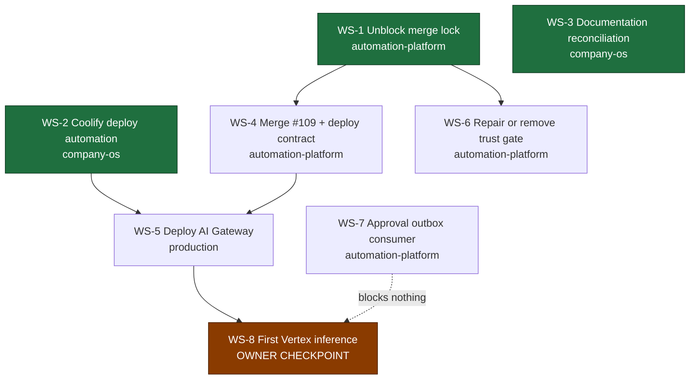

# Execution program

Current workstreams to reach a deployed, healthy AI Gateway and then exactly one
governed Vertex inference.

Two workstreams the handoff proposed are **not** here. FX configuration is
already specified on `main` and needs three values at deploy time, not a
workstream. Least-privilege role provisioning is a step inside deployment, not
a parallel track. Removing work is part of the job.

## Dependency graph



**Start now, in parallel:** WS-1, WS-2, WS-3. They share no files and no
repository state.

**WS-1 is the critical path.** Nothing in the platform repository can merge
until it lands.

## Branch discipline

One branch per workstream, separate worktrees, no mixed-purpose pull requests.
No workstream may modify another's files.

| Workstream | Repository | Branch |
|---|---|---|
| WS-1 | `adapteng-automation-platform` | `fix/n8n-isolation-check-scope` |
| WS-2 | `adapteng-company-os` | `feat/coolify-deploy-automation` |
| WS-3 | `adapteng-company-os` | `chore/registry-drift-reconcile` |
| WS-4 | `adapteng-automation-platform` | `feat/ai-gateway-deploy-contract` |
| WS-5 | — | deployment, no branch |
| WS-6 | `adapteng-automation-platform` | `fix/rollout-trust-anchor-fetch` |
| WS-7 | `adapteng-automation-platform` | `feat/approval-outbox-consumer` |

---

## WS-1 — Unblock the repository-wide merge lock

**Repository** `adapteng-automation-platform` · **Base** `main` · **Branch**
`fix/n8n-isolation-check-scope` · **Depends on** nothing

**Objective.** Stop a lapsed n8n isolation waiver from blocking every pull
request in the repository, without weakening the isolation boundary itself.

**Auto-merge** YES, once required checks pass · **Auto-deploy** N/A ·
**Owner decision** NO for this change. Renewing the waiver is separate and is
owner-only.

### Prompt

> You are working in `Ivan-Shyla/adapteng-automation-platform`. Branch from
> `main` to `fix/n8n-isolation-check-scope`.
>
> **Problem.** `.github/workflows/validate.yml` defines one job named
> `Validate repository structure and content`. That job name is a required
> status check in the repository's `main-protected` ruleset. One of its steps
> runs `scripts/validation/validate_n8n_isolation.py`. That script currently
> exits 1 because the single waiver in `n8n/isolation-waivers.json` has
> `expires_on: 2026-08-08`, which is in the past. The relevant logic is the
> `elif today > expiry:` branch in `_load_waivers`, which appends
> `waiver expired isolation_ref=...` to the errors list.
>
> The effect is that **every** pull request in the repository is unmergeable,
> including ones that touch nothing related to n8n. Confirm this yourself
> before changing anything: the same workflow succeeded on `main` at `23a23f0`
> on 2026-08-08 and fails now.
>
> **Do not** delete the isolation check. **Do not** remove
> `Validate repository structure and content` from the required checks. **Do
> not** edit the waiver date, and **do not** edit `WAIVABLE_EXPIRES_ON` in the
> validator. The pinned-tuple design is deliberate and correct: extending a
> data-boundary waiver must be a reviewable code change, and it is an owner
> decision that is explicitly out of scope for you.
>
> **Do this instead — separate the concerns.**
>
> 1. In `.github/workflows/validate.yml`, remove the
>    `Run n8n isolation validation` step from the job named
>    `Validate repository structure and content`. Keep that job's name
>    **byte-identical** — the ruleset matches on it. Every other step in that
>    job stays exactly as it is, including repo validation, the isolated Vertex
>    auth environment, deploy spec validation, policy unit tests, the
>    detect-secrets scan, trust-root validation, AI gateway hardening
>    validation, the `.gitignore` pattern check and the required
>    directory/file checks. All of those must remain blocking.
> 2. Add a second job in the same workflow, named `n8n isolation`, that always
>    runs on every push and pull request and executes the same validator. It
>    must be blocking when the pull request changes anything under `n8n/`, and
>    reporting-only otherwise. Implement this by always running the job and
>    always running the validator, then deciding whether a non-zero result
>    fails the job based on whether n8n paths changed — do **not** use a
>    workflow-level `paths:` filter, because a required check that never starts
>    blocks a pull request forever. When it is reporting-only, the job must
>    still print the full validator output and add a clearly worded warning to
>    the job summary.
> 3. Add a scheduled workflow that runs the isolation validator daily and fails
>    when the waiver is expired **or within 14 days of expiring**, so the next
>    lapse is visible before it blocks anyone. Warning ahead of time is the
>    entire point; do not settle for detecting it afterwards.
> 4. Add or extend a test under `tests/` proving both behaviours: an expired
>    waiver fails the `n8n isolation` job when n8n paths changed, and does not
>    fail `Validate repository structure and content`.
>
> **Verify before opening the pull request.** Run
> `python scripts/validation/validate_n8n_isolation.py` locally and confirm it
> still reports the expired waiver — you are not fixing the finding, only its
> blast radius. Then confirm your own pull request shows
> `Validate repository structure and content` green.
>
> Open the pull request against `main` with a title starting `fix(ci):`, and
> explain in the body that the isolation finding remains open and that renewing
> the waiver is a separate owner decision. Then merge it once required checks
> pass — no approval is required by the ruleset. If the two rollout trust-anchor
> checks are red, ignore them: they are not required checks and are handled by
> WS-6.

**Success criteria.** `Validate repository structure and content` is green on a
pull request that does not touch `n8n/`. The isolation finding is still
reported and still blocks n8n changes. A scheduled job warns before expiry. PR
#109 becomes mergeable.

---

## WS-2 — Coolify deployment automation

**Repository** `adapteng-company-os` · **Base** `main` · **Branch**
`feat/coolify-deploy-automation` · **Depends on** nothing

**Objective.** Replace console clicking with an API-driven deploy the agent can
run, using the credential that already exists in this repository.

**Auto-merge** YES · **Auto-deploy** N/A · **Owner decision** NO — no new
credential is created and nothing is deployed by this workstream.

### Prompt

> You are working in `Ivan-Shyla/adapteng-company-os`. Branch from `main` to
> `feat/coolify-deploy-automation`.
>
> **Context you must verify first.** This repository — not the platform
> repository — already holds the Coolify credential as a repository secret and
> the Coolify base URL as a repository variable. Confirm both exist with
> `gh secret list` and `gh variable list` before writing anything. Do not create
> a new credential. Do not ask anyone to paste a credential value anywhere. Do
> not print, echo or log the credential, and do not write it into a file that
> is committed.
>
> **Objective.** A reusable, idempotent GitHub Actions workflow in this
> repository that drives the Coolify API so an agent can run "deploy
> ai-gateway" instead of asking the owner to click through a console.
>
> **Required operations**, each independently invocable via
> `workflow_dispatch` inputs:
> - `inspect` — list the project, environment and applications, and report
>   whether a given application exists and its current state. Read-only.
> - `reconcile` — create the application if absent, or update it to match the
>   declared spec if present. Must be safe to run repeatedly with no change on
>   the second run. Never deletes anything.
> - `deploy` — trigger a deployment and poll until it reaches a terminal state,
>   then report success or failure with the deployment identifier.
> - `status` — report the current deployment and health state. Read-only.
>
> **The spec must be declarative and committed**, not passed as ad-hoc inputs.
> Add a directory such as `deploy/` in this repository holding one file per
> deployable service. For the AI Gateway the declared values are: project
> `adapteng-ops`, environment `production`, resource name `ai-gateway`, source
> repository `Ivan-Shyla/adapteng-automation-platform`, branch `main`, build
> pack Dockerfile, base directory `/services/ai-gateway`, Dockerfile
> `/Dockerfile`, internal port `8081`, health path `/health`, and **no public
> FQDN — private network only**. Non-secret configuration values belong in this
> spec. Secret values must be referenced by name only and never inlined.
>
> **Behaviour requirements.**
> - Fail closed. A missing credential, an unreachable API, an ambiguous
>   resource match or a non-2xx response must abort with a clear message and a
>   non-zero exit, never a silent partial apply.
> - `reconcile` must verify by re-reading after writing, and report a diff of
>   what changed. Do not trust the write response alone. This repository already
>   uses that read-back pattern in `scripts/bootstrap_rulesets.py`; follow it.
> - Never delete or destroy a resource. Deletion is an owner action and must not
>   be reachable from this workflow at all.
> - Redact anything credential-shaped from all output.
>
> **Implementation notes.** Match this repository's existing conventions: a
> Python script under `scripts/` using only the standard library, driven by a
> thin workflow that passes configuration through the environment. Pin action
> versions by commit SHA as the existing workflows do. Add unit tests following
> the pattern of the existing suites and register any new test module in the
> explicit list in `.github/workflows/ci.yml`, because `unittest discover`
> cannot be used in this repository.
>
> **Before opening the pull request**, run the checks documented in `README.md`:
> `python scripts/validate_sensitive_references.py` and the unittest suites.
> The sensitive-reference validator will reject committed resource identifiers
> and credential values — that is intentional; fix your content rather than the
> validator.
>
> **Do not deploy anything in this workstream.** Delivering the capability is
> the whole scope. Open the pull request titled `feat(deploy):` and merge once
> CI is green.

**Success criteria.** An agent can run inspect, reconcile, deploy and status
against Coolify from CI. Re-running reconcile is a no-op. No credential value
appears in any log. Nothing is deployed yet.

---

## WS-3 — Documentation and registry reconciliation

**Repository** `adapteng-company-os` · **Base** `main` · **Branch**
`chore/registry-drift-reconcile` · **Depends on** nothing

**Objective.** Close the drift register in
[`current-state.md`](current-state.md) §9 so the next agent is not told to redo
finished work.

**Auto-merge** YES · **Auto-deploy** N/A · **Owner decision** NO

### Prompt

> You are working in `Ivan-Shyla/adapteng-company-os`.
>
> **First, merge pull request #35.** It is `CLEAN`, all checks are green, and
> the `main-protected` ruleset requires zero approving reviews. It has been open
> with nothing waiting on it. Merge it, then branch from the updated `main` to
> `chore/registry-drift-reconcile`. Working before merging it will cause
> conflicts, because #35 edits `owner/action-items.md` and two registry files.
>
> Then correct the drift recorded in `control-plane/current-state.md` §9.
>
> **D-1, highest priority.** `owner/action-items.md` states that migrations
> 002, 003, 005, 006, 007 and both 008 units "remain repo-only and unapplied".
> The owner's post-rollout manual production check found all nine logical units
> exact. Production outranks the note. Rewrite that item to record the verified
> state and to say explicitly that these migrations must not be replayed. This
> is the most dangerous entry in the repository: as written it invites an agent
> to re-apply migrations that are already correct.
>
> **D-2.** The rollout-authorization blocker refers to an
> automation-evidence lifecycle pull request as an outstanding dependency. That
> chain merged through platform pull requests #93, #94 and #98. Verify with
> `gh pr view` against `Ivan-Shyla/adapteng-automation-platform` and, if
> confirmed, close the item and record the evidence.
>
> **D-3.** Narrow the AI Gateway readiness language in `ai/` so it reads as
> "implemented and tested, not deployed" rather than as cost- or
> runtime-blocked. Its tests and supply-chain gates are green on the platform
> repository's `main`.
>
> **D-5.** Record the migration 001 allocator incident as closed by platform
> pull request #108.
>
> Also update `registry/services.yaml` so the AI Gateway's status distinguishes
> "implemented" from "deployed", and add the AI Gateway to
> `registry/environments.yaml` as a declared but not-yet-created production
> resource, if it is not already represented.
>
> **Rules.** Change existing entries; do not create a parallel status document.
> Every claim you write must name its evidence — a commit, a pull request
> number, a CI run, or the owner's production check. Where you cannot verify
> something from GitHub, mark it `UNVERIFIED` and say what would settle it
> rather than asserting it. Do not mark anything as done that you have not
> checked.
>
> Run `python scripts/validate_sensitive_references.py` and the unittest suites
> from `README.md` before opening the pull request. Title it `docs:` and merge
> once CI is green.

**Success criteria.** PR #35 merged. No document still claims the nine
migrations are unapplied. Every closed item names its evidence.

---

## WS-4 — Merge PR #109 and close the deployment contract

**Repository** `adapteng-automation-platform` · **Base** `main` · **Branch**
`feat/ai-gateway-deploy-contract` · **Depends on** WS-1

**Objective.** Land the credential-file validation already written, and fix the
two undocumented deployment blockers found in §5 of `current-state.md`.

**Auto-merge** YES · **Auto-deploy** NO · **Owner decision** NO

### Prompt

> You are working in `Ivan-Shyla/adapteng-automation-platform`. WS-1 must have
> merged first; confirm that a pull request can now show
> `Validate repository structure and content` green before you start.
>
> **Step 1 — merge pull request #109.** Branch
> `feature/ai-gateway-owner-decisions`, head `9184def`. It hardens
> `services/ai-gateway/app/config.py` so that startup fails closed when the
> provider credential file is missing, unreadable or empty — without ever
> reading what is inside it. It also adds tests and a least-privilege
> runtime-role runbook. Its own tests are green: unit
> tests on Linux and Windows, PostgreSQL semantics, and supply-chain gates.
> Re-run the checks, confirm the required ones pass, and merge. Do not rewrite
> it. If the two rollout trust-anchor checks are still red, ignore them — they
> are not required by the ruleset and WS-6 owns them.
>
> **Step 2 — fix the container bind address.** `services/ai-gateway/Dockerfile`
> currently ends with `ENV AI_GATEWAY_HTTP_HOST=127.0.0.1`. A process bound to
> loopback inside a container is unreachable from the container network, so the
> health check cannot pass and no consumer can reach the service. Keep the safe
> default in the image, but make the deployment contract explicit: document in
> `docs/runbooks/` that a container deployment **must** set
> `AI_GATEWAY_HTTP_HOST=0.0.0.0`, and add a startup log line, emitted at bind
> time, stating the bound host and port so a misconfiguration is obvious in the
> first seconds of a deployment rather than after a failed health check. Do not
> log tokens, the DSN or any credential.
>
> **Step 3 — separate liveness from readiness.** `/health` in
> `app/http_app.py` returns `{"status":"ok"}` without touching the database, so
> a green health check proves only that the process is listening. Add a
> distinct readiness endpoint that verifies database connectivity and that the
> budget store is reachable, and that returns a non-2xx status when it is not.
> It must not leak configuration, credential state, model names or cap values —
> match the existing endpoint's discipline exactly. Keep `/health` as-is for
> the platform's liveness probe.
>
> **Step 4 — write the deployment configuration contract.** Add a runbook
> listing every environment variable a production deployment must set, which
> are secret and which are not, and which have no safe default. Cross-check it
> against `services/ai-gateway/.env.example` and the validation in
> `app/config.py` so the list is complete and neither invents nor omits a
> variable. State plainly that the FX rate, its timestamp and its source label
> are operator inputs that are never looked up live, and that the price version
> is a pinned audited constant rather than a deployment choice. Do not invent
> an FX rate or source value.
>
> Add tests for the readiness endpoint and the bind-address logging. Open one
> pull request per step if they are large; do not create a single mixed-purpose
> pull request. Merge once required checks pass.

**Success criteria.** #109 merged. A deployment that binds to loopback is
obvious immediately. Readiness is distinguishable from liveness. Every required
environment variable is documented in one place.

---

## WS-5 — Deploy the AI Gateway to production

**Depends on** WS-2 and WS-4 · **No branch** — this is a deployment

**Objective.** The first milestone: deployed, running, healthy, private-network
only, PostgreSQL ready, credentials ready, **inference count still 0**.

**Auto-merge** N/A · **Auto-deploy** YES, fail closed · **Owner decision** YES,
once — see the checkpoint below.

### Prompt

> Use the WS-2 automation. Do not deploy by hand through the console, and do not
> ask the owner to.
>
> 1. Run `inspect` and record whether an `ai-gateway` application already
>    exists. The reconciliation could not verify this remotely; treat the
>    inspect output as authoritative and do not assume either way.
> 2. Run `reconcile` to create or align the application to the committed spec:
>    project `adapteng-ops`, environment `production`, Dockerfile build, base
>    directory `/services/ai-gateway`, internal port `8081`, no public FQDN.
> 3. Bind configuration. Non-secret values come from the committed spec. The
>    provider credential must be delivered as a runtime file at
>    `/run/secrets/gcp-adc.json`, referenced through
>    `GOOGLE_APPLICATION_CREDENTIALS`. It must never be committed, never baked
>    into the image, never printed and never logged. Prefer a native runtime
>    file mount; a base64 environment secret decoded at startup is acceptable
>    only if that is already the established pattern in this platform. Do not
>    redesign this around workload identity federation — that is later
>    hardening, not a prerequisite.
> 4. Set `AI_GATEWAY_HTTP_HOST=0.0.0.0`. Without it the service is unreachable
>    regardless of everything else.
> 5. Provision the least-privilege database role from the runbook merged in
>    #109 — login, no superuser, no create, no replication, no bypass, execute
>    only on the definer functions the budget store needs, no direct table
>    access — and point the gateway's connection string at it. Verify the role
>    cannot read unrelated tables before proceeding.
> 6. Deploy and poll to a terminal state. On failure, read the logs, report the
>    cause, and stop. Do not retry blindly.
> 7. Verify: the process is listening on the internal network, liveness is
>    green, readiness is green, the private network reaches PostgreSQL, and no
>    public route exists. Confirm the model call count is still zero.
>
> Report the result with evidence. Do not make a model call. Do not proceed to
> WS-8.

**Success criteria.** Deployed, healthy, private-network only, database ready
through the least-privilege role, credentials mounted at runtime, inference
count 0.

---

## WS-6 — Repair or remove the trust-anchor gate

**Repository** `adapteng-automation-platform` · **Branch**
`fix/rollout-trust-anchor-fetch` · **Depends on** WS-1 · **Priority** low

**Auto-merge** YES · **Owner decision** NO to fix. YES to remove.

> **This prompt shipped an incorrect root cause.** It is kept verbatim below,
> with the correction after it, because the failure mode is worth preserving:
> the brief named the loudest symptom as the defect and directed an agent to
> fix something that was not broken. The agent rejected the diagnosis, proved
> it wrong, and fixed the real bug. That is the behaviour these prompts should
> invite — the "verify before you implement" instruction in the dispatch rules
> is what made it possible, and it must stay.

### Prompt (as dispatched — contains an error, see below)

> Two checks — `Verify exact current head from merged base` and `Base-trusted
> rollout authorization` — fail on every pull request with:
>
> ```
> fatal: could not read Username for 'https://github.com'
> fatal: could not fetch <object> from promisor remote
> rollout_trust_anchor.approval.unexpected
> ```
>
> The job checks out a partial clone and then re-invokes git through
> `env -i` with a scrubbed environment carrying no credential, so the lazy
> object fetch fails. The verifier then reports an authorization failure for
> what is actually an infrastructure failure.
>
> Neither check is in the ruleset's required list, so neither blocks a merge.
> Their only current effect is a permanent red mark, which trains reviewers to
> ignore red marks.
>
> Fix the fetch so the check can complete: ensure the objects it needs are
> present before the environment is scrubbed, or supply a credential to that
> git invocation deliberately without widening its trust boundary. Preserve the
> scrubbed-environment design — that part is sound. Then make the verifier
> distinguish "not authorized" from "could not determine", and fail closed on
> both while reporting them differently, because they demand different
> responses.
>
> If it cannot be made to complete reliably, say so plainly and propose
> removing it rather than leaving it permanently red. Removal is an owner
> decision; repair is not.

### Correction (2026-08-10, verified against `main`)

The second paragraph is wrong in both of its claims.

The `fatal:` lines are genuine and reproducible, but they do **not** originate
from `env -i` — the git calls at `rollout-trust-anchor.yml` lines 82/84 are
outside the scrubbed block, which closes with its command substitution at line
77. The credential is missing because the checkout sets
`persist-credentials: false`. More importantly they did not fail the step:
`test "$(git status --porcelain=v1)" = ""` throws away git's exit 128 and its
empty stdout satisfies the comparison, so that assertion **failed open**.

The real defect is in `scripts/validation/verify_rollout_trust_anchor.py`,
which asks whether approval material is *present* in a tree rather than whether
the pull request *introduced* it. Once PR #104 merged the receipt onto `main`
at `2026-08-06T15:42:06Z`, every later branch inherited it. Both directions of
the gate then jammed — `approval.unexpected` for ordinary PRs,
`approval.circular_or_stale` for any owner-signed receipt.

**What the prompt should have said:** state the observed failure, state the
last known-good timestamp, and require the agent to establish the causal chain
itself. Supplying a mechanism invited implementation against a wrong premise.
Only the closing instruction — distinguish "not authorized" from "could not
determine", fail closed on both — survives intact, and it turned out to be the
most valuable part.

**Success criteria.** The check either passes on a legitimate pull request and
fails only on genuine authorization problems, or a removal recommendation is
put to the owner with reasoning.

---

## WS-7 — Approval outbox consumer

**Repository** `adapteng-automation-platform` · **Branch**
`feat/approval-outbox-consumer` · **Depends on** nothing · **Deferred**

**Blocks nothing on the path to first inference.** Do not let it delay WS-5 or
WS-8.

**Auto-merge** YES · **Owner decision** NO for the consumer. YES before it is
allowed to perform real external writes.

### Prompt

> `external_draft_dispatcher` is `None` at gateway construction. Close this as
> an asynchronous consumer of `approval_outbox`, not by wiring the writer into
> the gateway process. The reasoning is in
> `control-plane/current-state.md` §7: in-process binding would force the
> gateway image to import the write adapter and its schema dependency, coupling
> two independently deployable services and requiring a gateway redeploy to
> change approval behaviour.
>
> The approval ledger already enforces single-use tokens and replay rejection in
> the database, and the outbox is already transactional, so do not
> re-implement those properties — depend on them, and add a test proving a
> replayed outbox row is rejected rather than double-written.
>
> The consumer must be idempotent, must never approve or publish, must only
> ever create pending drafts, and must fail closed on an ambiguous row. Do not
> import gateway internals into the consumer or consumer internals into the
> gateway.
>
> Deliver it inert: implemented, tested, and not performing real external
> writes until the owner enables it.

**Success criteria.** A tested consumer that preserves idempotency and replay
rejection, with no new coupling between the gateway and the write adapter, and
no external writes enabled.

---

## WS-8 — First controlled Vertex inference

**Depends on** WS-5 · **OWNER CHECKPOINT**

**Auto-deploy** N/A · **Owner decision** YES. This is the one checkpoint that
should exist.

Preconditions, all evidenced before anything runs: gateway deployed and healthy
with readiness green; least-privilege role in use; credentials mounted at
runtime; budget cap and FX configured with real operator values; approved-asset
package imported; replay and preflight passed; inference count still 0.

Then **exactly one** model call, through the gateway, against the pinned model
and region, producing a ledger entry, a cost record and an audit trail. It may
produce only an unapproved draft. Nothing is published.

The reason this is an owner checkpoint is not that the call is technically
risky. It is the first activation of a paid provider in production, and first
activation of a materially new paid provider is reserved to the owner under the
[autonomy policy](autonomy-policy.md).

---

## Dispatch status

**Rounds 1 and 2 landed 2026-08-10.** Every dispatched workstream is complete.

| WS | Status | Evidence |
|---|---|---|
| **WS-1** | **Done** | Platform PR #110, completed by company-os PR #45 which made `n8n isolation` a required check. Merge lock cleared; #109 merged. |
| **WS-2** | **Done** | company-os PR #41. `inspect` confirmed `ai-gateway` absent in Coolify. |
| **WS-3** | **Done** | company-os PRs #35 and #40. Drift register closed. |
| **WS-4** | **Done** | Platform #109, #112, #113, #114: credential check, bind-address contract and logging, readiness split from liveness, deployment contract documented. |
| **WS-6** | **Done** | Platform PR #116, merged 17:49Z. Trust anchor green at 17:52Z and 18:03Z — first successes in four days. Diagnosis corrected; see F-3 and `current-state.md` §12. |
| WS-5 | **Unblocked, needs the owner** | WS-2 and WS-4 both complete, so nothing technical remains. Requires three operator values at run time: the FX rate, its timestamp and its source label. |
| WS-7 | Deferred | Deliberately. Nothing depends on it. |
| WS-8 | Blocked | Needs WS-5 **and** the owner checkpoint. Model inference count is still **0**. |

Unplanned work that landed in the same window and is not attributable to any
workstream: platform **#117** (records the required checks and how to read
their verdicts) and platform **#118**, which removed the MM-25 cross-scope
write and thereby deleted the ISO-1 waiver decision rather than deferring it
(`current-state.md` §11a). #118 replaced **#115**, which was closed unmerged.

The critical path is now **WS-5 → WS-8**, and both need the owner. There is no
remaining agent-executable work on the path to a deployed AI Gateway.

## Next owner checkpoint

There should be one, and it is **WS-8**.

Two smaller owner decisions exist and neither is on the critical path to a
deployed gateway:

1. **Renewing the n8n isolation waiver, or resolving the crossing.** WS-1 has
   landed, so this no longer blocks unrelated engineering and can be decided
   calmly. It remains owner-only because it is a data boundary. A scheduled job
   now warns 14 days before the next expiry.
2. **The FX rate, timestamp and source label**, needed during WS-5. Three
   values, entered once. Not a workstream, and not a governance programme.

Everything else on the path to a deployed, healthy AI Gateway is either AUTO or
AUTO + FAIL CLOSED under the [autonomy policy](autonomy-policy.md).
