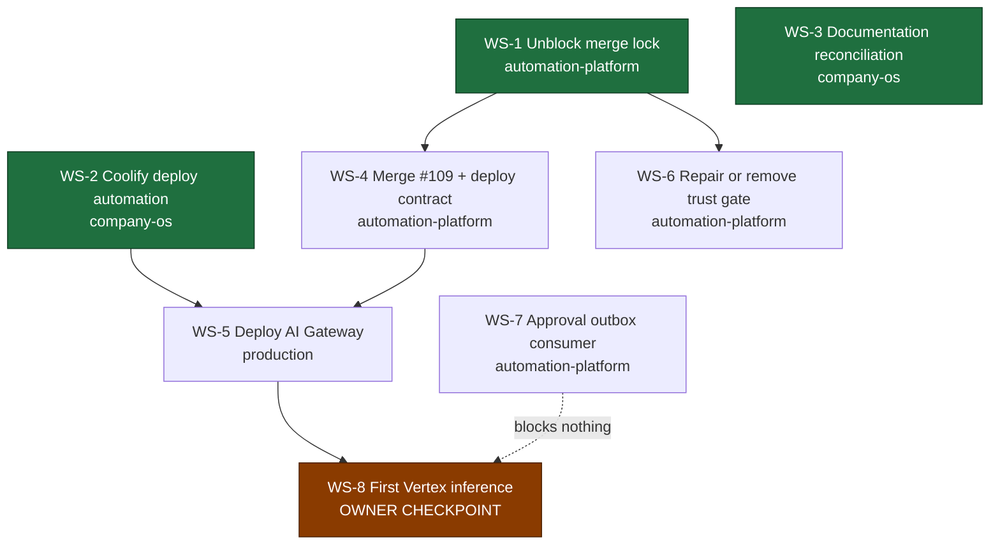

# Execution program

Current workstreams to reach a deployed, healthy AI Gateway and then exactly one
governed Vertex inference.

Two workstreams the handoff proposed are **not** here. FX configuration is
already specified on `main` and needs three values at deploy time, not a
workstream. Least-privilege role provisioning is a step inside deployment, not
a parallel track. Removing work is part of the job.

## Dependency graph



**Start now, in parallel:** WS-1, WS-2, WS-3. They share no files and no
repository state.

**WS-1 is the critical path.** Nothing in the platform repository can merge
until it lands.

## Branch discipline

One branch per workstream, separate worktrees, no mixed-purpose pull requests.
No workstream may modify another's files.

| Workstream | Repository | Branch |
|---|---|---|
| WS-1 | `adapteng-automation-platform` | `fix/n8n-isolation-check-scope` |
| WS-2 | `adapteng-company-os` | `feat/coolify-deploy-automation` |
| WS-3 | `adapteng-company-os` | `chore/registry-drift-reconcile` |
| WS-4 | `adapteng-automation-platform` | `feat/ai-gateway-deploy-contract` |
| WS-5 | — | deployment, no branch |
| WS-6 | `adapteng-automation-platform` | `fix/rollout-trust-anchor-fetch` |
| WS-7 | `adapteng-automation-platform` | `feat/approval-outbox-consumer` |

---

## WS-1 — Unblock the repository-wide merge lock

**Repository** `adapteng-automation-platform` · **Base** `main` · **Branch**
`fix/n8n-isolation-check-scope` · **Depends on** nothing

**Objective.** Stop a lapsed n8n isolation waiver from blocking every pull
request in the repository, without weakening the isolation boundary itself.

**Auto-merge** YES, once required checks pass · **Auto-deploy** N/A ·
**Owner decision** NO for this change. Renewing the waiver is separate and is
owner-only.

### Prompt

> You are working in `Ivan-Shyla/adapteng-automation-platform`. Branch from
> `main` to `fix/n8n-isolation-check-scope`.
>
> **Problem.** `.github/workflows/validate.yml` defines one job named
> `Validate repository structure and content`. That job name is a required
> status check in the repository's `main-protected` ruleset. One of its steps
> runs `scripts/validation/validate_n8n_isolation.py`. That script currently
> exits 1 because the single waiver in `n8n/isolation-waivers.json` has
> `expires_on: 2026-08-08`, which is in the past. The relevant logic is the
> `elif today > expiry:` branch in `_load_waivers`, which appends
> `waiver expired isolation_ref=...` to the errors list.
>
> The effect is that **every** pull request in the repository is unmergeable,
> including ones that touch nothing related to n8n. Confirm this yourself
> before changing anything: the same workflow succeeded on `main` at `23a23f0`
> on 2026-08-08 and fails now.
>
> **Do not** delete the isolation check. **Do not** remove
> `Validate repository structure and content` from the required checks. **Do
> not** edit the waiver date, and **do not** edit `WAIVABLE_EXPIRES_ON` in the
> validator. The pinned-tuple design is deliberate and correct: extending a
> data-boundary waiver must be a reviewable code change, and it is an owner
> decision that is explicitly out of scope for you.
>
> **Do this instead — separate the concerns.**
>
> 1. In `.github/workflows/validate.yml`, remove the
>    `Run n8n isolation validation` step from the job named
>    `Validate repository structure and content`. Keep that job's name
>    **byte-identical** — the ruleset matches on it. Every other step in that
>    job stays exactly as it is, including repo validation, the isolated Vertex
>    auth environment, deploy spec validation, policy unit tests, the
>    detect-secrets scan, trust-root validation, AI gateway hardening
>    validation, the `.gitignore` pattern check and the required
>    directory/file checks. All of those must remain blocking.
> 2. Add a second job in the same workflow, named `n8n isolation`, that always
>    runs on every push and pull request and executes the same validator. It
>    must be blocking when the pull request changes anything under `n8n/`, and
>    reporting-only otherwise. Implement this by always running the job and
>    always running the validator, then deciding whether a non-zero result
>    fails the job based on whether n8n paths changed — do **not** use a
>    workflow-level `paths:` filter, because a required check that never starts
>    blocks a pull request forever. When it is reporting-only, the job must
>    still print the full validator output and add a clearly worded warning to
>    the job summary.
> 3. Add a scheduled workflow that runs the isolation validator daily and fails
>    when the waiver is expired **or within 14 days of expiring**, so the next
>    lapse is visible before it blocks anyone. Warning ahead of time is the
>    entire point; do not settle for detecting it afterwards.
> 4. Add or extend a test under `tests/` proving both behaviours: an expired
>    waiver fails the `n8n isolation` job when n8n paths changed, and does not
>    fail `Validate repository structure and content`.
>
> **Verify before opening the pull request.** Run
> `python scripts/validation/validate_n8n_isolation.py` locally and confirm it
> still reports the expired waiver — you are not fixing the finding, only its
> blast radius. Then confirm your own pull request shows
> `Validate repository structure and content` green.
>
> Open the pull request against `main` with a title starting `fix(ci):`, and
> explain in the body that the isolation finding remains open and that renewing
> the waiver is a separate owner decision. Then merge it once required checks
> pass — no approval is required by the ruleset. If the two rollout trust-anchor
> checks are red, ignore them: they are not required checks and are handled by
> WS-6.

**Success criteria.** `Validate repository structure and content` is green on a
pull request that does not touch `n8n/`. The isolation finding is still
reported and still blocks n8n changes. A scheduled job warns before expiry. PR
#109 becomes mergeable.

---

## WS-2 — Coolify deployment automation

**Repository** `adapteng-company-os` · **Base** `main` · **Branch**
`feat/coolify-deploy-automation` · **Depends on** nothing

**Objective.** Replace console clicking with an API-driven deploy the agent can
run, using the credential that already exists in this repository.

**Auto-merge** YES · **Auto-deploy** N/A · **Owner decision** NO — no new
credential is created and nothing is deployed by this workstream.

### Prompt

> You are working in `Ivan-Shyla/adapteng-company-os`. Branch from `main` to
> `feat/coolify-deploy-automation`.
>
> **Context you must verify first.** This repository — not the platform
> repository — already holds the Coolify credential as a repository secret and
> the Coolify base URL as a repository variable. Confirm both exist with
> `gh secret list` and `gh variable list` before writing anything. Do not create
> a new credential. Do not ask anyone to paste a credential value anywhere. Do
> not print, echo or log the credential, and do not write it into a file that
> is committed.
>
> **Objective.** A reusable, idempotent GitHub Actions workflow in this
> repository that drives the Coolify API so an agent can run "deploy
> ai-gateway" instead of asking the owner to click through a console.
>
> **Required operations**, each independently invocable via
> `workflow_dispatch` inputs:
> - `inspect` — list the project, environment and applications, and report
>   whether a given application exists and its current state. Read-only.
> - `reconcile` — create the application if absent, or update it to match the
>   declared spec if present. Must be safe to run repeatedly with no change on
>   the second run. Never deletes anything.
> - `deploy` — trigger a deployment and poll until it reaches a terminal state,
>   then report success or failure with the deployment identifier.
> - `status` — report the current deployment and health state. Read-only.
>
> **The spec must be declarative and committed**, not passed as ad-hoc inputs.
> Add a directory such as `deploy/` in this repository holding one file per
> deployable service. For the AI Gateway the declared values are: project
> `adapteng-ops`, environment `production`, resource name `ai-gateway`, source
> repository `Ivan-Shyla/adapteng-automation-platform`, branch `main`, build
> pack Dockerfile, base directory `/services/ai-gateway`, Dockerfile
> `/Dockerfile`, internal port `8081`, health path `/health`, and **no public
> FQDN — private network only**. Non-secret configuration values belong in this
> spec. Secret values must be referenced by name only and never inlined.
>
> **Behaviour requirements.**
> - Fail closed. A missing credential, an unreachable API, an ambiguous
>   resource match or a non-2xx response must abort with a clear message and a
>   non-zero exit, never a silent partial apply.
> - `reconcile` must verify by re-reading after writing, and report a diff of
>   what changed. Do not trust the write response alone. This repository already
>   uses that read-back pattern in `scripts/bootstrap_rulesets.py`; follow it.
> - Never delete or destroy a resource. Deletion is an owner action and must not
>   be reachable from this workflow at all.
> - Redact anything credential-shaped from all output.
>
> **Implementation notes.** Match this repository's existing conventions: a
> Python script under `scripts/` using only the standard library, driven by a
> thin workflow that passes configuration through the environment. Pin action
> versions by commit SHA as the existing workflows do. Add unit tests following
> the pattern of the existing suites and register any new test module in the
> explicit list in `.github/workflows/ci.yml`, because `unittest discover`
> cannot be used in this repository.
>
> **Before opening the pull request**, run the checks documented in `README.md`:
> `python scripts/validate_sensitive_references.py` and the unittest suites.
> The sensitive-reference validator will reject committed resource identifiers
> and credential values — that is intentional; fix your content rather than the
> validator.
>
> **Do not deploy anything in this workstream.** Delivering the capability is
> the whole scope. Open the pull request titled `feat(deploy):` and merge once
> CI is green.

**Success criteria.** An agent can run inspect, reconcile, deploy and status
against Coolify from CI. Re-running reconcile is a no-op. No credential value
appears in any log. Nothing is deployed yet.

---

## WS-3 — Documentation and registry reconciliation

**Repository** `adapteng-company-os` · **Base** `main` · **Branch**
`chore/registry-drift-reconcile` · **Depends on** nothing

**Objective.** Close the drift register in
[`current-state.md`](current-state.md) §9 so the next agent is not told to redo
finished work.

**Auto-merge** YES · **Auto-deploy** N/A · **Owner decision** NO

### Prompt

> You are working in `Ivan-Shyla/adapteng-company-os`.
>
> **First, merge pull request #35.** It is `CLEAN`, all checks are green, and
> the `main-protected` ruleset requires zero approving reviews. It has been open
> with nothing waiting on it. Merge it, then branch from the updated `main` to
> `chore/registry-drift-reconcile`. Working before merging it will cause
> conflicts, because #35 edits `owner/action-items.md` and two registry files.
>
> Then correct the drift recorded in `control-plane/current-state.md` §9.
>
> **D-1, highest priority.** `owner/action-items.md` states that migrations
> 002, 003, 005, 006, 007 and both 008 units "remain repo-only and unapplied".
> The owner's post-rollout manual production check found all nine logical units
> exact. Production outranks the note. Rewrite that item to record the verified
> state and to say explicitly that these migrations must not be replayed. This
> is the most dangerous entry in the repository: as written it invites an agent
> to re-apply migrations that are already correct.
>
> **D-2.** The rollout-authorization blocker refers to an
> automation-evidence lifecycle pull request as an outstanding dependency. That
> chain merged through platform pull requests #93, #94 and #98. Verify with
> `gh pr view` against `Ivan-Shyla/adapteng-automation-platform` and, if
> confirmed, close the item and record the evidence.
>
> **D-3.** Narrow the AI Gateway readiness language in `ai/` so it reads as
> "implemented and tested, not deployed" rather than as cost- or
> runtime-blocked. Its tests and supply-chain gates are green on the platform
> repository's `main`.
>
> **D-5.** Record the migration 001 allocator incident as closed by platform
> pull request #108.
>
> Also update `registry/services.yaml` so the AI Gateway's status distinguishes
> "implemented" from "deployed", and add the AI Gateway to
> `registry/environments.yaml` as a declared but not-yet-created production
> resource, if it is not already represented.
>
> **Rules.** Change existing entries; do not create a parallel status document.
> Every claim you write must name its evidence — a commit, a pull request
> number, a CI run, or the owner's production check. Where you cannot verify
> something from GitHub, mark it `UNVERIFIED` and say what would settle it
> rather than asserting it. Do not mark anything as done that you have not
> checked.
>
> Run `python scripts/validate_sensitive_references.py` and the unittest suites
> from `README.md` before opening the pull request. Title it `docs:` and merge
> once CI is green.

**Success criteria.** PR #35 merged. No document still claims the nine
migrations are unapplied. Every closed item names its evidence.

---

## WS-4 — Merge PR #109 and close the deployment contract

**Repository** `adapteng-automation-platform` · **Base** `main` · **Branch**
`feat/ai-gateway-deploy-contract` · **Depends on** WS-1

**Objective.** Land the credential-file validation already written, and fix the
two undocumented deployment blockers found in §5 of `current-state.md`.

**Auto-merge** YES · **Auto-deploy** NO · **Owner decision** NO

### Prompt

> You are working in `Ivan-Shyla/adapteng-automation-platform`. WS-1 must have
> merged first; confirm that a pull request can now show
> `Validate repository structure and content` green before you start.
>
> **Step 1 — merge pull request #109.** Branch
> `feature/ai-gateway-owner-decisions`, head `9184def`. It hardens
> `services/ai-gateway/app/config.py` so that startup fails closed when the
> provider credential file is missing, unreadable or empty — without ever
> reading what is inside it. It also adds tests and a least-privilege
> runtime-role runbook. Its own tests are green: unit
> tests on Linux and Windows, PostgreSQL semantics, and supply-chain gates.
> Re-run the checks, confirm the required ones pass, and merge. Do not rewrite
> it. If the two rollout trust-anchor checks are still red, ignore them — they
> are not required by the ruleset and WS-6 owns them.
>
> **Step 2 — fix the container bind address.** `services/ai-gateway/Dockerfile`
> currently ends with `ENV AI_GATEWAY_HTTP_HOST=127.0.0.1`. A process bound to
> loopback inside a container is unreachable from the container network, so the
> health check cannot pass and no consumer can reach the service. Keep the safe
> default in the image, but make the deployment contract explicit: document in
> `docs/runbooks/` that a container deployment **must** set
> `AI_GATEWAY_HTTP_HOST=0.0.0.0`, and add a startup log line, emitted at bind
> time, stating the bound host and port so a misconfiguration is obvious in the
> first seconds of a deployment rather than after a failed health check. Do not
> log tokens, the DSN or any credential.
>
> **Step 3 — separate liveness from readiness.** `/health` in
> `app/http_app.py` returns `{"status":"ok"}` without touching the database, so
> a green health check proves only that the process is listening. Add a
> distinct readiness endpoint that verifies database connectivity and that the
> budget store is reachable, and that returns a non-2xx status when it is not.
> It must not leak configuration, credential state, model names or cap values —
> match the existing endpoint's discipline exactly. Keep `/health` as-is for
> the platform's liveness probe.
>
> **Step 4 — write the deployment configuration contract.** Add a runbook
> listing every environment variable a production deployment must set, which
> are secret and which are not, and which have no safe default. Cross-check it
> against `services/ai-gateway/.env.example` and the validation in
> `app/config.py` so the list is complete and neither invents nor omits a
> variable. State plainly that the FX rate, its timestamp and its source label
> are operator inputs that are never looked up live, and that the price version
> is a pinned audited constant rather than a deployment choice. Do not invent
> an FX rate or source value.
>
> Add tests for the readiness endpoint and the bind-address logging. Open one
> pull request per step if they are large; do not create a single mixed-purpose
> pull request. Merge once required checks pass.

**Success criteria.** #109 merged. A deployment that binds to loopback is
obvious immediately. Readiness is distinguishable from liveness. Every required
environment variable is documented in one place.

---

## WS-5 — Deploy the AI Gateway to production

**Depends on** WS-2 and WS-4 · **No branch** — this is a deployment

**Objective.** The first milestone: deployed, running, healthy, private-network
only, PostgreSQL ready, credentials ready, **inference count still 0**.

**Auto-merge** N/A · **Auto-deploy** YES, fail closed · **Owner decision** YES,
once — see the checkpoint below.

### Prompt

> Use the WS-2 automation. Do not deploy by hand through the console, and do not
> ask the owner to.
>
> 1. Run `inspect` and record whether an `ai-gateway` application already
>    exists. The reconciliation could not verify this remotely; treat the
>    inspect output as authoritative and do not assume either way.
> 2. Run `reconcile` to create or align the application to the committed spec:
>    project `adapteng-ops`, environment `production`, Dockerfile build, base
>    directory `/services/ai-gateway`, internal port `8081`, no public FQDN.
> 3. Bind configuration. Non-secret values come from the committed spec. The
>    provider credential must be delivered as a runtime file at
>    `/run/secrets/gcp-adc.json`, referenced through
>    `GOOGLE_APPLICATION_CREDENTIALS`. It must never be committed, never baked
>    into the image, never printed and never logged. Prefer a native runtime
>    file mount; a base64 environment secret decoded at startup is acceptable
>    only if that is already the established pattern in this platform. Do not
>    redesign this around workload identity federation — that is later
>    hardening, not a prerequisite.
> 4. Set `AI_GATEWAY_HTTP_HOST=0.0.0.0`. Without it the service is unreachable
>    regardless of everything else.
> 5. Provision the least-privilege database role from the runbook merged in
>    #109 — login, no superuser, no create, no replication, no bypass, execute
>    only on the definer functions the budget store needs, no direct table
>    access — and point the gateway's connection string at it. Verify the role
>    cannot read unrelated tables before proceeding.
> 6. Deploy and poll to a terminal state. On failure, read the logs, report the
>    cause, and stop. Do not retry blindly.
> 7. Verify: the process is listening on the internal network, liveness is
>    green, readiness is green, the private network reaches PostgreSQL, and no
>    public route exists. Confirm the model call count is still zero.
>
> Report the result with evidence. Do not make a model call. Do not proceed to
> WS-8.

**Success criteria.** Deployed, healthy, private-network only, database ready
through the least-privilege role, credentials mounted at runtime, inference
count 0.

---

## WS-6 — Repair or remove the trust-anchor gate

**Repository** `adapteng-automation-platform` · **Branch**
`fix/rollout-trust-anchor-fetch` · **Depends on** WS-1 · **Priority** low

**Auto-merge** YES · **Owner decision** NO to fix. YES to remove.

> **This prompt shipped an incorrect root cause.** It is kept verbatim below,
> with the correction after it, because the failure mode is worth preserving:
> the brief named the loudest symptom as the defect and directed an agent to
> fix something that was not broken. The agent rejected the diagnosis, proved
> it wrong, and fixed the real bug. That is the behaviour these prompts should
> invite — the "verify before you implement" instruction in the dispatch rules
> is what made it possible, and it must stay.

### Prompt (as dispatched — contains an error, see below)

> Two checks — `Verify exact current head from merged base` and `Base-trusted
> rollout authorization` — fail on every pull request with:
>
> ```
> fatal: could not read Username for 'https://github.com'
> fatal: could not fetch <object> from promisor remote
> rollout_trust_anchor.approval.unexpected
> ```
>
> The job checks out a partial clone and then re-invokes git through
> `env -i` with a scrubbed environment carrying no credential, so the lazy
> object fetch fails. The verifier then reports an authorization failure for
> what is actually an infrastructure failure.
>
> Neither check is in the ruleset's required list, so neither blocks a merge.
> Their only current effect is a permanent red mark, which trains reviewers to
> ignore red marks.
>
> Fix the fetch so the check can complete: ensure the objects it needs are
> present before the environment is scrubbed, or supply a credential to that
> git invocation deliberately without widening its trust boundary. Preserve the
> scrubbed-environment design — that part is sound. Then make the verifier
> distinguish "not authorized" from "could not determine", and fail closed on
> both while reporting them differently, because they demand different
> responses.
>
> If it cannot be made to complete reliably, say so plainly and propose
> removing it rather than leaving it permanently red. Removal is an owner
> decision; repair is not.

### Correction (2026-08-10, verified against `main`)

The second paragraph is wrong in both of its claims.

The `fatal:` lines are genuine and reproducible, but they do **not** originate
from `env -i` — the git calls at `rollout-trust-anchor.yml` lines 82/84 are
outside the scrubbed block, which closes with its command substitution at line
77. The credential is missing because the checkout sets
`persist-credentials: false`. More importantly they did not fail the step:
`test "$(git status --porcelain=v1)" = ""` throws away git's exit 128 and its
empty stdout satisfies the comparison, so that assertion **failed open**.

The real defect is in `scripts/validation/verify_rollout_trust_anchor.py`,
which asks whether approval material is *present* in a tree rather than whether
the pull request *introduced* it. Once PR #104 merged the receipt onto `main`
at `2026-08-06T15:42:06Z`, every later branch inherited it. Both directions of
the gate then jammed — `approval.unexpected` for ordinary PRs,
`approval.circular_or_stale` for any owner-signed receipt.

**What the prompt should have said:** state the observed failure, state the
last known-good timestamp, and require the agent to establish the causal chain
itself. Supplying a mechanism invited implementation against a wrong premise.
Only the closing instruction — distinguish "not authorized" from "could not
determine", fail closed on both — survives intact, and it turned out to be the
most valuable part.

**Success criteria.** The check either passes on a legitimate pull request and
fails only on genuine authorization problems, or a removal recommendation is
put to the owner with reasoning.

---

## WS-7 — Approval outbox consumer

**Repository** `adapteng-automation-platform` · **Branch**
`feat/approval-outbox-consumer` · **Depends on** nothing · **Deferred**

**Blocks nothing on the path to first inference.** Do not let it delay WS-5 or
WS-8.

**Auto-merge** YES · **Owner decision** NO for the consumer. YES before it is
allowed to perform real external writes.

### Prompt

> `external_draft_dispatcher` is `None` at gateway construction. Close this as
> an asynchronous consumer of `approval_outbox`, not by wiring the writer into
> the gateway process. The reasoning is in
> `control-plane/current-state.md` §7: in-process binding would force the
> gateway image to import the write adapter and its schema dependency, coupling
> two independently deployable services and requiring a gateway redeploy to
> change approval behaviour.
>
> The approval ledger already enforces single-use tokens and replay rejection in
> the database, and the outbox is already transactional, so do not
> re-implement those properties — depend on them, and add a test proving a
> replayed outbox row is rejected rather than double-written.
>
> The consumer must be idempotent, must never approve or publish, must only
> ever create pending drafts, and must fail closed on an ambiguous row. Do not
> import gateway internals into the consumer or consumer internals into the
> gateway.
>
> Deliver it inert: implemented, tested, and not performing real external
> writes until the owner enables it.

**Success criteria.** A tested consumer that preserves idempotency and replay
rejection, with no new coupling between the gateway and the write adapter, and
no external writes enabled.

---

## WS-8 — First controlled Vertex inference

**Depends on** WS-5 · **OWNER CHECKPOINT**

**Auto-deploy** N/A · **Owner decision** YES. This is the one checkpoint that
should exist.

Preconditions, all evidenced before anything runs: gateway deployed and healthy
with readiness green; least-privilege role in use; credentials mounted at
runtime; budget cap and FX configured with real operator values; approved-asset
package imported; replay and preflight passed; inference count still 0.

Then **exactly one** model call, through the gateway, against the pinned model
and region, producing a ledger entry, a cost record and an audit trail. It may
produce only an unapproved draft. Nothing is published.

The reason this is an owner checkpoint is not that the call is technically
risky. It is the first activation of a paid provider in production, and first
activation of a materially new paid provider is reserved to the owner under the
[autonomy policy](autonomy-policy.md).

---

## WS-9 — Make the flaky required check observable, then decide

**Repository:** `Ivan-Shyla/adapteng-automation-platform`. **Priority:** P1 —
it randomly blocks merges today. **Not on the WS-5 → WS-8 critical path.**

> You are working in `Ivan-Shyla/adapteng-automation-platform`. Branch from
> `main`.
>
> `root-rollout-tests` is one of five checks required by the repository
> ruleset, and it is nondeterministic. Verified evidence, not a report:
> commit `2c9824ba` (PR #112) passed under `push` and failed under
> `pull_request` on attempt 1; commit `084c4d17` (PR #114) passed under `push`
> and needed attempt 2 under `pull_request`. Identical trees, opposite
> verdicts. Both were re-run to green, so the current check-run conclusions
> read `success` and you will only find the failures by inspecting
> `run_attempt` and the archived run logs.
>
> The failing case is always `ok-fail-0-90` in
> `test_production_lifecycle_cleanup_status_is_fail_closed`
> (`tests/test_migrate_approved_assets.py`). It exits 1 with
> `lifecycle.run_selection_failed` instead of reaching the cleanup path and
> exiting 90. The test is POSIX-only and raises `SkipTest` on Windows, so it
> runs on Linux CI only.
>
> **Step 1, and do only this first.** In
> `scripts/operations/authorize_approved_assets_phase.sh`, the
> `select-queued-run` call discards the helper's stderr with `2>/dev/null`
> inside the command substitution. That stderr carries the `MetadataError`
> code, which is the single datum that identifies the cause. Capture it and
> print it on the failure path alongside `lifecycle.run_selection_failed`.
> This is purely additive: it changes no control semantics, no exit code and
> no retry behaviour. Check whether any test asserts on that stderr being
> exactly `lifecycle.run_selection_failed` and update it deliberately if so.
>
> **Step 2. Do not skip to this.** Only once a failure has been observed with
> its real code should you decide whether the retry contract is wrong. Today
> the loop treats **only** exit 2 (`run_selection.zero`) as retryable and
> hard-fails on everything else. That may well be correct — a hard failure on
> an unrecognised status is defensible fail-closed behaviour. Widening it on a
> guess would be changing the semantics of a lifecycle control without
> evidence.
>
> **What is already ruled out, so you do not repeat it.** Not
> `run_selection.multiple`: the fake `gh` returns exactly one run
> (`total_count: 1`). Not `run_selection.zero`: that maps to exit 2 and would
> retry, and the filter `created_at >= created_after` truncates both sides to
> whole seconds while `created_at` is always the later real time, so
> truncation cannot invert it. The remaining suspicion — the fake `gh` reading
> `$state/dispatch.json` and the helper then parsing empty or partial output —
> is **a hypothesis, not a finding.** Confirm it before acting on it.
>
> **Do not** disable, skip, quarantine or `xfail` the test, and do not remove
> `root-rollout-tests` from the required set. A flaky required check is a
> problem; an absent one is worse.
>
> **Read [`friction-audit.md`](friction-audit.md) F-3 before you start.** That
> entry records a coherent, confidently-stated and entirely wrong mechanism
> which cost a full session. Distinguish what you have observed from what you
> have inferred, in your report as well as in your commits.

---

## Dispatch status

**Rounds 1 and 2 landed 2026-08-10.** Every dispatched workstream is complete.

| WS | Status | Evidence |
|---|---|---|
| **WS-1** | **Done** | Platform PR #110, completed by company-os PR #45 which made `n8n isolation` a required check. Merge lock cleared; #109 merged. |
| **WS-2** | **Done** | company-os PR #41. `inspect` confirmed `ai-gateway` absent in Coolify. |
| **WS-3** | **Done** | company-os PRs #35 and #40. Drift register closed. |
| **WS-4** | **Done** | Platform #109, #112, #113, #114: credential check, bind-address contract and logging, readiness split from liveness, deployment contract documented. |
| **WS-6** | **Done** | Platform PR #116, merged 17:49Z. Trust anchor green at 17:52Z and 18:03Z — first successes in four days. Diagnosis corrected; see F-3 and `current-state.md` §12. |
| WS-5 | **Unblocked, needs the owner** | WS-2 and WS-4 both complete, so nothing technical remains. Requires three operator values at run time: the FX rate, its timestamp and its source label. |
| WS-7 | Deferred | Deliberately. Nothing depends on it. |
| WS-8 | Blocked | Needs WS-5 **and** the owner checkpoint. Model inference count is still **0**. |
| WS-9 | **Instrument delivered; needs the owner** | Platform PR **#121**, open. Purely additive: stops discarding the helper's stderr so the next occurrence names its own cause. Observation and inference kept separate, and the retry contract deliberately left alone. **Cannot be merged by an agent** — both files are in `PROTECTED_EXACT_PATHS`, so the trust anchor correctly refuses with `unauthorized.approval.commit_delta_invalid`. All five required checks green. See F-8. |

Unplanned work that landed in the same window and is not attributable to any
workstream: platform **#117** (records the required checks and how to read
their verdicts) and platform **#118**, which removed the MM-25 cross-scope
write and thereby deleted the ISO-1 waiver decision rather than deferring it
(`current-state.md` §11a). #118 replaced **#115**, which was closed unmerged.

The critical path is now **WS-5 → WS-8**, and both need the owner. There is no
remaining agent-executable work **on the path to a deployed AI Gateway** —
WS-9 sits off that path, and fixing it does not bring a deployment any closer.

**As of PR #121 there is no remaining agent-executable work anywhere in this
program.** WS-9 was the last of it, and it has run out of agent authority rather
than out of engineering: its fix touches the protected rollout boundary, so it
needs an owner-signed receipt. Every open item below is now an owner decision.

## Next owner checkpoint

There should be one, and it is **WS-8**.

Two smaller owner decisions exist and neither is on the critical path to a
deployed gateway:

1. **Renewing the n8n isolation waiver, or resolving the crossing.** WS-1 has
   landed, so this no longer blocks unrelated engineering and can be decided
   calmly. It remains owner-only because it is a data boundary. A scheduled job
   now warns 14 days before the next expiry. **Superseded in practice:** #118
   removed the crossing outright, so the waiver list is empty and there is
   currently nothing to renew.
2. **The FX rate, timestamp and source label**, needed during WS-5. Three
   values, entered once. Not a workstream, and not a governance programme.
3. **An owner-signed receipt for platform PR #121**, or an explicit decision to
   leave the flaky required check as it is. The pull request is the diagnostic
   instrument for F-8; without it, the next occurrence is as unreadable as the
   last. The trust anchor refuses it correctly, because it touches the protected
   rollout boundary, and no agent should merge past that refusal. Procedure is in
   the platform's `docs/runbooks/authorize-rollout-policy-change.md`. **Worth
   extending before signing, and the case for that is now much stronger than
   "one more site".** This item previously said #121 repairs one of **two**
   stderr-discard sites. That was scoped to the metadata helper's invocations.
   Scored across the whole file — all eighteen lines carrying a `2>` redirect at
   `824b4238`, enumerated from the blob — the sites that discard the only account
   of a failure number **seven**: 254 and 379 (the two already named), plus 353,
   359, 367, 388 and 151. #121 closes one. Full enumeration and the scoring in
   F-8.

   **The reason this changes the decision rather than just the number is that
   almost all of it is nearly free.** Three cost classes, and only the first needs
   #121's construct:

   | Class | Sites | Fix |
   | --- | --- | --- |
   | stdout captured into a variable | 379 | temp-file technique, ports verbatim from #121 |
   | both streams discarded, no capture | 353, 359, 367, 388 | delete `2>&1`; stderr then flows through |
   | no handler at all | 151 | needs a `\|\| { printf …; exit 1; }`, not a redirect change |

   The middle class is four of the seven and is a one-token deletion each with no
   contamination risk, because nothing captures those streams. **One caveat on it:**
   353 and 359 are `gh secret set`, the only two sites whose input is secret
   material. The value is encrypted client-side so their stderr almost certainly
   cannot echo it, but that has not been checked by anyone and the cost
   classification above is keyed on capture mechanics, which cannot ask the
   question. One deliberate look before letting those two through.

   **151 is the one to look at first even though it is listed last.**
   `gh auth status >/dev/null 2>&1` has no `|| { … }`, and `set -Eeuo pipefail`
   at line 2 is in force there (151 falls outside every `set +e` window), so a
   failure exits the script through `set -e` **printing no `lifecycle.*` token at
   all**. It is the only failure in the file that is not named. Every other site
   in this finding degrades an operator from "what and why" to "what"; this one
   gives neither, and it is upstream of everything else, so it is the failure most
   likely to be met first and the one that says least.

   Covering the set in one receipt
   avoids needing a second signature later for an identical one-line change. See
   F-8. **Context is already on the pull request:** WS-6 posted the verdict's
   meaning and then corrected its own comment to disclose the §15 hold and the
   fact that it merged #122 past the same verdict four minutes earlier. Opening
   #121 gives the whole picture without needing these documents. **Anchor the
   target to text, not to a line number.** The site to extend is *the
   `2>/dev/null` on the `verify-staged-runner` call whose stdout is captured into
   `runner_id`, and the `lifecycle.runner_registration_invalid` printf below it*.
   That description is true in both trees; the coordinates are not, and they
   invert rather than merely drift — `379`/`384` on `main` at `824b4238`,
   `388`/`393` on `f0a2d17`, because #121 inserts nine lines above them. A
   number-only citation here is wrong today and becomes right the moment the
   receipt is signed, with no edit to the citation, which is worse than a stable
   error. **And "388" is now an outright collision, not merely unstable:** on
   `main` it is a real discard site — `"$runner_start" … >/dev/null 2>&1`, one of
   the seven — while on `f0a2d17` it is the verify-staged-runner capture. Two
   correct records, one integer, two different sites; the failure mode is that
   they read as contradicting each other. Do not carry the +9 to other sites in
   the file: the insertion is
   interior, so the select-queued-run coordinates shift by +1 and +7 instead. Full
   table in F-8. The fix ports verbatim from #121's own construct — both sites
   are command substitutions capturing into a variable, so `2>&1` is wrong at
   both for the same reason. **This item is now worth more than it was, and part
   of it is free.** #121 is the only available source of the two verdicts the
   trust anchor has never produced under its current verifier — see
   `current-state.md` §12a: since #122 reset the evidence at 20:44:08Z there have
   been zero `authorized` and zero `unauthorized` observations, only one
   `not_applicable`. A **title or body edit on #121, with no push**, re-runs the
   anchor against the current verifier and yields the first `unauthorized`
   observation at no cost — verified that `rollout-trust-anchor.yml` is the only
   workflow in the repository listing the `edited` trigger, which is not in the
   default set, so no other check re-runs and no review is dismissed. Signing the
   receipt then yields the first `authorized` one, which cannot arrive from
   ordinary traffic at all. The receipt and the promotion evidence are one action.

   **Superseded in half, by ordinary traffic, before the owner acted — measured
   2026-08-11.** The paragraph above says #121 is *the only available source* of
   both missing verdicts. That is now false for one of the two. Opening **#124**
   (`fix(ci): report a broken trust root as undetermined, not unauthorized`,
   head `36119231`) fired the anchor on `pull_request_target` three seconds later,
   run `31466827525`, and it emitted
   **`rollout_trust_anchor.unauthorized.approval.commit_delta_invalid`** at
   06:54:39Z, exit 1 — read from the job log, not inferred from the exit code.
   That is the first post-reset `unauthorized` observation, and it cost nothing
   and required no owner action. Enumerated rather than assumed: exactly **two**
   runs postdate the 20:44:08Z reset — the `success` at 20:45:58Z that the
   paragraph above calls `not_applicable`, and this one.

   **What survives, and what the owner should now do.** ~~The `authorized` half is
   untouched: it still cannot arrive from ordinary traffic, because it requires a
   signed receipt, and #121 remains its only source.~~ **Corrected 2026-08-11 — see
   `current-state.md` §12b.** Two claims were bundled there and only one is true.
   *`authorized` requires a signing action* is exactly right and is now measured:
   the receipt files have exactly four commits on `main` in the repository's whole
   history — #93, #94, #98, #104 — and every one of the seven historical
   `authorized` verdicts was produced by a pull request carrying `approval.json`
   and `approval.sig` edits in its own diff. No `authorized` verdict has ever been
   produced without one. *It cannot arrive from ordinary traffic* is false, and
   **#121 is not its only source** — it is only the only *open* source. Three of the
   four authorizing pull requests were ordinary feature work — a backup-retention
   binding, a model proof, a Vertex fallback fix — that signed as one step among
   several, **four times in twenty-six hours**. Signing was routine practice, not a
   ceremony, and then it stopped: #104 is the last pull request ever to carry a
   receipt, and the first receipt-free run afterwards failed immediately. So the
   instruction to the owner changes in kind. It is not *manufacture a rare input*;
   it is **resume a practice that was ordinary for a day and has lapsed** — any
   protected-path pull request that carries a signed receipt yields `authorized`,
   and #121 qualifies only because it happens to be open.

   The rest of the original paragraph stands: the sentence "the receipt and the
   promotion evidence are one action" is no longer accurate — half the evidence
   arrived on its own — and **the title-or-body edit on #121 should not be
   performed for the purpose of harvesting an `unauthorized` observation, because
   that observation already exists.** Sign the receipt when the hold
   lifts; that yields `authorized` and completes the pair. The `edited`-trigger
   finding stays on the record as the correct instrument if a further
   `unauthorized` observation is ever wanted deliberately.

   **And the reason this matters beyond the wording.** The paragraph above treated
   a lapsed habit as a property of the input distribution. That is the more
   expensive error of the two, because "the input is rare" prices the remedy as a
   key ceremony requiring the owner, while "the practice stopped" prices it as
   restarting something a workstream already did four times unaided. The 79 %
   red figure in `current-state.md` §14 has the same origin: it does not measure a
   broken check so much as the twenty-six-hour window in which **every** anchor run
   was on a branch carrying its own receipt, followed by traffic that carried none.

   **Why this is worth recording beyond the instruction it repairs.** The claim
   was true when written and was falsified by an event no one had to take —
   a workstream opening a routine pull request. It carried no validity interval,
   so nothing about it announced that it expires the moment any pull request
   opens against the platform. That is the *right answer, unstated validity
   interval* shape in `current-state.md` §13, applied to a scarcity claim: "the
   only available source" is a statement about the world at an instant, written
   in the present tense of a standing instruction.
   **Use the edit, not `gh run rerun`.** Re-running #121's existing run would also
   pick up the current verifier — the checkout resolves `refs/heads/main` at
   execution time — but it replaces that run's conclusion in place, while an edit
   adds a run alongside the existing one. #121's pre-reset refusal is part of the
   evidence base, and a re-run additionally leaves `created_at` describing an
   execution it no longer matches. See `current-state.md` §12a.

   **#124 has since become a substantive item in its own right, not just the event
   that falsified this paragraph.** It repairs a live misclassification: a missing
   or broken trust root — an infrastructure fault — is currently reported as
   `rollout_trust_anchor.unauthorized.trust_root_file_missing`, exit 1, on **two
   required, merge-blocking checks** (*Validate repository structure and content*
   and *Fail on unencrypted secret-like content*, both confirmed against the active
   `main-protected` ruleset). Reproduced here by executing the real script, not read
   from a diff. #124 converts the 21 bare raises in `validate_allowed_signers` (15)
   and `_validate_executable` (6) to `UndeterminedError`, on the stated principle
   that those functions validate the *instrument* and never the *subject* — neither
   reads the pull request. Both categories still block, so nothing previously
   refused becomes admitted, and the `trust_root_not_configured` → exit 0 special
   case at 3210 is deliberately preserved and pinned by test. **The owner decision
   is only whether to merge past `commit_delta_invalid`**, which is item 4 below and
   not specific to #124; the change itself is verified. WS-6 left it open rather
   than merging, which is the correct application of the standing rule.
4. **One sentence settling whether an advisory authorization refusal may be
   merged past.** Two sessions answered this oppositely within four minutes —
   platform #122 merged, #121 was left open — from materially identical
   positions, and both readings are supportable from the documentation. See
   `current-state.md` §15, which sets out the likely resolution: treat changes to
   the anchor's own machinery, which cannot self-authorize, differently from
   ordinary protected changes. That distinction has since been tested against
   both live cases and separates them correctly. Until it is settled, agents
   should leave such pull requests open. **Worth deciding at the same time:**
   whether the verifier should *emit* the distinction as distinct codes rather
   than leaving it in prose for readers to re-derive. It can already see the
   difference, and a policy encoded in the check cannot drift from the check —
   which is what most of the friction register is about. **The test for the
   sentence:** could an incautious agent apply it correctly without judgement? If
   not, it needs sharpening whichever reading it adopts — the failure here was
   not a wrong answer but a rule nobody could point at. **If the encoded form is
   chosen, it is a security design and not a labelling exercise.** Bootstrap must
   be its own class with its own exit code, not a sub-code under `unauthorized`,
   because the three cases need three different human responses — refuse, repair,
   escalate. And it must be classified strictest-applicable: a naive file-list
   detection makes the softer class **self-selecting**, since anyone could add a
   trivial edit to the verifier and inherit it. §15 carries the full argument, the
   check against both live cases, and two gaps the proposal does not yet close —
   that "the anchor's own machinery" is not a set that exists anywhere in the
   code, and that constraining only protected paths leaves the unprotected payload
   unexamined. Do not hand this to an implementer without that section.

   **One fact this ruling now has to survive, discovered by WS-6 stacking a pull
   request.** A pull request whose base is not `main` is governed by **nothing**:
   `main-protected` is the repository's only ruleset and includes `~DEFAULT_BRANCH`
   alone, and `rollout-trust-anchor.yml` fires only on `branches: [main]`. Verified
   against the check-runs API — platform #125 (base `fix/trust-root-undetermined`)
   has **10** check runs, all green, **none required**, and **no anchor verdict at
   all**; #124 (base `main`) has 12 including both anchor checks. So the standing
   "leave such pull requests open" instruction is currently enforced by agent
   discipline alone on any stacked pull request, not by a control. That does not
   change the ruling, and it is not an argument for merging — it is an argument that
   the sentence must say what it governs. **A rule that says "do not merge past an
   advisory refusal" is silent about a pull request that never received one.** State
   the stacked case explicitly, in whichever direction: either the layer retargets to
   `main` and takes a verdict before merging, or the rule names the base-branch
   condition under which no verdict is expected.
5. **Whether to re-pin the verifier so the F-8 fixture can be repaired.** The
   defective fake `gh` lives in a file that is both protected and digest-pinned,
   and the pin lives in a verifier that pins itself. The fix is known, was
   implemented and verified, and was then deliberately reverted rather than
   shipped. See F-8. **This is the larger of the two F-8 decisions and is not the
   same act as item 3:** path protection needs a signature, a digest pin needs a
   signature *and* a change to the verifier that authorizes edits. Item 3 is
   ordinary; this one touches the trust boundary's own machinery. They can be
   taken at the same sitting. **Scope, now traced:** only the stub at 773–775 is
   on the live path — the second regenerating stub at 783 feeds a single
   `api_call` with no re-fetch, so it cannot produce the failure. Fix 773–775 to
   close the path; include 783 in the same edit because it is free once the file
   is open and the signature is one attempt. **Enumerate the pins before
   starting.** These validation modules are launched by a fixed-registry dynamic
   loader (`run_rollout_module.py`, which exists to run them "without adding
   repository roots to `sys.path`"), so a single file is typically named in
   several places at once — a loader registry, `PROTECTED_EXACT_PATHS`, a
   module-name allowlist, `CLOSURE_PROCESS_ALLOWED_SOURCE_SHA256`, and test
   tables. Those references are *pins, not callers*: nothing changes behaviour
   when the file changes, but any pin left stale makes the loader refuse it with
   `closure.dynamic_import`. With one signature available, the failure mode to
   plan against is a missed pin, not a broken dependant. See F-8.

   **The inventory, verified at `824b4238`** — WS-1 established it, and it is
   reproduced here because it is what the signature is spent against. Digest
   entries span two lines: the path is the key, the hex is on the line below, and
   the line to *edit* is the second one.

   | File | Protected at | Digest key → value | Constant |
   |---|---|---|---|
   | `tests/test_migrate_approved_assets.py` | 112 | 417 → **418** `1f181579…` | `CLOSURE_PROCESS_ALLOWED_SOURCE_SHA256` |
   | `scripts/validation/approved_assets_github_metadata.py` | 85 | 402 → **403** `6e3c4f85…` | `CLOSURE_PROCESS_ALLOWED_SOURCE_SHA256` |
   | `scripts/validation/approved_assets_github_metadata.py` | 85 | 434 → **435** `6e3c4f85…` | `CLOSURE_SYS_PATH_ALLOWED_SOURCE_SHA256` |

   **The metadata helper is pinned twice, in two different constants, to the same
   digest** — byte-identical, verified. So a re-pin that updates 403 and misses
   435 fails in exactly the way this item exists to plan against. The fixture edit
   at 773–775 and 783 touches `test_migrate_approved_assets.py`, which carries one
   digest; if it also touches the metadata helper, it carries two.

   **One other change wants the same signature, for a corrected reason.** The
   negative invariant proposed in `current-state.md` §15 —
   `ANCHOR_MACHINERY ∩ (APPROVAL_PATHS ∪ {allowed_signers}) == ∅` — needs a path
   constant for `allowed_signers`, which has none. This item previously said "the
   only `.py` files that could host it are the verifier and its test, both
   digest-pinned at 408 and 423, so it consumes a re-pin too". That enumeration
   was short: `scripts/validation/validate_rollout_ci_policy.py` already holds the
   literal at 137, is protected at 96, and is in **neither** digest map — checked
   against `CLOSURE_PROCESS_…` (392–426) and `CLOSURE_SYS_PATH_…` (427–440). The
   conclusion is unchanged but the reason inverts: `is_protected_path` is verifier
   behaviour (1107), so the classifier that consumes `ANCHOR_MACHINERY` has to
   live in the verifier, and both pins — 408 and 423, since the new behaviour
   needs a test and the test is pinned — are spent by *encoding the classifier at
   all*. **The negative conjunct's marginal cost is zero.** If both are wanted
   they are one sitting, and the invariant should not be deferred on cost.

   **And the hard-coded literal needs one assertion beside it, anchored on the
   filesystem — this is the part that is easy to get wrong in a way no reviewer
   sees.** A bare hard-coded path in the verifier is silent on a trust-root rename:
   the intersection goes empty because the literal names nothing, the invariant
   passes forever, and nothing fails to point at it. WS-6's remedy is right —
   hard-code plus a consistency assertion — but the precedent it was first justified
   by, `tests/test_rollout_trust_anchor.py` 1935–1948, must not be copied. That test
   binds three copies of the path to *each other*, and all three can go stale
   together (`current-state.md` §15). An assertion built that way puts the new
   literal in the same silent class.

   **Assert `(ROOT / literal).is_file()` directly in
   `tests/test_rollout_trust_anchor.py`.** This supersedes the earlier instruction in
   this item, which said to chain the assertion to `REQUIRED_FILES` in
   `scripts/validation/validate_repo.py` because its entry at line 34 is
   existence-checked at 268–272. That works, but it inherits 272: if `REQUIRED_FILES`
   ever stops being existence-checked, the guard silently rejoins the silent class,
   and the change responsible would be nowhere near the guard. The direct form has no
   intermediary. Every set is one refactor away from being a claim about copies
   again; the filesystem is not a set.

   **The precedent previously cited here is withdrawn.** This item used to say that
   the same file already contains a filesystem-anchored assertion at **5259–5271**
   "guarding the other two entries of the same sparse-checkout list", to be cited for
   the *category* but never copied for its shape. Measurement reverses all of it
   except the shape warning. It does not guard those entries: executed against a tree
   holding only `services/ai-gateway/.gitattributes` and `.gitignore`, with no root
   copies, it **passes**. Its population is a *filesystem* walk while the claim is
   about the *tracked* tree, and `.gitignore:115` ignores the directory `pytest`
   writes a `.gitignore` into. And its object is wrong: with
   `sparse-checkout-cone-mode: false` a pattern without a slash matches at any depth,
   so nested dotfiles are already inside the sparse set and the hazard its comment
   names cannot occur. **Cite it for nothing.** The direct form above needs no
   precedent — one literal, no glob, no projection, no population.

   **Add a second assertion, on the pattern form rather than on the tree.** What
   actually prevents the unauthenticated-promisor failure (F-2) is that
   `rollout-trust-anchor.yml` **33–34** are *bare basenames*. Rewriting them as
   `/.gitattributes` and `/.gitignore` drops nested files out of the sparse set and
   restores the failure, through an edit that reads as tidying — and every existing
   assertion passes on it, because the only guard on pattern form is 5257–5258, an
   `assertIn` substring check that `"/.gitattributes"` satisfies. Assert that the two
   entries are exactly those basenames, with no leading slash. Verified in both
   directions against real Git on a filtered credential-free clone.

   **Placement is load-bearing.** `root-rollout-tests` is one of the five required
   checks (live ruleset `20236725`), it runs this file explicitly
   (`.github/workflows/rollout-policy.yml:24`), and on a `pull_request` event its
   checkout takes `refs/pull/N/merge` — the **merge commit**, since line 13–16 sets
   `persist-credentials: false` and gives no `ref:`. The merge ref contains the
   rename, so the assertion fails **on the pull request that performs the rename**.
   (This previously read "checks out the pull request's own head". The conclusion is
   unchanged, but the two refs diverge whenever the base has moved, so the precise
   form is the one to reason from.) The only mechanism that currently catches a
   coordinated rename — `rollout-trust-anchor.yml:69` — is not required *and* reads
   its anchor from `refs/heads/main`, so it cannot fire until one merge later; and
   because line 35 hard-codes the old path while the checkout stays pinned to `main`,
   it then fails on **every** subsequent pull request until a protected workflow is
   edited. This assertion is what closes that gap; see `current-state.md`
   §15 for the three-mechanism analysis.

   No third pin is incurred: the test already reads repository files as text at
   1941–1946 and already names `validate_repo.py` at 2025, 4048 and 4063, so the
   assertion needs no import, and `validate_repo.py`'s own pin at 431–432 is
   unaffected by being read. Pins 408 and 423 remain the only two touched, and
   both digests were re-derived from the blobs at `824b4238` and are current.

   **The recipe, since a wrong one costs the signature.** `_reviewed_source_sha256`
   (anchor 1242) normalizes `\r\n` to `\n`, refuses a lone `\r`, and then at line
   1257 returns a plain `sha256` of the normalized bytes **for every path except
   `verify_rollout_trust_anchor.py`**. The marker-substitution branch that WS-1
   flagged as a possible complication applies only to the anchor's own self-entry,
   so it does not reach either file here: `sha256` of the *normalized* bytes is the
   right function.

   **The line-ending hazard is measured, not inferred.** WS-2 measured it on a
   platform worktree; it is reproduced here from the canonical blobs, so the
   numbers do not depend on anyone's git configuration. Both files are stored pure
   LF (518 and 2882 newlines, zero `CR`), so **any** CRLF checkout of `824b4238`
   yields exactly these digests:

   | File | `sha256` of disk bytes on a CRLF checkout | `sha256` of LF bytes = **the pin** |
   |---|---|---|
   | `approved_assets_github_metadata.py` | `2d065710…` ✗ | `6e3c4f85…` ✓ |
   | `tests/test_migrate_approved_assets.py` | `bc6e7c2a…` ✗ | `1f181579…` ✓ |

   **The direction matters, and it is the opposite of an ambient risk.** The
   verifier normalizes, so it is *safe* on a CRLF tree — nothing is broken today
   and no existing check will warn. The trap is armed at exactly one moment: when
   someone computes a replacement digest by hashing the file on disk. That is the
   moment the signature is spent, so the hazard and the scarce resource coincide.

   **The symptom does not tell you which mistake you made.** Both constants raise
   the identical `TrustError("closure.dynamic_import")` — 1436 for the `sys.path`
   constant, 1481 for the process one — and each collapses *path absent*
   (`expected is None`) with *digest mismatched* into that one code, carrying
   neither the expected nor the actual value. So a missed second pin, a stale
   digest and a CRLF-inflated digest are three different errors that present
   identically. Verify the digest before pushing rather than diagnosing after.

   **Use the recipe that cannot see the working tree at all:**

   ```
   git cat-file blob 824b4238:scripts/validation/approved_assets_github_metadata.py | sha256sum
   ```

   It reads the stored object, so it is correct regardless of `core.autocrlf`,
   `.gitattributes` or checkout history. Hashing `read_bytes()` after a manual
   `\r\n` → `\n` replacement is equivalent; hashing the file on disk is not.

   **The repository already runs this experiment, with a clean control.** WS-2 ran
   `tests/test_migration_digest_pins.py` on a CRLF checkout: **7 failed, 2 passed**,
   and the split is exactly the `.gitattributes` membership. Nine SQL migrations
   exist under `database/migrations/`; the two carrying `eol=lf` —
   `007_source_identity_reservation.sql` and
   `008_drive_bridge_replay_reservations.sql` — pass, and the seven without it
   fail. Same test, same commit, same machine, one variable, 9/9 with no
   exceptions. The mechanism is visible at line 53 of that test:
   `hashlib.sha256(migration.path.read_bytes())` — **raw bytes, no
   normalization**, unlike the anchor. That contrast is the whole story: a checker
   that normalizes is CRLF-safe and a checker that does not is CRLF-fragile, and
   the person computing a digest by hand is in the second category.

   **`.gitattributes` is not free, and the earlier verdict that it is not
   effective was wrong.** It is not free because `.gitattributes` is itself
   protected, at anchor line 69, so adding an `eol=lf` entry needs the same
   authority as the re-pin. The rest of this paragraph previously said it was also
   ineffective, on the grounds that the attribute governs *checkout* and the files
   are already checked out. That measured one population and described all of
   them. Corrected and re-measured on a scratch repository at
   `core.autocrlf=true`:

   | Step | `sample.py` `CR` | `notes.txt` `CR` (no attribute) |
   |---|---|---|
   | fresh materialization, no attributes | 3 | 2 |
   | after committing `*.py text eol=lf` | 3 | 2 |
   | after `git add --renormalize .` | 3 | 2 |
   | after `git checkout -- .` | 3 | 2 |
   | after `git rm --cached -r .` ; `git reset --hard` | **0** | 2 |
   | **fresh clone, attribute already committed** | **0** | 2 |

   Working tree clean at every row and the blob unchanged throughout
   (`a9aeef04`), so no pin is invalidated. Two things follow that the four-row
   version got wrong. **The attribute works immediately for every future
   materialization** — the last row is a new clone, not a repair — so the commit
   is effective the moment it lands. And **the stale worktree has a one-sitting
   local fix** that touches no blob and needs no authority. It is also surgical:
   `notes.txt`, which carries no attribute, keeps its `autocrlf` behaviour. WS-2's
   caveat is worth keeping: `git reset --hard` discards uncommitted work, so if it
   is ever used during a signing sitting it belongs *before* the edit.

   **The three trust-root pins in this same file are asserted by nothing, which
   changes what the owner is deciding.** Root `.gitattributes` carries six
   `text eol=lf` entries: two `database/migrations/*.sql`, `.secrets.baseline`, and
   the three that fix the trust root's bytes —
   `.github/trust/rollout-policy/allowed_signers`, `approval.json` and
   `approval.sig`. The only test that reads the file is
   `tests/test_migrate_approved_assets.py:2060`, on the required
   `root-rollout-tests`, and it asserts the **two migration pins only**. Across all
   four files on that check, zero assertions name the trust-root pins. So deleting
   those three lines passes **all five required checks**; the sole objection is the
   anchor, because `.gitattributes` is in `PROTECTED_EXACT_PATHS` (anchor line 69) —
   and the anchor is advisory, and its refusals have already been merged past once
   (§15). **Measured, not reasoned**, on scratch clones at `core.autocrlf=true`,
   reading the checked-out bytes of `allowed_signers` (blob stored LF):

   | arrangement | bytes | CRLF pairs |
   |---|---|---|
   | root pin `text eol=lf` (today) | 4 | 0 |
   | nested `.gitattributes` with `allowed_signers -text` | 4 | **0 — still pinned** |
   | nested `.gitattributes` with `allowed_signers text eol=crlf` | 6 | 2 |
   | **three lines deleted from root `.gitattributes`** | 6 | 2 |

   Two consequences. The natural override form — `-text` — does **not** unpin:
   disabling conversion preserves the stored LF, so it is the *wrong* attack and the
   one a reviewer would expect. And the simplest route to unpinned bytes is deleting
   three lines from the root file, which no test notices. **Recommendation: assert
   the three trust-root pins on `root-rollout-tests`.** It is a required check, the
   assertion is three `assertIn`s, and it converts an advisory-only guard into a
   pre-merge one for the specific bytes the signature is taken over.

   **Why the original table could not have found this, which is the part worth
   carrying.** The experiment mutated a worktree that already existed, so every
   row it could produce was a *transition*. The population where the remedy works
   — a materialization that has not happened yet — was outside what the instrument
   could observe, not something overlooked within it. Seeing it needs a different
   instrument (clone into an empty directory), never a further step.

   **One scoping fact for this decision, since "CI is Linux" is not exactly
   true.** Sixteen workflows at `824b4238`, none setting `core.autocrlf`; the
   self-hosted runners in `migrate-approved-assets.yml` are labelled `linux`/
   `x64`; but `ai-gateway-tests.yml` runs its `unit` job on a matrix of
   `[ubuntu-latest, windows-latest]` (line 66). So a Windows CI leg does exist.

   **Its CI verdict does not depend on the entry's scope, and the earlier claim
   here that it does is withdrawn.** That leg is inert for two independent
   reasons: it is scoped to `services/ai-gateway` by
   `defaults.run.working-directory` (67–69), *and* every repo-file reader in it
   normalizes line endings. A repo-wide entry escapes the first and not the
   second, and the second is sufficient alone. Enumerated rather than sampled,
   across all 22 test modules and all 19 application modules: one `read_bytes()`
   in the test tree (`tests/migration_support.py:20`, feeding
   `decode_utf8_normalized`); three `read_text(encoding="utf-8")` sites, which
   apply universal newlines; one `read_bytes()` in application code
   (`app/company_os_model_proof.py:165`) whose digest is taken over a canonical
   JSON re-serialization (171–177) and so cannot see the file's endings; no
   `open(…, "rb")` and no `newline=` override anywhere. WS-2 confirmed the result
   by running the leg under both a CRLF and an LF checkout of `824b4238` —
   **221 passed / 1 skipped from each**, which also removes the need to know what
   `core.autocrlf` a hosted runner uses.

   **So scope is still a real decision, but on different grounds:** blast radius,
   review surface, and the transition cost on worktrees that already exist — not
   on any CI verdict. Choose it on breadth of review, not on risk of breakage.

   **One adjacent hazard this uncovered, which is `.sql` and not `.py`.** At the
   repository root, `tests/test_migration_digest_pins.py:53` digests
   `migration.path.read_bytes()` with no normalization, over the seven migrations
   that carry no `eol=lf`. That tree has the scope protection and *not* the
   normalization protection, and it has stayed green only because the sole Windows
   leg is directory-scoped away from it — protection by accident of collection,
   with nothing in the test expressing the dependency. Adding any Windows job at
   repository root, or moving that job's working directory, turns seven subtests
   red. It cannot be triggered by a `*.py` entry of any breadth, since
   `ALL_MIGRATIONS` are `.sql`. A `*.sql text eol=lf` covering all nine would
   retire the class and make the two pinned migrations consistent with the seven —
   **wider than this item, and listed here only so the decision is not taken twice.**
6. **Whether a base that moves mid-run should stay an authorization refusal.**
   `verify_pull_request` at anchor 2653–2659 raises one
   `TrustError("pull_request.live_ref_changed")` for two different events: the
   *head* moving between the event and the API read, which is a TOCTOU signature
   and defensibly authorization-class, and the *base* moving, which is somebody
   merging to `main` in those seconds and has nothing to do with the pull
   request's author. This is listed here rather than left in `current-state.md`
   §12a because a fact filed away from the decision it bears on is not available
   at decision time — the failure recorded as the second limit on §13. **It is not
   a matter of taste:** the same file already argues the other way for the sibling
   race at 975–982, whose comment says refusing it "would accuse its author of an
   attempt nobody made, which is the confusion this verifier exists to avoid".
   Base-moved is that situation exactly and gets the opposite class. Two further
   points the ruling needs. First, the presentation is not merely mislabelled:
   outcome `failure` renders "The exact current head is not externally authorized"
   (2780), which is *affirmatively false* when the base moved, so the repair is a
   different sentence and not only a renamed code. Second, and the part most
   likely to be got wrong — **the ruling must say explicitly that
   `operator.live_ref_changed` at 3087–3088 is excluded.** That site looks like a
   sibling and is not: it sits between `verify_signature` (3079) and
   `staging.replace(output)` (3089), so it is a signing-time freshness guard on a
   receipt that binds `base_sha` (2966), and any movement must fail it. Its reader
   is also different — the `create` handler prints the exact code to the operator
   who just ran the command (3192–3201), so there is no author being accused and
   none of the cost that motivates the change at the first site. A ruling that
   omits this invites a later reader to harmonise the two and put a hole in the
   signing path. Strength: mechanism read at source at `824b4238`; **no production
   occurrence observed**, and not observable by check-run inspection, because the
   check-run rendering maps outcomes to fixed strings (2771–2787) and never
   carries the code. Latent, not live, and the file is under the hold.

7. **Whether the ungoverned interpreter at `authorize_approved_assets_phase.sh:168`
   is repaired now or with the #121 receipt.** The script makes two
   secret-**absence** assertions through the same helper and governs them
   differently. Line 161 runs `python -I "$metadata_helper" assert-secret-absent`
   for `$authorization_name`, failing to `lifecycle.authorization_secret_present`
   (165). Its immediate sibling at 168 runs the identical subcommand for
   `$reviewed_evidence_name` — **without `-I`** — failing to
   `lifecycle.reviewed_evidence_secret_present` (172). Seven of the eight helper
   calls in the file carry `-I` (56, 61, 71, 156, 161, 248, 376); 168 is the sole
   deviation. **Why it is a security item and not hygiene:** an absence assertion
   that is subverted returns *success*, so the script proceeds believing a
   reviewed-evidence secret is absent when it is present — a false negative on a
   gate, not a crash. Measured, not recalled: without `-I` the interpreter prepends
   the script's own directory to `sys.path`, the helper's `sys.path.insert(0, …)` at
   line 20 stacks the repository root on top rather than displacing it (script
   directory lands at index 1, ahead of the standard library at 4), and the helper's
   stdlib imports at lines 6–16 all execute *before* that insert. The exposed
   directory holds 22 modules. **Scope of the exposure today:** none of the 22 shares
   a name with any module the helper imports, so it is structural, not live; the
   file's other ungoverned interpreters (`python -c` at 177, 179, 230 and stdin at
   186, 280) expose the working directory instead, which holds zero `.py` files.
   **That last bound is real but unstated in the script, and it is not the whole
   story** (§ the ungoverned-interpreter analysis in the friction audit). Nothing in
   the file sets or resolves the working directory — seven tokens searched, zero
   hits — so the confinement is a side effect of the input-validation conjunction at
   119–130, specifically clauses **124 and 125**, the only two of seven that test
   hard-coded relative paths. Two consequences for this item. First, the fix here is
   **not** "add `-I` to every interpreter in the file": lines 190 and 286 import
   `scripts.validation.bounded_json` through a cwd-rooted package path and would
   break under `-I`. 168 and the three `python -c` sites can take it; the two stdin
   heredocs cannot. Second, absolutising the helper paths at lines 10–11 — the
   textbook repair for relative paths in a shell script — would unbind the working
   directory for the two sites that execute before the first cwd-rooted import
   fails, one of which mints the dispatch locator from `secrets.token_hex`. So the
   scope of *this* item is 168 alone, and the file's cwd bound should be recorded
   before anyone tidies it. Exploitability of that window is **not traced**.
   **Why it is an owner decision rather than AUTO:** the one-character fix is
   obvious, but the file is under #121's signature hold, and editing it would
   invalidate green checks on a PR awaiting signature while smuggling an unrelated
   change into a receipt. The choice is *repair now and re-run the checks* versus
   *fold it into the #121 receipt*, not whether to repair. **Note this cuts against
   the usual CI-versus-local intuition:** no workflow runs this script — it is
   operator-run — and an operator workstation is precisely where `PYTHONPATH` and
   user site-packages pollution lives, while line 152 asserts repository-admin
   before 168 executes. Strength: read at source at `824b4238`, blobs size-checked;
   interpreter behaviour measured on 3.11.9; **no exploitation observed and none
   possible today**, since the collision set is empty.

Everything else on the path to a deployed, healthy AI Gateway is either AUTO or
AUTO + FAIL CLOSED under the [autonomy policy](autonomy-policy.md).
